# Backend API

<cite>
**Referenced Files in This Document**
- [server.py](file://backend/server.py)
- [requirements.txt](file://backend/requirements.txt)
- [backend.ts](file://frontend/utils/backend.ts)
- [api.ts](file://web/src/lib/api.ts)
- [types.ts](file://shared/types.ts)
- [tunnel.py](file://backend/tunnel.py)
- [frontend/.env](file://frontend/.env)
- [web/.env.local](file://web/.env.local)
- [next.config.ts](file://web/next.config.ts)
</cite>

## Table of Contents
1. [Introduction](#introduction)
2. [Project Structure](#project-structure)
3. [Core Components](#core-components)
4. [Architecture Overview](#architecture-overview)
5. [Detailed Component Analysis](#detailed-component-analysis)
6. [Dependency Analysis](#dependency-analysis)
7. [Performance Considerations](#performance-considerations)
8. [Troubleshooting Guide](#troubleshooting-guide)
9. [Conclusion](#conclusion)
10. [Appendices](#appendices)

## Introduction
This document explains the backend API built with FastAPI that serves the complete REST API for the Polymath OS project. It covers the async architecture using MongoDB/Motor, AI integration via OpenAI, robust error handling, and the full endpoint structure for activities CRUD, journal management, AI operations, export/import functionality, and statistics. It also documents the data models, validation schemas, and business logic, and clarifies the relationship between the backend and frontend applications, including authentication mechanisms and performance optimization strategies.

## Project Structure
The backend is a standalone FastAPI application with:
- A primary server module defining models, helpers, AI operations, and endpoints
- A requirements file listing dependencies including FastAPI, Motor (async MongoDB driver), OpenAI SDK, and Sentry
- A tunnel script to expose the backend securely via Cloudflare tunnel and auto-update frontend configuration
- Frontend integrations in both React Native (Expo) and Next.js (web) consuming the backend API

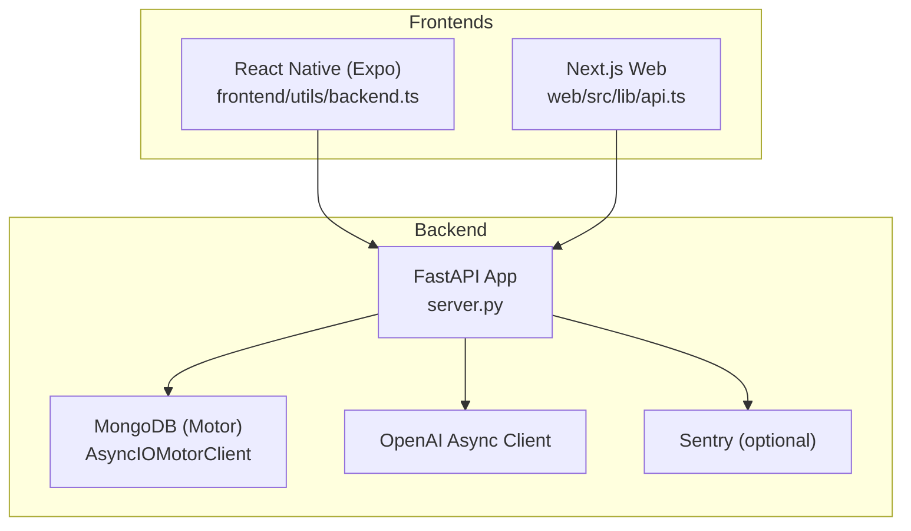

**Diagram sources**
- [server.py:74-1302](file://backend/server.py#L74-L1302)
- [requirements.txt:21-129](file://backend/requirements.txt#L21-L129)
- [backend.ts:1-76](file://frontend/utils/backend.ts#L1-L76)
- [api.ts:1-93](file://web/src/lib/api.ts#L1-L93)

**Section sources**
- [server.py:74-1302](file://backend/server.py#L74-L1302)
- [requirements.txt:21-129](file://backend/requirements.txt#L21-L129)
- [backend.ts:1-76](file://frontend/utils/backend.ts#L1-L76)
- [api.ts:1-93](file://web/src/lib/api.ts#L1-L93)

## Core Components
- Async database operations powered by Motor (MongoDB) for all collections: activities, journals, connections, agent memory, learning logs, agent persona, and AI configuration.
- AI integration using OpenAI’s async client for content analysis, connection generation, suggestions, and chat with agent memory.
- Comprehensive validation via Pydantic models for request/response shapes.
- Export/import endpoints supporting JSON, Markdown, and CSV formats.
- Agent memory and persona system with learning logs and statistics.

Key implementation patterns:
- Deduplication of activities using a generated hash
- AI analysis prompts constrained to return JSON only
- Connection generation using AI to propose links between activities
- Memory consolidation and relevance ranking using AI
- Health checks and graceful shutdown

**Section sources**
- [server.py:79-180](file://backend/server.py#L79-L180)
- [server.py:182-284](file://backend/server.py#L182-L284)
- [server.py:320-497](file://backend/server.py#L320-L497)
- [server.py:524-1033](file://backend/server.py#L524-L1033)
- [server.py:1035-1281](file://backend/server.py#L1035-L1281)

## Architecture Overview
The backend follows a layered architecture:
- API Layer: FastAPI routers and endpoints
- Business Logic Layer: Helpers for AI analysis, connection generation, memory operations, and learning
- Persistence Layer: Motor client connecting to MongoDB collections
- Integration Layer: OpenAI async client for AI operations
- Observability: Sentry SDK for error tracking and performance monitoring

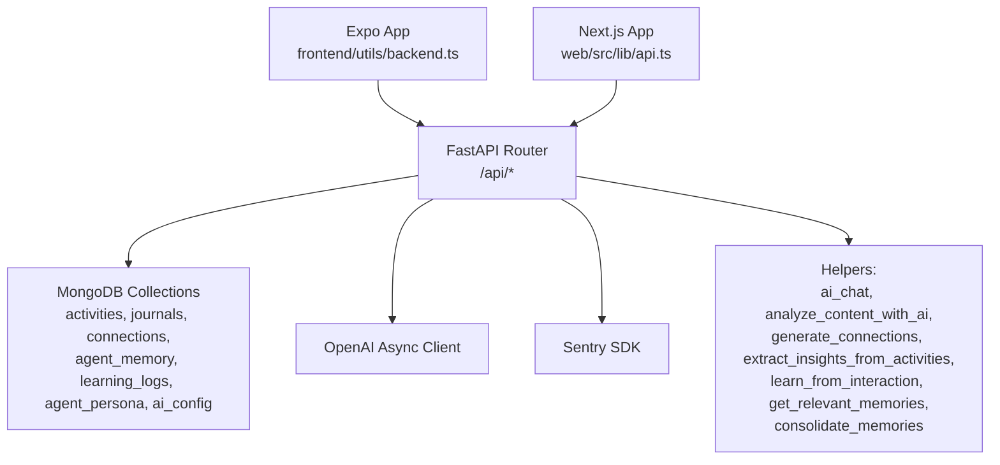

**Diagram sources**
- [server.py:74-1302](file://backend/server.py#L74-L1302)
- [backend.ts:56-76](file://frontend/utils/backend.ts#L56-L76)
- [api.ts:17-93](file://web/src/lib/api.ts#L17-L93)

## Detailed Component Analysis

### Data Models and Validation
The backend defines Pydantic models for all domain entities and request/response schemas. These models are used across endpoints to enforce validation and serialization.

```mermaid
classDiagram
class Activity {
+string id
+string title
+string url
+string source
+string category
+string content_type
+string notes
+datetime timestamp
+dict raw_data
+dict ai_analysis
+string hash
}
class ActivityCreate {
+string title
+string url
+string source
+string notes
+datetime timestamp
}
class Journal {
+string id
+string title
+string content
+string[] tags
+string[] linked_activities
+datetime timestamp
}
class JournalCreate {
+string title
+string content
+string[] tags
+string[] linked_activities
}
class Connection {
+string id
+string from_id
+string to_id
+string connection_type
+string ai_reasoning
+float strength
+datetime timestamp
}
class AIConfig {
+string id
+string provider
+string model
+string api_key
+bool is_active
}
class AIConfigCreate {
+string provider
+string model
+string api_key
}
class ExportRequest {
+string format
+bool include_journals
+bool include_activities
+bool include_connections
}
class ImportRequest {
+dict data
}
class AgentMemory {
+string id
+string memory_type
+string content
+string source
+dict metadata
+float importance
+datetime timestamp
+datetime last_accessed
+int access_count
}
class AgentPersona {
+string id
+string name
+string role
+string[] focus_areas
+dict learning_style_preferences
+string[] behavior_traits
+string custom_instructions
+bool is_active
+datetime updated_at
}
class LearningLog {
+string id
+string insight
+datetime learned_at
+dict source_data
+string[] applied_to
}
class PersonaUpdate {
+string name
+string role
+string[] focus_areas
+dict learning_style_preferences
+string[] behavior_traits
+string custom_instructions
}
```

**Diagram sources**
- [server.py:79-179](file://backend/server.py#L79-L179)

**Section sources**
- [server.py:79-179](file://backend/server.py#L79-L179)
- [types.ts:1-92](file://shared/types.ts#L1-L92)

### AI Operations and Business Logic
AI operations are implemented as reusable helpers that encapsulate prompt construction, JSON parsing, and error handling. They are invoked by endpoints to perform:
- Content analysis to categorize and annotate activities
- Connection generation between activities
- Learning suggestions based on recent activity history
- Insight extraction and memory consolidation
- Chat with agent memory and persona

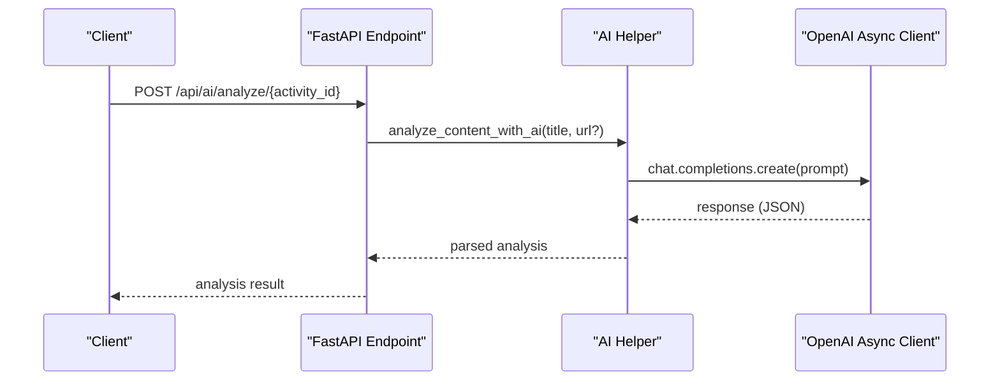

**Diagram sources**
- [server.py:192-233](file://backend/server.py#L192-L233)
- [server.py:788-807](file://backend/server.py#L788-L807)

**Section sources**
- [server.py:192-233](file://backend/server.py#L192-L233)
- [server.py:234-284](file://backend/server.py#L234-L284)
- [server.py:824-859](file://backend/server.py#L824-L859)
- [server.py:322-361](file://backend/server.py#L322-L361)
- [server.py:450-497](file://backend/server.py#L450-L497)

### Activities CRUD and Search
Endpoints support creating, uploading, retrieving, updating, deleting activities, and searching across all domains.

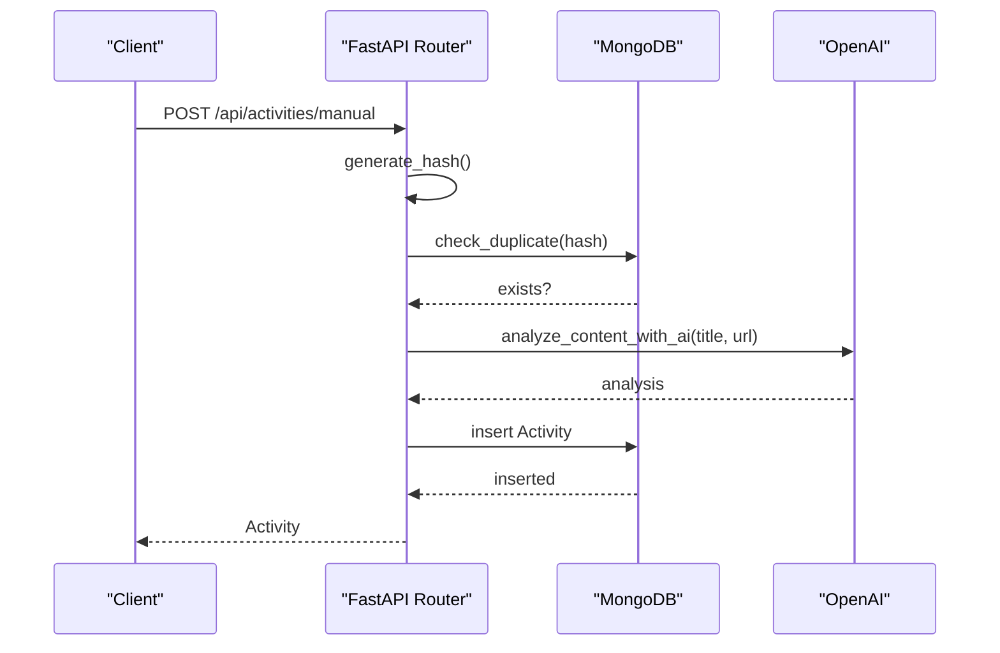

**Diagram sources**
- [server.py:525-551](file://backend/server.py#L525-L551)
- [server.py:182-191](file://backend/server.py#L182-L191)
- [server.py:192-233](file://backend/server.py#L192-L233)

**Section sources**
- [server.py:525-611](file://backend/server.py#L525-L611)
- [server.py:613-640](file://backend/server.py#L613-L640)
- [server.py:641-683](file://backend/server.py#L641-L683)

### Journal Management
Journals support full CRUD operations with tagging and linking to activities.

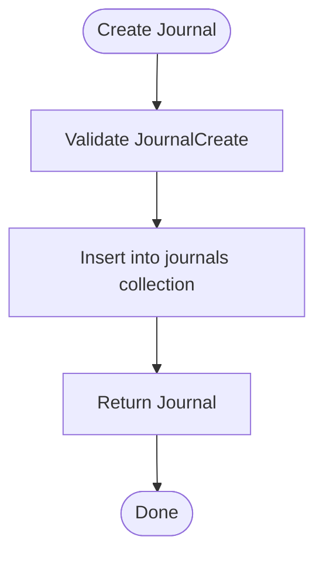

**Diagram sources**
- [server.py:741-751](file://backend/server.py#L741-L751)

**Section sources**
- [server.py:741-785](file://backend/server.py#L741-L785)

### AI Analysis, Connection Generation, Suggestions, and Config
- AI analysis per activity
- AI-powered connection generation
- AI suggestions for learning
- AI configuration management

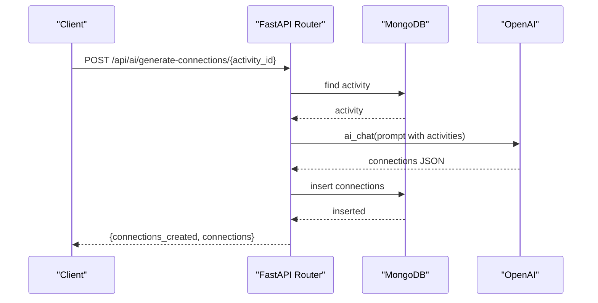

**Diagram sources**
- [server.py:808-817](file://backend/server.py#L808-L817)
- [server.py:234-284](file://backend/server.py#L234-L284)

**Section sources**
- [server.py:788-859](file://backend/server.py#L788-L859)
- [server.py:861-883](file://backend/server.py#L861-L883)

### Export/Import Functionality
Export endpoints produce structured data in multiple formats. Import restores state from exported data with deduplication and conflict handling.

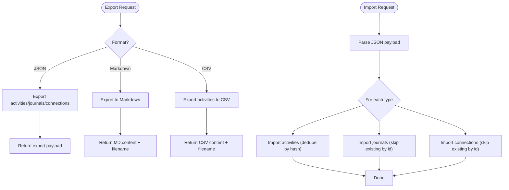

**Diagram sources**
- [server.py:885-910](file://backend/server.py#L885-L910)
- [server.py:912-944](file://backend/server.py#L912-L944)
- [server.py:945-964](file://backend/server.py#L945-L964)
- [server.py:966-1006](file://backend/server.py#L966-L1006)

**Section sources**
- [server.py:885-1006](file://backend/server.py#L885-L1006)

### Statistics and Notifications
Statistics endpoints aggregate counts and distributions. Notifications surface recent system events.

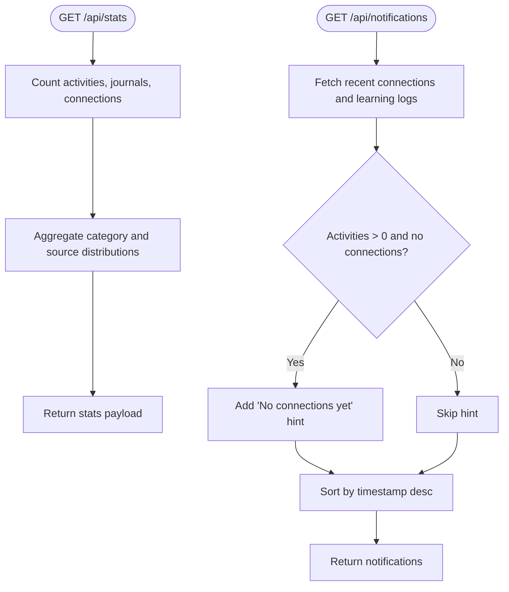

**Diagram sources**
- [server.py:1008-1033](file://backend/server.py#L1008-L1033)
- [server.py:685-731](file://backend/server.py#L685-L731)

**Section sources**
- [server.py:1008-1033](file://backend/server.py#L1008-L1033)
- [server.py:685-731](file://backend/server.py#L685-L731)

### Agent Memory, Persona, and Learning
Agent memory supports CRUD operations, relevance-based retrieval, and consolidation. Persona management allows customization of the agent’s behavior. Learning logs track insights and interactions.

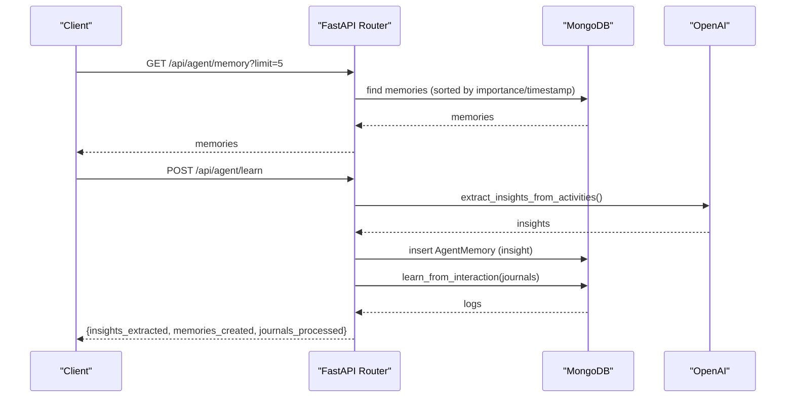

**Diagram sources**
- [server.py:1037-1127](file://backend/server.py#L1037-L1127)
- [server.py:322-401](file://backend/server.py#L322-L401)
- [server.py:450-497](file://backend/server.py#L450-L497)

**Section sources**
- [server.py:1037-1281](file://backend/server.py#L1037-L1281)

### Frontend Integration and Authentication
- The React Native app resolves the backend URL dynamically and caches it, allowing runtime configuration and persistence.
- The Next.js app constructs an API client pointing to the backend base URL plus the "/api" prefix.
- Environment variables configure backend URLs for both platforms.
- No explicit authentication middleware is present in the backend; CORS is enabled broadly for development.

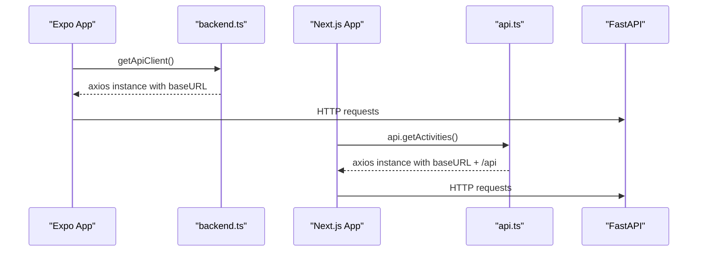

**Diagram sources**
- [backend.ts:56-76](file://frontend/utils/backend.ts#L56-L76)
- [api.ts:17-93](file://web/src/lib/api.ts#L17-L93)

**Section sources**
- [backend.ts:1-76](file://frontend/utils/backend.ts#L1-L76)
- [api.ts:1-93](file://web/src/lib/api.ts#L1-L93)
- [frontend/.env:1-2](file://frontend/.env#L1-L2)
- [web/.env.local:1-5](file://web/.env.local#L1-L5)

## Dependency Analysis
External dependencies include FastAPI, Motor, OpenAI, Pydantic, Sentry, and various serialization libraries. The backend uses async I/O for database and HTTP operations.

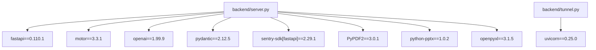

**Diagram sources**
- [requirements.txt:21-129](file://backend/requirements.txt#L21-L129)
- [server.py:1-25](file://backend/server.py#L1-L25)
- [tunnel.py:55-62](file://backend/tunnel.py#L55-L62)

**Section sources**
- [requirements.txt:21-129](file://backend/requirements.txt#L21-L129)
- [server.py:1-25](file://backend/server.py#L1-L25)

## Performance Considerations
- Use pagination and limits on endpoints that return large datasets (e.g., activities, journals, connections).
- Prefer projection and selective field retrieval where possible to reduce payload sizes.
- Batch operations for imports and exports to minimize round trips.
- Cache frequently accessed small resources (e.g., AI config) in memory.
- Monitor slow queries and add appropriate indexes on hot fields (e.g., timestamps, hashes).
- Use streaming for large exports (e.g., CSV) to reduce memory overhead.
- Enable Sentry profiling to identify hotspots in production.

## Troubleshooting Guide
Common issues and resolutions:
- Health check failures indicate database connectivity problems; verify MONGO_URL and DB_NAME environment variables.
- AI analysis failures often stem from malformed JSON responses; the backend strips code fences and falls back to defaults.
- Duplicate activity creation errors occur when hash-based deduplication detects near-identical entries.
- CORS issues in development can be resolved by ensuring the frontend resolves the correct backend URL.
- Sentry configuration requires a valid DSN; otherwise, errors are logged locally only.

Operational checks:
- Use the health endpoint to confirm database and AI configuration status.
- Review Sentry dashboard for exceptions and performance traces.
- Validate environment variables for backend URL resolution in both apps.

**Section sources**
- [server.py:500-518](file://backend/server.py#L500-L518)
- [server.py:192-233](file://backend/server.py#L192-L233)
- [server.py:532-534](file://backend/server.py#L532-L534)
- [backend.ts:23-34](file://frontend/utils/backend.ts#L23-L34)
- [web/.env.local:1-5](file://web/.env.local#L1-L5)

## Conclusion
The backend provides a robust, async-first REST API integrating MongoDB and OpenAI to power learning activity tracking, journaling, AI-driven insights, and export/import workflows. Its modular design, strong validation, and observability make it suitable for both rapid iteration and production deployments. The frontend integrations are straightforward, enabling seamless consumption of the API across platforms.

## Appendices

### API Endpoint Reference
- Activities
  - POST /api/activities/manual
  - POST /api/activities/upload
  - GET /api/activities
  - GET /api/activities/{activity_id}
  - DELETE /api/activities/{activity_id}
  - GET /api/search?q&limit
  - GET /api/notifications?limit
- Journals
  - POST /api/journals
  - GET /api/journals
  - PUT /api/journals/{journal_id}
  - DELETE /api/journals/{journal_id}
- AI Operations
  - POST /api/ai/analyze/{activity_id}
  - POST /api/ai/generate-connections/{activity_id}
  - GET /api/ai/suggestions
  - POST /api/ai-config
  - GET /api/ai-config
- Export/Import
  - POST /api/export/json
  - POST /api/export/markdown
  - POST /api/export/csv
  - POST /api/import/restore
- Statistics
  - GET /api/stats
- Agent Memory, Persona, and Learning
  - GET /api/agent/memory
  - POST /api/agent/memory
  - PUT /api/agent/memory/{memory_id}
  - DELETE /api/agent/memory/{memory_id}
  - POST /api/agent/learn
  - POST /api/agent/consolidate
  - GET /api/agent/persona
  - PUT /api/agent/persona
  - GET /api/agent/learning-logs
  - GET /api/agent/chat
  - GET /api/agent/stats
- System
  - GET /api/health
  - GET /

**Section sources**
- [server.py:524-1281](file://backend/server.py#L524-L1281)

### Environment Variables
- Backend
  - MONGO_URL, DB_NAME
  - OPENAI_API_KEY
  - SENTRY_DSN (optional)
  - SENTRY_ENV, SENTRY_RELEASE (optional)
- Frontend (Expo)
  - EXPO_PUBLIC_BACKEND_URL
- Frontend (Next.js)
  - NEXT_PUBLIC_BACKEND_URL
  - NEXT_PUBLIC_SENTRY_DSN (optional)

**Section sources**
- [server.py:44-41](file://backend/server.py#L44-L41)
- [frontend/.env:1](file://frontend/.env#L1)
- [web/.env.local:1-5](file://web/.env.local#L1-L5)

### Deployment and Tunneling
- Use the tunnel script to start a Cloudflare tunnel and automatically update the frontend environment variable for the Expo app.
- The backend runs via Uvicorn on port 8001.

**Section sources**
- [tunnel.py:40-65](file://backend/tunnel.py#L40-L65)
- [tunnel.py:55-62](file://backend/tunnel.py#L55-L62)