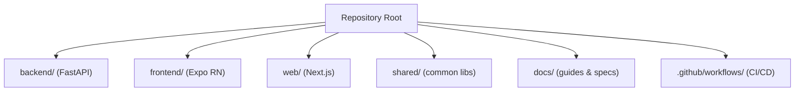
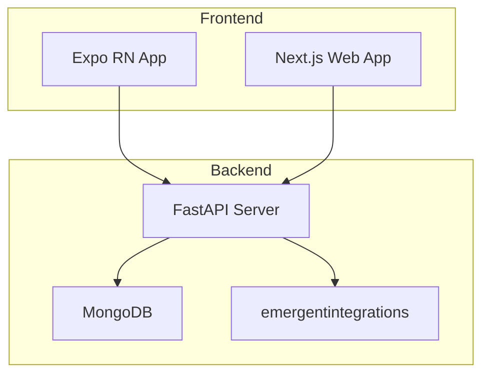
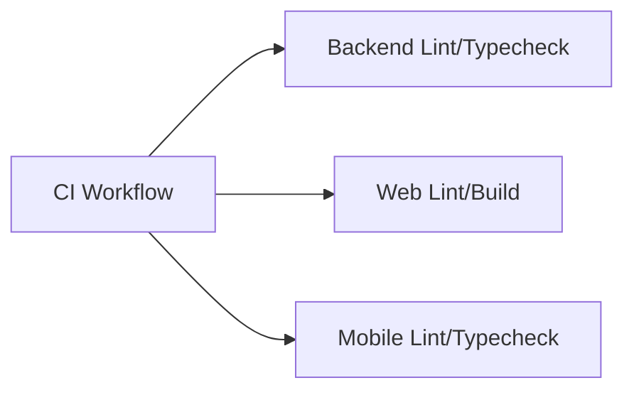
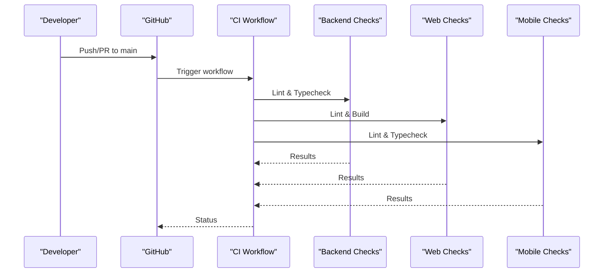
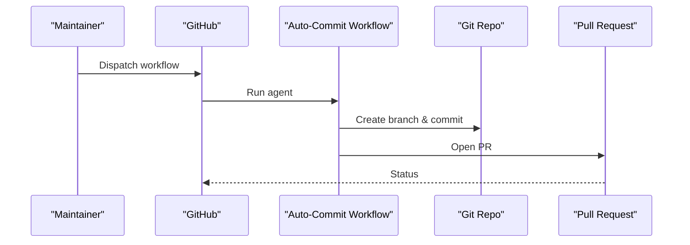

# Contributing

<cite>
**Referenced Files in This Document**
- [README.md](file://README.md)
- [SETUP_GUIDE.md](file://SETUP_GUIDE.md)
- [ROADMAP.md](file://ROADMAP.md)
- [.github/workflows/ci.yml](file://.github/workflows/ci.yml)
- [.github/workflows/auto-commit.yml](file://.github/workflows/auto-commit.yml)
- [backend_test.py](file://backend_test.py)
- [test_result.md](file://test_result.md)
- [IMPLEMENTATION_SUMMARY.md](file://IMPLEMENTATION_SUMMARY.md)
- [docs/00_USER_GUIDE.md](file://docs/00_USER_GUIDE.md)
- [docs/01_PROJECT_PLAN.md](file://docs/01_PROJECT_PLAN.md)
</cite>

## Table of Contents
1. [Introduction](#introduction)
2. [Project Structure](#project-structure)
3. [Core Components](#core-components)
4. [Architecture Overview](#architecture-overview)
5. [Detailed Component Analysis](#detailed-component-analysis)
6. [Dependency Analysis](#dependency-analysis)
7. [Performance Considerations](#performance-considerations)
8. [Troubleshooting Guide](#troubleshooting-guide)
9. [Conclusion](#conclusion)
10. [Appendices](#appendices)

## Introduction
This guide explains how to contribute effectively to Polymath OS. It covers the development workflow (forking, branching, PRs), code review expectations, testing requirements, documentation standards, community guidelines, and the release process. The goal is to help you deliver high-quality changes quickly while keeping the project consistent and maintainable.

## Project Structure
Polymath OS is a multi-platform project with:
- A FastAPI backend (Python) under the backend directory
- An Expo React Native frontend (TypeScript) under the frontend directory
- A Next.js web app under the web directory
- Shared libraries under shared
- Extensive documentation under docs
- CI/CD workflows under .github/workflows

**Section sources**
- [README.md:63-103](file://README.md#L63-L103)
- [SETUP_GUIDE.md:281-310](file://SETUP_GUIDE.md#L281-L310)

## Core Components
- Backend (FastAPI): REST API with AI integration, export/import, and MongoDB persistence
- Frontend (Expo RN): Mobile-first UI with tab navigation, state management, and theme system
- Web (Next.js): Responsive desktop experience mirroring mobile features
- Shared: Common types and utilities used across platforms
- Docs: User and technical documentation, design system, and roadmap

**Section sources**
- [README.md:63-103](file://README.md#L63-L103)
- [ROADMAP.md:139-211](file://ROADMAP.md#L139-L211)
- [docs/01_PROJECT_PLAN.md:240-276](file://docs/01_PROJECT_PLAN.md#L240-L276)

## Architecture Overview
The system follows a layered architecture:
- UI (Expo RN and Next.js) communicates with the backend via REST APIs
- Backend uses FastAPI, async MongoDB via Motor, and emergentintegrations for AI
- CI enforces linting and type checks across backend, web, and mobile

**Diagram sources**
- [README.md:78-83](file://README.md#L78-L83)
- [.github/workflows/ci.yml:14-100](file://.github/workflows/ci.yml#L14-L100)

**Section sources**
- [README.md:78-83](file://README.md#L78-L83)
- [.github/workflows/ci.yml:14-100](file://.github/workflows/ci.yml#L14-L100)

## Detailed Component Analysis

### Contribution Workflow: Fork, Branch, PR
- Fork the repository on GitHub
- Clone your fork locally
- Create a feature branch named descriptively (see Branch Naming Conventions)
- Commit changes following the project’s style and add tests where applicable
- Push your branch and open a Pull Request targeting the main branch
- Ensure CI passes and address reviewer feedback promptly

Branch naming conventions
- Use kebab-case
- Prefix with feature/, fix/, chore/, docs/, refactor/
- Include a short, descriptive suffix (e.g., feature/add-export-formats, fix/mongo-duplicate-check)

Pull Request expectations
- Keep PRs focused and small
- Reference related issues
- Include screenshots or short demos for UI changes
- Update documentation and tests as needed

**Section sources**
- [.github/workflows/ci.yml:3-11](file://.github/workflows/ci.yml#L3-L11)
- [ROADMAP.md:139-211](file://ROADMAP.md#L139-L211)

### Code Review Process
- Automated checks run on push and pull_request to main
- Reviewers are assigned automatically or by maintainers
- Feedback incorporation
  - Address comments directly in the PR
  - Re-run checks after changes
- Approval criteria
  - All CI jobs passing
  - Code meets style and correctness standards
  - Tests updated or added
  - Documentation updated if user-visible

**Section sources**
- [.github/workflows/ci.yml:14-100](file://.github/workflows/ci.yml#L14-L100)

### Testing Requirements
- Backend tests
  - Use the provided script to validate new agent memory endpoints and other backend features
  - Confirm API responses, data shapes, and error handling
- Frontend and web tests
  - Ensure UI flows work as expected and pass lint/type checks
- Test report submission
  - Document outcomes in a concise summary aligned with the established protocol
  - Include environment details, test scenarios, and pass/fail outcomes

Examples of testing artifacts
- Backend test runner for agent memory endpoints
- Test result summary documenting endpoint coverage and fixes

**Section sources**
- [backend_test.py:1-456](file://backend_test.py#L1-L456)
- [test_result.md:105-332](file://test_result.md#L105-L332)
- [.github/workflows/ci.yml:14-100](file://.github/workflows/ci.yml#L14-L100)

### Documentation Standards
- README updates
  - Reflect new features, API changes, and environment setup steps
- API documentation
  - Keep endpoint references accurate; update when adding or changing endpoints
- Architectural diagrams
  - Add or update diagrams in docs to reflect system changes
- User documentation
  - Update user guides when introducing new workflows or UI changes

**Section sources**
- [README.md:113-141](file://README.md#L113-L141)
- [docs/00_USER_GUIDE.md:1-80](file://docs/00_USER_GUIDE.md#L1-L80)
- [docs/01_PROJECT_PLAN.md:148-174](file://docs/01_PROJECT_PLAN.md#L148-L174)

### Community Guidelines
- Code of Conduct
  - Treat each other professionally and respectfully
- Communication channels
  - Use GitHub Discussions or Issues for questions and proposals
- Issue reporting
  - Provide clear reproduction steps, expected vs. actual behavior, and environment details
- Contributor recognition
  - Contributors who consistently improve code quality and documentation will be invited to maintain

**Section sources**
- [README.md:142-167](file://README.md#L142-L167)

### Release Process
- Versioning
  - Use semantic versioning (MAJOR.MINOR.PATCH)
- Changelog maintenance
  - Summarize breaking changes, new features, fixes, and performance improvements
- Deployment
  - Backend: deployable to platforms supporting FastAPI apps
  - Mobile: build and distribute via Expo EAS or platform stores
  - Web: deploy to Vercel or equivalent static hosting

**Section sources**
- [ROADMAP.md:113-123](file://ROADMAP.md#L113-L123)
- [IMPLEMENTATION_SUMMARY.md:742-746](file://IMPLEMENTATION_SUMMARY.md#L742-L746)

### Practical Examples and Common Pitfalls
Successful contribution examples
- Adding new backend endpoints with tests and documentation updates
- Improving frontend UI with consistent theming and accessibility
- Enhancing export/import logic with clearer error messages

Common pitfalls to avoid
- Skipping tests or documentation updates
- Ignoring CI failures
- Large, unfocused PRs
- Breaking backward compatibility without clear justification

**Section sources**
- [backend_test.py:381-439](file://backend_test.py#L381-L439)
- [test_result.md:105-332](file://test_result.md#L105-L332)
- [README.md:142-167](file://README.md#L142-L167)

### Types of Contributions
- Bug fixes
  - Reproduce the issue, fix the root cause, add regression tests
- Feature additions
  - Define clear acceptance criteria, implement backend and frontend, update docs
- Documentation improvements
  - Clarify user guides, API docs, and architectural notes
- UI enhancements
  - Maintain design system consistency, test on multiple devices, update themes

**Section sources**
- [docs/00_USER_GUIDE.md:1-80](file://docs/00_USER_GUIDE.md#L1-L80)
- [docs/01_PROJECT_PLAN.md:148-174](file://docs/01_PROJECT_PLAN.md#L148-L174)

## Dependency Analysis
The CI pipeline enforces linting and type checking across backend, web, and mobile layers. This ensures consistent quality and reduces integration risks.

**Diagram sources**
- [.github/workflows/ci.yml:14-100](file://.github/workflows/ci.yml#L14-L100)

**Section sources**
- [.github/workflows/ci.yml:14-100](file://.github/workflows/ci.yml#L14-L100)

## Performance Considerations
- Keep PRs small to reduce merge conflicts and review time
- Prefer incremental improvements to complex features
- Optimize database queries and caching where changes touch backend logic
- Ensure UI remains responsive, especially on lower-end devices

## Troubleshooting Guide
- CI failures
  - Review failing job logs; address lint/type errors
- Backend API issues
  - Validate request/response shapes and error codes
  - Confirm MongoDB connectivity and indexes
- Frontend/web issues
  - Check environment variables and base URLs
  - Verify package installations and dependency versions

**Section sources**
- [.github/workflows/ci.yml:14-100](file://.github/workflows/ci.yml#L14-L100)
- [SETUP_GUIDE.md:211-277](file://SETUP_GUIDE.md#L211-L277)

## Conclusion
By following this guide, you help maintain Polymath OS’s quality, consistency, and momentum. Thank you for contributing—your efforts make the project stronger and more valuable to the community.

## Appendices

### Appendix A: CI/CD Overview

**Diagram sources**
- [.github/workflows/ci.yml:3-11](file://.github/workflows/ci.yml#L3-L11)
- [.github/workflows/ci.yml:14-100](file://.github/workflows/ci.yml#L14-L100)

### Appendix B: AI Agent Auto-Commit Flow

**Diagram sources**
- [.github/workflows/auto-commit.yml:11-91](file://.github/workflows/auto-commit.yml#L11-L91)