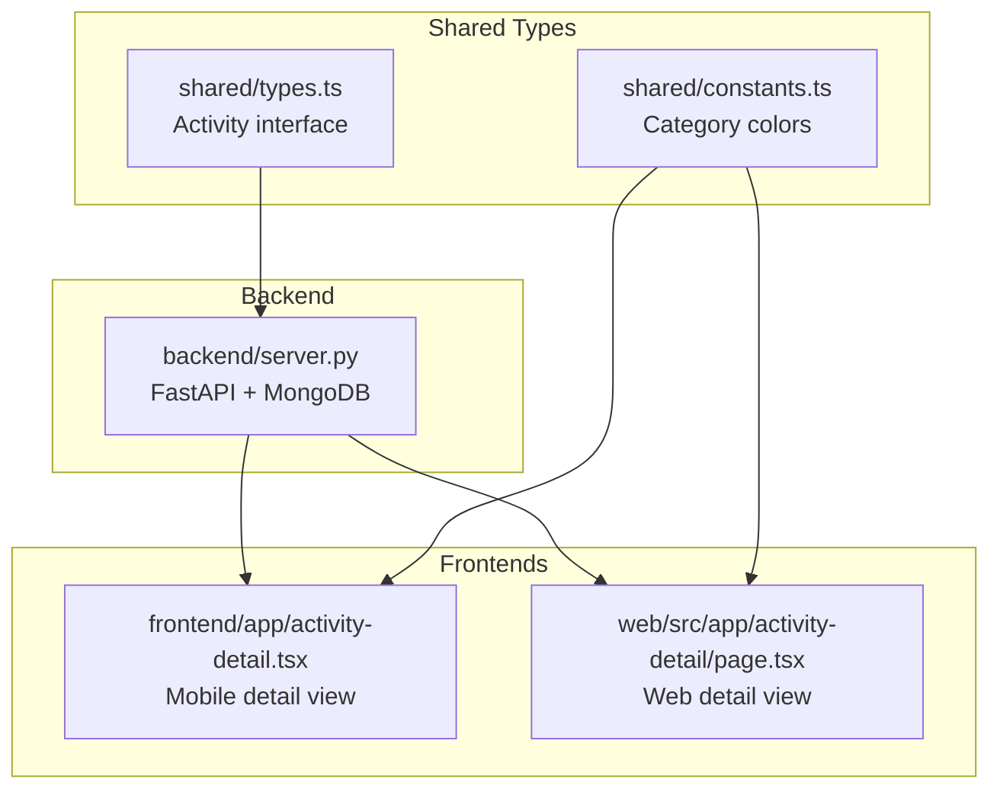
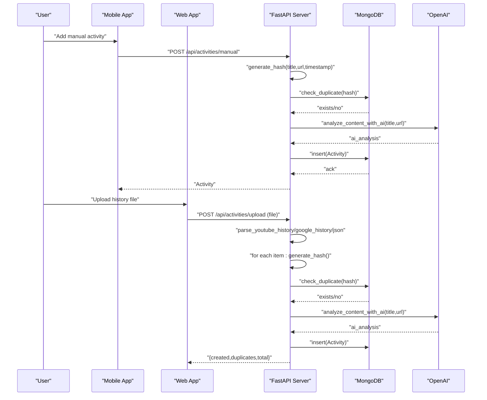
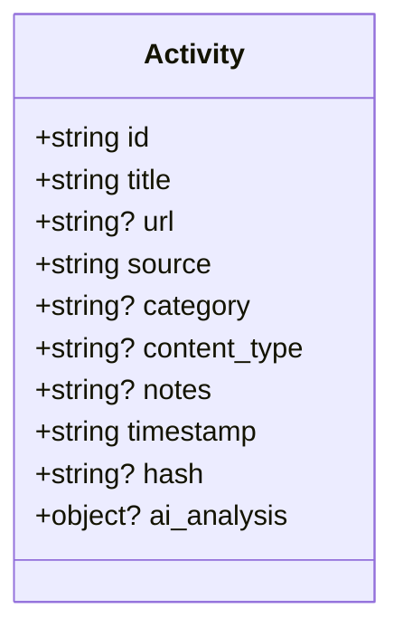
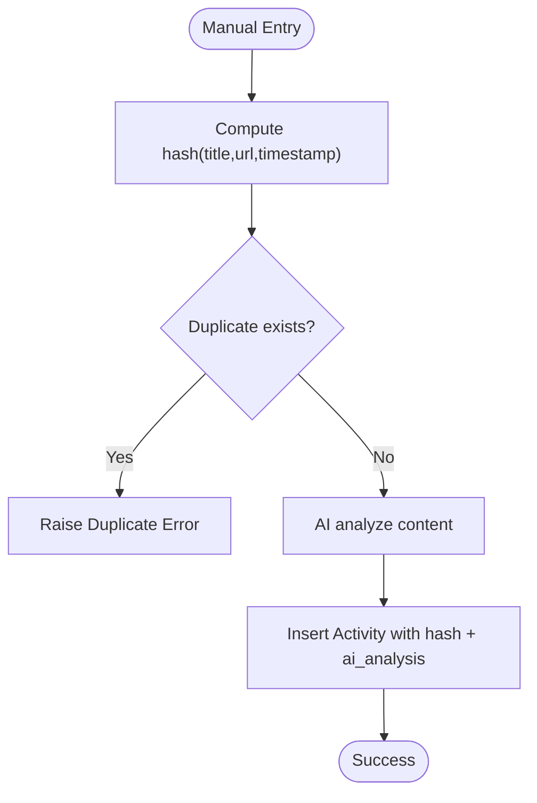
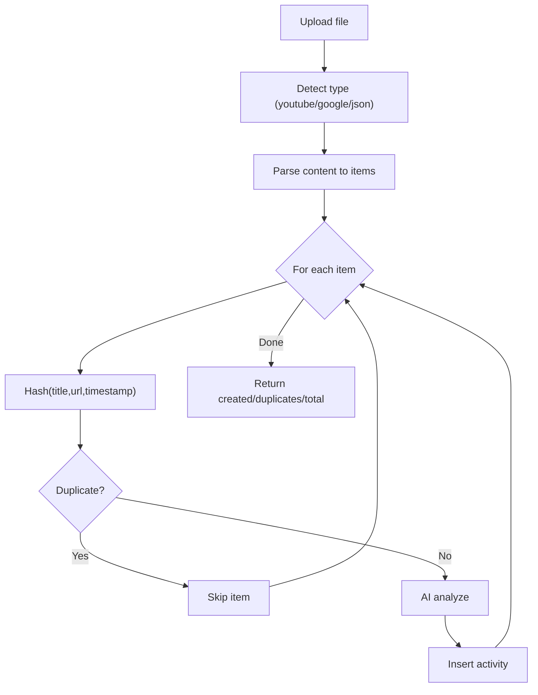
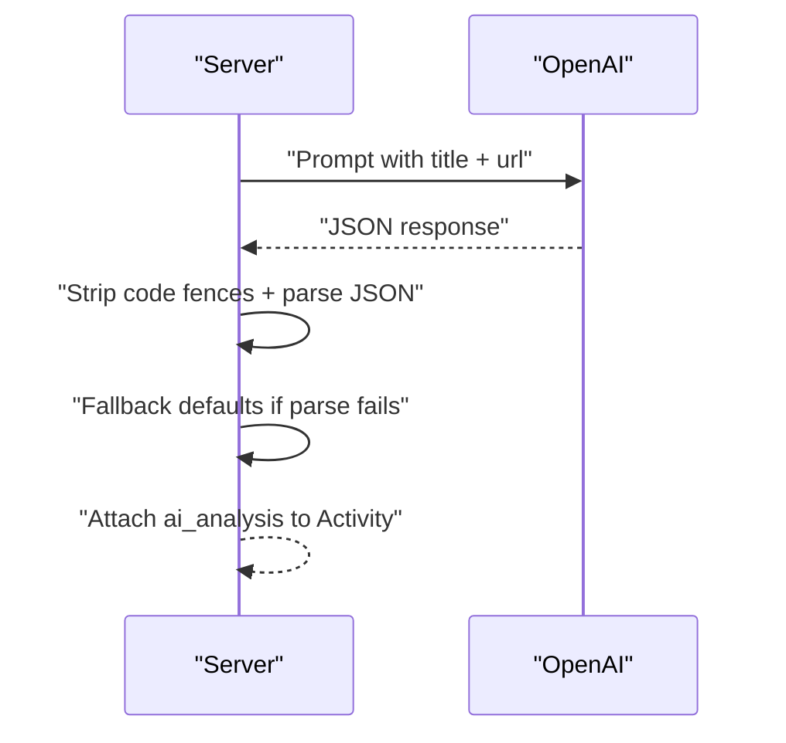
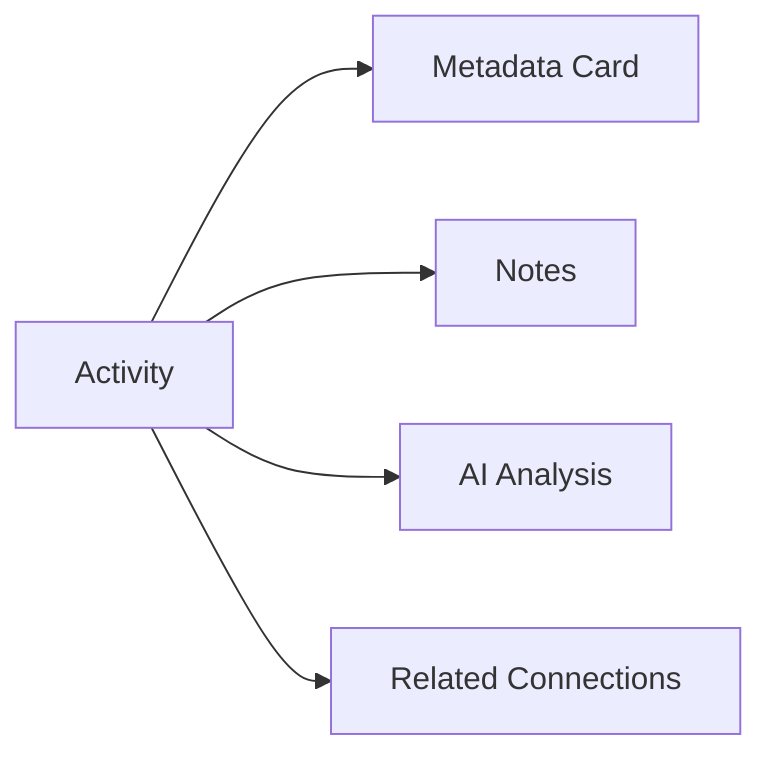
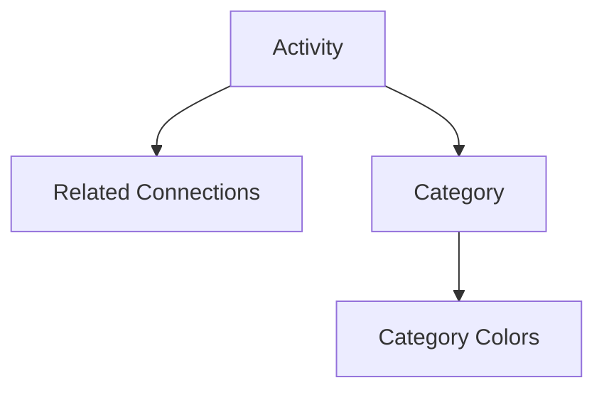
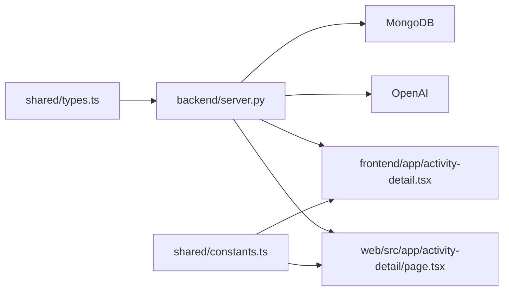

# Activity Tracking

<cite>
**Referenced Files in This Document**
- [types.ts](file://shared/types.ts)
- [server.py](file://backend/server.py)
- [activity-detail.tsx](file://frontend/app/activity-detail.tsx)
- [page.tsx](file://web/src/app/activity-detail/page.tsx)
- [constants.ts](file://shared/constants.ts)
</cite>

## Table of Contents
1. [Introduction](#introduction)
2. [Project Structure](#project-structure)
3. [Core Components](#core-components)
4. [Architecture Overview](#architecture-overview)
5. [Detailed Component Analysis](#detailed-component-analysis)
6. [Dependency Analysis](#dependency-analysis)
7. [Performance Considerations](#performance-considerations)
8. [Troubleshooting Guide](#troubleshooting-guide)
9. [Conclusion](#conclusion)
10. [Appendices](#appendices)

## Introduction
This document explains the Activity Tracking feature in Polymath OS, focusing on how learning activities are captured, validated, deduplicated, and enriched with AI-powered metadata. It covers:
- Dual input mechanisms: manual entry with URL validation and automatic deduplication, and batch uploads for historical data
- The activity data model and fields
- The AI-powered content analysis workflow that categorizes activities and extracts metadata
- The deduplication algorithm preventing duplicate entries
- Practical examples of creating, editing, and viewing activities
- Integration with the knowledge visualization system and how activities form the building blocks for dot-to-dot connections
- Common use cases and troubleshooting guidance

## Project Structure
The Activity Tracking feature spans three layers:
- Shared data model: TypeScript interfaces define the activity structure used across platforms
- Backend service: FastAPI endpoints handle creation, upload, deduplication, AI analysis, and retrieval
- Frontends: React Native mobile and Next.js web render activity details and integrate with the backend

**Diagram sources**
- [types.ts:1-92](file://shared/types.ts#L1-L92)
- [constants.ts:1-24](file://shared/constants.ts#L1-L24)
- [server.py:79-91](file://backend/server.py#L79-L91)
- [activity-detail.tsx:1-325](file://frontend/app/activity-detail.tsx#L1-L325)
- [page.tsx:1-186](file://web/src/app/activity-detail/page.tsx#L1-L186)

**Section sources**
- [types.ts:1-92](file://shared/types.ts#L1-L92)
- [server.py:79-91](file://backend/server.py#L79-L91)
- [activity-detail.tsx:1-325](file://frontend/app/activity-detail.tsx#L1-L325)
- [page.tsx:1-186](file://web/src/app/activity-detail/page.tsx#L1-L186)
- [constants.ts:1-24](file://shared/constants.ts#L1-L24)

## Core Components
- Activity data model: The Activity interface defines the canonical shape of an activity across the system, including identifiers, title, URL, source, category, content type, notes, timestamp, hash, and AI analysis metadata.
- Backend endpoints:
  - Manual creation endpoint validates inputs, computes a hash, checks for duplicates, runs AI analysis, and persists the activity
  - Batch upload endpoint parses supported history files, deduplicates entries, runs AI analysis, and returns summary statistics
  - Retrieval endpoints serve lists and details, including related connections for visualization
- Frontend views:
  - Mobile detail view renders activity metadata, notes, AI analysis, and related connections
  - Web detail view mirrors the mobile rendering with a web-friendly UI

Key fields in the Activity model:
- id: Unique identifier
- title: Human-readable title
- url: Optional URL for the source
- source: Origin of the activity (manual, youtube, google, upload)
- category: AI-derived category
- content_type: AI-derived content type
- notes: Optional personal notes
- timestamp: Creation or recorded time
- hash: SHA-256 fingerprint used for deduplication
- ai_analysis: Structured AI metadata (category, content_type, key topics, domain, learning value)

**Section sources**
- [types.ts:1-18](file://shared/types.ts#L1-L18)
- [server.py:79-91](file://backend/server.py#L79-L91)
- [server.py:525-551](file://backend/server.py#L525-L551)
- [server.py:553-611](file://backend/server.py#L553-L611)
- [server.py:623-639](file://backend/server.py#L623-L639)
- [activity-detail.tsx:102-233](file://frontend/app/activity-detail.tsx#L102-L233)
- [page.tsx:8-171](file://web/src/app/activity-detail/page.tsx#L8-L171)

## Architecture Overview
The system integrates a mobile-first and web-first UI with a centralized backend that enforces data integrity and enriches content via AI.

**Diagram sources**
- [server.py:525-551](file://backend/server.py#L525-L551)
- [server.py:553-611](file://backend/server.py#L553-L611)
- [server.py:182-190](file://backend/server.py#L182-L190)
- [server.py:192-232](file://backend/server.py#L192-L232)
- [server.py:285-301](file://backend/server.py#L285-L301)
- [server.py:302-317](file://backend/server.py#L302-L317)

## Detailed Component Analysis

### Activity Data Model
The Activity interface defines the canonical structure used across the system. It includes:
- Identity: id, hash
- Content: title, url, notes
- Context: source, timestamp
- AI enrichment: category, content_type, ai_analysis
- Cross-linking: related_connections returned by retrieval endpoints

**Diagram sources**
- [types.ts:1-18](file://shared/types.ts#L1-L18)

**Section sources**
- [types.ts:1-18](file://shared/types.ts#L1-L18)

### Manual Activity Entry and Deduplication
Manual entry supports URL-backed activities. The backend:
- Computes a deterministic hash from title, URL, and timestamp
- Checks for existing records with the same hash
- Prevents duplicates by raising an error if a match is found
- Calls AI to analyze content and enrich metadata
- Persists the activity with computed fields

**Diagram sources**
- [server.py:525-551](file://backend/server.py#L525-L551)
- [server.py:182-190](file://backend/server.py#L182-L190)
- [server.py:192-232](file://backend/server.py#L192-L232)

**Section sources**
- [server.py:525-551](file://backend/server.py#L525-L551)
- [server.py:182-190](file://backend/server.py#L182-L190)
- [server.py:192-232](file://backend/server.py#L192-L232)

### Batch Upload Processing
Batch imports support YouTube and Google history files. The backend:
- Detects file type by filename
- Parses JSON content into normalized activity items
- Iterates items, computes hashes, checks duplicates, and inserts new records
- Returns counts for created, duplicates skipped, and total processed

**Diagram sources**
- [server.py:553-611](file://backend/server.py#L553-L611)
- [server.py:285-301](file://backend/server.py#L285-L301)
- [server.py:302-317](file://backend/server.py#L302-L317)
- [server.py:182-190](file://backend/server.py#L182-L190)
- [server.py:192-232](file://backend/server.py#L192-L232)

**Section sources**
- [server.py:553-611](file://backend/server.py#L553-L611)
- [server.py:285-301](file://backend/server.py#L285-L301)
- [server.py:302-317](file://backend/server.py#L302-L317)

### AI-Powered Content Analysis Workflow
The backend queries OpenAI to derive:
- Category: e.g., AI, News, Tools, Market, Research, Tutorial, Other
- Content Type: e.g., Video, Article, Blog, Course, Documentation
- Key Topics: a list of extracted concepts
- Domain: Technology, Science, Business, Arts
- Learning Value: numeric score

The AI response is sanitized and parsed into the activity’s ai_analysis field. Defaults are applied if parsing fails.

**Diagram sources**
- [server.py:192-232](file://backend/server.py#L192-L232)

**Section sources**
- [server.py:192-232](file://backend/server.py#L192-L232)

### Activity Detail Views
Both mobile and web detail pages present:
- Metadata: content type/badge, source, URL
- Notes: user-added notes
- AI Analysis: summary, key concepts, category
- Connections: related links with strength and reasoning

**Diagram sources**
- [activity-detail.tsx:102-233](file://frontend/app/activity-detail.tsx#L102-L233)
- [page.tsx:66-171](file://web/src/app/activity-detail/page.tsx#L66-L171)

**Section sources**
- [activity-detail.tsx:102-233](file://frontend/app/activity-detail.tsx#L102-L233)
- [page.tsx:66-171](file://web/src/app/activity-detail/page.tsx#L66-L171)

### Integration with Knowledge Visualization
Activities feed the broader knowledge graph:
- Retrieval endpoints include related connections for visualization
- Category and content type inform UI theming and filtering
- Category colors are centrally defined for consistent presentation

**Diagram sources**
- [server.py:623-639](file://backend/server.py#L623-L639)
- [constants.ts:1-24](file://shared/constants.ts#L1-L24)

**Section sources**
- [server.py:623-639](file://backend/server.py#L623-L639)
- [constants.ts:1-24](file://shared/constants.ts#L1-L24)

## Dependency Analysis
- Shared types define the contract between frontend and backend
- Backend depends on MongoDB for persistence and OpenAI for enrichment
- Frontends depend on backend APIs for CRUD and detail retrieval
- Category colors are consumed by both frontends for consistent visuals

**Diagram sources**
- [types.ts:1-92](file://shared/types.ts#L1-L92)
- [server.py:43-50](file://backend/server.py#L43-L50)
- [activity-detail.tsx:1-325](file://frontend/app/activity-detail.tsx#L1-L325)
- [page.tsx:1-186](file://web/src/app/activity-detail/page.tsx#L1-L186)
- [constants.ts:1-24](file://shared/constants.ts#L1-L24)

**Section sources**
- [types.ts:1-92](file://shared/types.ts#L1-L92)
- [server.py:43-50](file://backend/server.py#L43-L50)
- [activity-detail.tsx:1-325](file://frontend/app/activity-detail.tsx#L1-L325)
- [page.tsx:1-186](file://web/src/app/activity-detail/page.tsx#L1-L186)
- [constants.ts:1-24](file://shared/constants.ts#L1-L24)

## Performance Considerations
- Hash computation is O(n) per record; batch uploads process sequentially. Consider batching insertions and parallelizing AI calls if throughput becomes a bottleneck.
- AI calls are rate-limited; implement retries with backoff and consider caching frequent analyses.
- Deduplication queries on hash are efficient with proper indexing in MongoDB.
- Frontend rendering of long lists benefits from virtualization and pagination.

## Troubleshooting Guide
Common issues and resolutions:
- Duplicate activity detected during manual entry
  - Cause: Same hash exists (title, URL, timestamp identical)
  - Resolution: Modify title or timestamp, or reuse existing entry
  - Section sources
    - [server.py:525-551](file://backend/server.py#L525-L551)
    - [server.py:182-190](file://backend/server.py#L182-L190)

- URL parsing/validation errors
  - Cause: Malformed or unsupported URLs
  - Resolution: Ensure URLs are valid and reachable; verify protocol and host
  - Section sources
    - [server.py:525-551](file://backend/server.py#L525-L551)

- Batch upload failures
  - Cause: Unsupported file format or malformed JSON
  - Resolution: Confirm filename hints (youtube/google) or valid JSON array; check timestamps are ISO formatted
  - Section sources
    - [server.py:553-611](file://backend/server.py#L553-L611)
    - [server.py:285-301](file://backend/server.py#L285-L301)
    - [server.py:302-317](file://backend/server.py#L302-L317)

- AI analysis errors or missing metadata
  - Cause: OpenAI API key not configured or response parsing failure
  - Resolution: Verify environment configuration; fallback defaults apply if parsing fails
  - Section sources
    - [server.py:48-50](file://backend/server.py#L48-L50)
    - [server.py:192-232](file://backend/server.py#L192-L232)

- Viewing activity details
  - Cause: Activity not found or network error
  - Resolution: Confirm activity ID; check backend health endpoint and connectivity
  - Section sources
    - [server.py:623-639](file://backend/server.py#L623-L639)
    - [activity-detail.tsx:37-49](file://frontend/app/activity-detail.tsx#L37-L49)
    - [page.tsx:14-20](file://web/src/app/activity-detail/page.tsx#L14-L20)

## Conclusion
The Activity Tracking feature provides robust mechanisms for capturing learning activities through manual entry and batch imports, with strong deduplication guarantees and AI-driven enrichment. Activities serve as the foundational nodes for knowledge visualization, enabling dot-to-dot connections and insights across the Polymath OS ecosystem.

## Appendices

### Practical Examples
- Creating a manual activity
  - Endpoint: POST /api/activities/manual
  - Fields: title, url (optional), source, notes (optional), timestamp (optional)
  - Behavior: hash computed, duplicate checked, AI analysis performed, persisted
  - Section sources
    - [server.py:525-551](file://backend/server.py#L525-L551)

- Uploading historical data
  - Endpoint: POST /api/activities/upload
  - Supported files: YouTube watch history, Google search history, generic JSON arrays
  - Behavior: parse → deduplicate → analyze → insert → summary response
  - Section sources
    - [server.py:553-611](file://backend/server.py#L553-L611)
    - [server.py:285-301](file://backend/server.py#L285-L301)
    - [server.py:302-317](file://backend/server.py#L302-L317)

- Viewing activity details
  - Endpoint: GET /api/activities/{activity_id}
  - Includes related connections for visualization
  - Section sources
    - [server.py:623-639](file://backend/server.py#L623-L639)
    - [activity-detail.tsx:37-49](file://frontend/app/activity-detail.tsx#L37-L49)
    - [page.tsx:14-20](file://web/src/app/activity-detail/page.tsx#L14-L20)

### Common Use Cases
- Adding YouTube videos
  - Use batch upload with a YouTube history file; URLs are parsed and deduplicated
  - Section sources
    - [server.py:285-301](file://backend/server.py#L285-L301)
    - [server.py:553-611](file://backend/server.py#L553-L611)

- Adding research papers and blog posts
  - Use manual entry with URL; AI analysis infers category/content type and extracts topics
  - Section sources
    - [server.py:525-551](file://backend/server.py#L525-L551)
    - [server.py:192-232](file://backend/server.py#L192-L232)