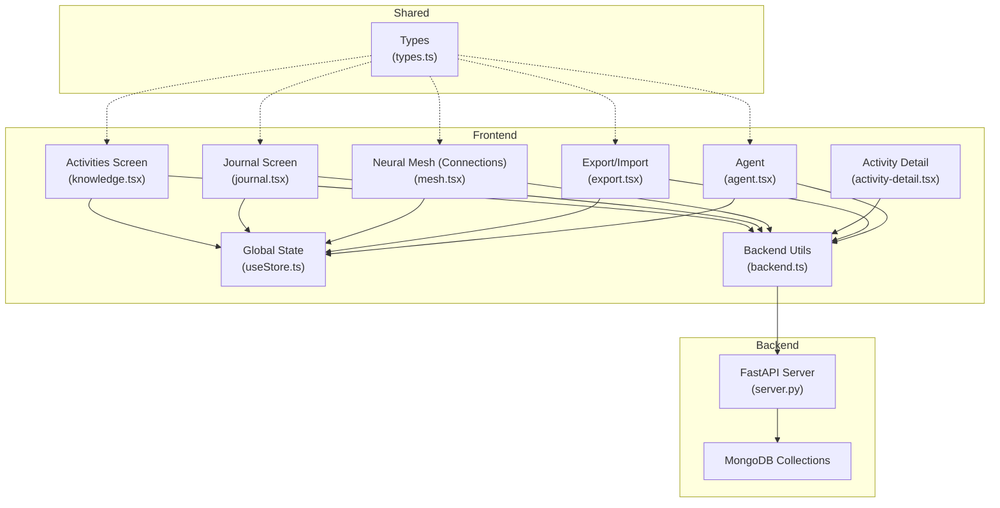
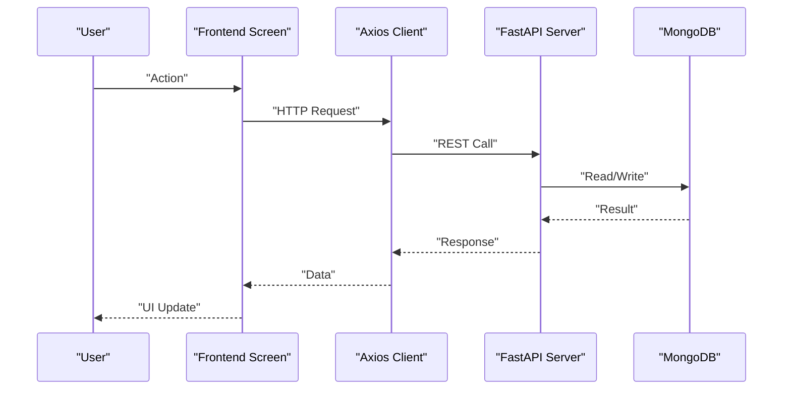
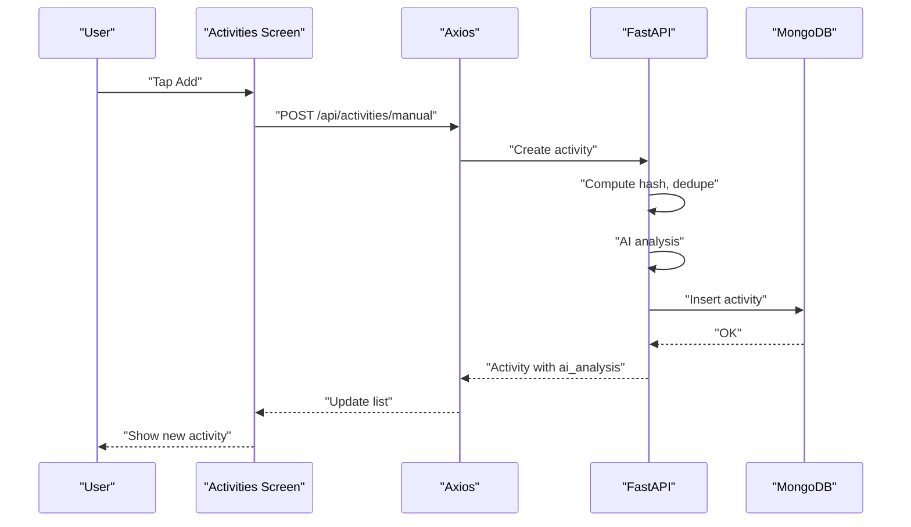
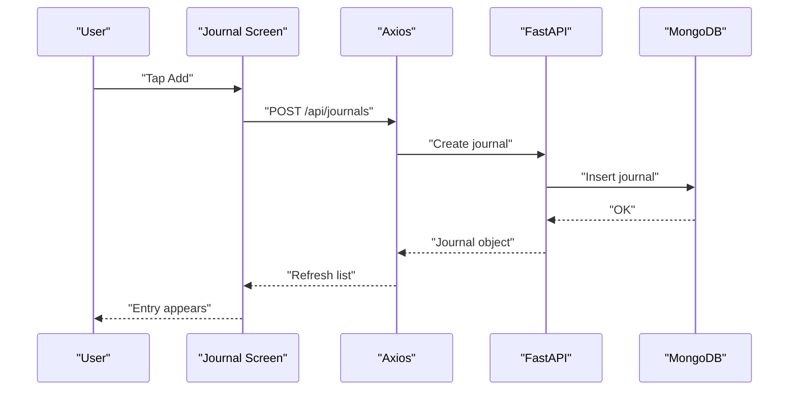
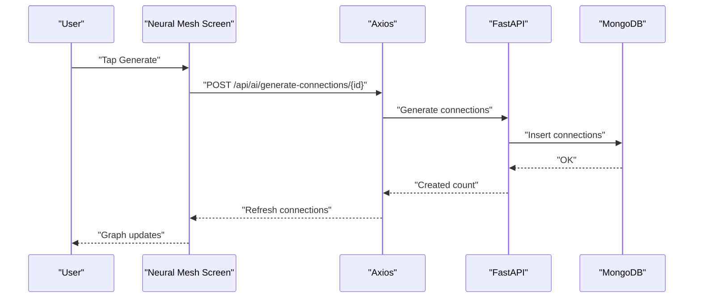
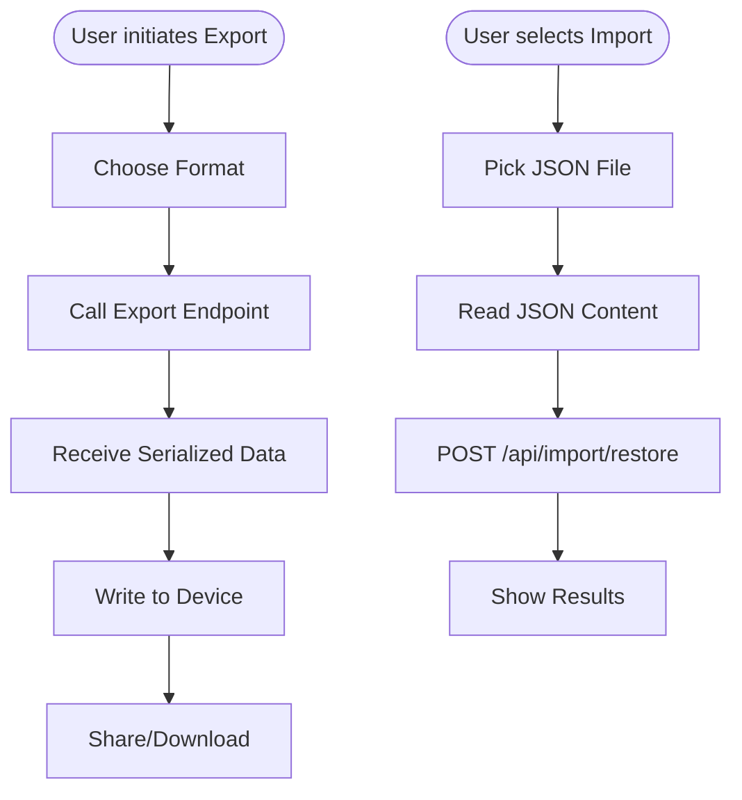
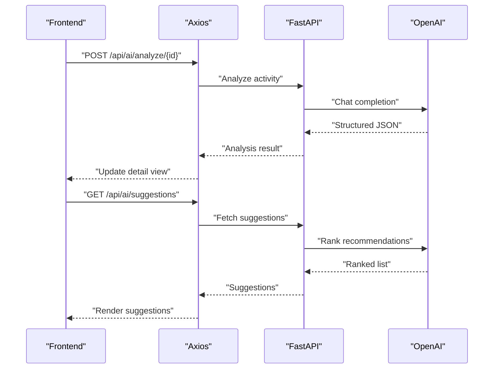
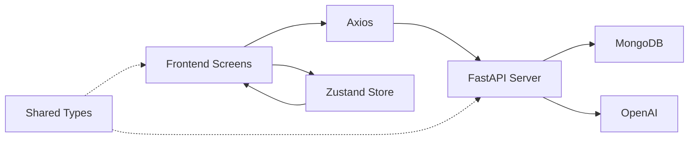

# Core Features

<cite>
**Referenced Files in This Document**
- [README.md](file://README.md)
- [knowledge.tsx](file://frontend/app/(tabs)/knowledge.tsx)
- [mesh.tsx](file://frontend/app/(tabs)/mesh.tsx)
- [journal.tsx](file://frontend/app/journal.tsx)
- [activity-detail.tsx](file://frontend/app/activity-detail.tsx)
- [export.tsx](file://frontend/app/export.tsx)
- [agent.tsx](file://frontend/app/agent.tsx)
- [types.ts](file://shared/types.ts)
- [server.py](file://backend/server.py)
- [useStore.ts](file://frontend/store/useStore.ts)
- [backend.ts](file://frontend/utils/backend.ts)
- [05_COMPLETE_TECHNICAL_DOCS.md](file://docs/05_COMPLETE_TECHNICAL_DOCS.md)
- [00_USER_GUIDE.md](file://docs/00_USER_GUIDE.md)
</cite>

## Table of Contents
1. [Introduction](#introduction)
2. [Project Structure](#project-structure)
3. [Core Components](#core-components)
4. [Architecture Overview](#architecture-overview)
5. [Detailed Component Analysis](#detailed-component-analysis)
6. [Dependency Analysis](#dependency-analysis)
7. [Performance Considerations](#performance-considerations)
8. [Troubleshooting Guide](#troubleshooting-guide)
9. [Conclusion](#conclusion)
10. [Appendices](#appendices)

## Introduction
This document explains Polymath OS core features and how they fit together to form a complete learning tracking experience. The five primary feature areas are:
- Activity tracking with manual entry and file upload
- Journaling system with tagging and linking
- Knowledge visualization through timeline and graph views and “AI suggestions”
- Export/import system for data portability
- AI integration for content analysis and recommendations

Each feature is described both conceptually (for beginners) and technically (for developers), including user workflows, backend APIs, and frontend integration patterns. The relationships between features are highlighted to show how data flows from input to analysis to visualization and portability.

## Project Structure
Polymath OS consists of:
- Frontend (Expo React Native) screens for Activities, Journal, Neural Mesh (Connections), Export, and Agent
- Shared TypeScript types for Activity, Journal, Connection, AgentMemory, and suggestions
- Backend (FastAPI) with MongoDB persistence and AI-powered helpers
- Utilities for backend URL resolution and state management with Zustand

**Diagram sources**
- [knowledge.tsx](file://frontend/app/(tabs)/knowledge.tsx#L1-L376)
- [journal.tsx:1-368](file://frontend/app/journal.tsx#L1-L368)
- [mesh.tsx](file://frontend/app/(tabs)/mesh.tsx#L1-L498)
- [activity-detail.tsx:1-325](file://frontend/app/activity-detail.tsx#L1-L325)
- [export.tsx:1-293](file://frontend/app/export.tsx#L1-L293)
- [agent.tsx:1-311](file://frontend/app/agent.tsx#L1-L311)
- [useStore.ts:1-135](file://frontend/store/useStore.ts#L1-L135)
- [backend.ts:1-76](file://frontend/utils/backend.ts#L1-L76)
- [server.py:1-800](file://backend/server.py#L1-L800)
- [types.ts:1-92](file://shared/types.ts#L1-L92)

**Section sources**
- [README.md:105-112](file://README.md#L105-L112)
- [05_COMPLETE_TECHNICAL_DOCS.md:326-364](file://docs/05_COMPLETE_TECHNICAL_DOCS.md#L326-L364)

## Core Components
- Activity tracking: Manual entry and file upload with AI categorization and deduplication
- Journaling: Tagging and linking to activities with full CRUD
- Knowledge visualization: Timeline and graph views plus “AI suggestions”
- Export/import: Multi-format export and restore for full portability
- AI integration: Content analysis, connection discovery, and recommendations

These components share a common data model and integrate via REST endpoints and global state.

**Section sources**
- [README.md:5-62](file://README.md#L5-L62)
- [types.ts:1-92](file://shared/types.ts#L1-L92)

## Architecture Overview
The frontend communicates with the backend over HTTP, using Axios configured with a runtime-resolved backend URL. The backend persists data in MongoDB and orchestrates AI operations. Global state consolidates data across screens.

**Diagram sources**
- [backend.ts:56-76](file://frontend/utils/backend.ts#L56-L76)
- [server.py:74-75](file://backend/server.py#L74-L75)

**Section sources**
- [05_COMPLETE_TECHNICAL_DOCS.md:433-441](file://docs/05_COMPLETE_TECHNICAL_DOCS.md#L433-L441)

## Detailed Component Analysis

### Activity Tracking
Conceptual overview
- Add learning activities manually or import historical data from YouTube/Google
- Automatic AI categorization and deduplication prevent noise and repetition
- Chronological listing with quick actions to analyze and connect

Technical details
- Manual entry endpoint creates an activity, computes a hash, checks for duplicates, runs AI analysis, and stores the record
- File upload endpoint parses supported JSON formats, deduplicates, and enriches each item with AI analysis
- Frontend screens load and present activities, support refresh, and trigger deletion

User workflows
- Manual capture: Open Activities → tap Add → fill title/URL/notes → submit → observe AI category badge
- Upload capture: Open Activities → tap Upload → select JSON → review results → refresh list
- Explore detail: Open activity → view AI analysis and related connections

Integration patterns
- Frontend screens call backend endpoints and update global state
- Deduplication uses a deterministic hash of title, URL, and timestamp
- AI analysis populates category, content type, and key topics

**Diagram sources**
- [knowledge.tsx](file://frontend/app/(tabs)/knowledge.tsx#L82-L105)
- [server.py:525-551](file://backend/server.py#L525-L551)

Practical examples
- Adding a blog post: title “ML basics”, URL “https://example.com/ml-basics” → AI assigns category and content type
- Uploading YouTube history: JSON file parsed, duplicates skipped, remaining enriched and stored

Feature interactions
- Activity detail shows AI analysis and related connections
- Export includes activities; import restores them

**Section sources**
- [README.md:7-14](file://README.md#L7-L14)
- [knowledge.tsx](file://frontend/app/(tabs)/knowledge.tsx#L61-L105)
- [activity-detail.tsx:102-201](file://frontend/app/activity-detail.tsx#L102-L201)
- [server.py:525-611](file://backend/server.py#L525-L611)
- [05_COMPLETE_TECHNICAL_DOCS.md:60-104](file://docs/05_COMPLETE_TECHNICAL_DOCS.md#L60-L104)

### Journaling System
Conceptual overview
- Create reflective entries with tags and link them to activities
- Supports full CRUD lifecycle with a clean editor UI

Technical details
- Journal entries include title, content, tags, and linked activity IDs
- Frontend manages a local editor modal and syncs with backend endpoints
- Tags are comma-separated and rendered as badges

User workflows
- Create: Open Journal → tap Add → fill title/content/tags → save
- Edit: Tap an entry → modify fields → update
- Delete: Long-press entry → confirm delete

Integration patterns
- Frontend uses Axios to call create, update, delete, and list endpoints
- Global state holds journals for summary screens

**Diagram sources**
- [journal.tsx:78-104](file://frontend/app/journal.tsx#L78-L104)
- [server.py:741-751](file://backend/server.py#L741-L751)

Practical examples
- Tagging: “learning, ideas, AI” becomes multiple badges
- Linking: associate journal with prior activities for cross-referencing

Feature interactions
- Journal entries can be linked to activities; export/import preserves links

**Section sources**
- [README.md:15-20](file://README.md#L15-L20)
- [journal.tsx:35-144](file://frontend/app/journal.tsx#L35-L144)
- [server.py:741-785](file://backend/server.py#L741-L785)
- [05_COMPLETE_TECHNICAL_DOCS.md:105-150](file://docs/05_COMPLETE_TECHNICAL_DOCS.md#L105-L150)

### Knowledge Visualization (Timeline, Graph, AI Suggestions)
Conceptual overview
- Timeline view: chronological display of learning journey
- Graph view: network of knowledge connections with types and strengths
- AI suggestions: personalized recommendations derived from your history

Technical details
- Neural Mesh screen loads connections and renders a graph using SVG
- Users can generate connections per activity and load AI suggestions
- Activity detail augments activities with related connections

User workflows
- Generate connections: open Neural Mesh → tap “Generate” → wait → refresh to see new connections
- Load suggestions: tap “AI Suggestions” → view ranked recommendations
- Explore timeline: switch to timeline view to browse chronologically

Integration patterns
- Frontend fetches connections and displays them in a graph
- AI suggestions are fetched from a dedicated endpoint
- Activity detail merges related connections into the view

**Diagram sources**
- [mesh.tsx](file://frontend/app/(tabs)/mesh.tsx#L84-L110)
- [server.py:788-806](file://backend/server.py#L788-L806)

Practical examples
- Generating connections: pick a few recent activities → generate → see new edges in the graph
- AI suggestions: “Explore advanced topics” with reasoning based on prior activity categories

Feature interactions
- Graph view depends on generated connections; timeline view complements it with chronological context

**Section sources**
- [README.md:21-40](file://README.md#L21-L40)
- [mesh.tsx](file://frontend/app/(tabs)/mesh.tsx#L39-L127)
- [activity-detail.tsx:103-233](file://frontend/app/activity-detail.tsx#L103-L233)
- [server.py:788-806](file://backend/server.py#L788-L806)
- [05_COMPLETE_TECHNICAL_DOCS.md:151-198](file://docs/05_COMPLETE_TECHNICAL_DOCS.md#L151-L198)

### Export/Import System
Conceptual overview
- Export your entire dataset in multiple formats for backup or sharing
- Import a previously exported backup to restore app state

Technical details
- Supported formats include JSON, Markdown, CSV
- Export endpoints produce downloadable content
- Import reads a JSON backup and posts it to the restore endpoint

User workflows
- Export: choose format → generate → share/download
- Import: select JSON file → upload → confirm restoration

Integration patterns
- Frontend uses document picking and sharing to orchestrate export/import
- Backend validates and applies the imported data

**Diagram sources**
- [export.tsx:47-96](file://frontend/app/export.tsx#L47-L96)
- [server.py:646-659](file://backend/server.py#L646-L659)

Practical examples
- Full backup: export JSON to cloud storage; later restore on another device
- Human-readable docs: export Markdown for personal archives

Feature interactions
- Export includes activities, journals, and connections; import restores them consistently

**Section sources**
- [README.md:41-56](file://README.md#L41-L56)
- [export.tsx:32-96](file://frontend/app/export.tsx#L32-L96)
- [server.py:646-659](file://backend/server.py#L646-L659)
- [05_COMPLETE_TECHNICAL_DOCS.md:199-251](file://docs/05_COMPLETE_TECHNICAL_DOCS.md#L199-L251)

### AI Integration (Content Analysis, Recommendations)
Conceptual overview
- AI categorizes content automatically upon creation
- AI discovers relationships between topics and generates “AI suggestions”

Technical details
- Content analysis endpoint returns category, content type, key topics, domain, and learning value
- Connection generation endpoint identifies related activities and reasons for links
- Suggestions endpoint provides prioritized recommendations based on your learning history

User workflows
- On activity creation, AI analysis populates metadata
- Generate connections per activity or load global suggestions
- Agent screen surfaces AI capabilities and memory insights

Integration patterns
- Frontend screens call AI endpoints and render results
- Backend orchestrates OpenAI chat completions and returns structured JSON

**Diagram sources**
- [activity-detail.tsx:169-201](file://frontend/app/activity-detail.tsx#L169-L201)
- [mesh.tsx](file://frontend/app/(tabs)/mesh.tsx#L112-L126)
- [server.py:788-806](file://backend/server.py#L788-L806)

Practical examples
- AI analysis: “Category: AI, Content Type: Video, Topics: [neural networks, ML]”
- AI suggestions: “Study reinforcement learning next” with reasoning

Feature interactions
- AI suggestions rely on your complete history; generated connections feed the graph view

**Section sources**
- [README.md:57-62](file://README.md#L57-L62)
- [server.py:192-284](file://backend/server.py#L192-L284)
- [05_COMPLETE_TECHNICAL_DOCS.md:550-607](file://docs/05_COMPLETE_TECHNICAL_DOCS.md#L550-L607)

## Dependency Analysis
- Frontend screens depend on Axios and a resolved backend URL
- Backend depends on MongoDB and OpenAI for AI operations
- Shared types define the contract for data exchanged across the stack
- Global state coordinates data across screens

**Diagram sources**
- [useStore.ts:49-78](file://frontend/store/useStore.ts#L49-L78)
- [types.ts:1-92](file://shared/types.ts#L1-L92)
- [backend.ts:56-76](file://frontend/utils/backend.ts#L56-L76)
- [server.py:48-50](file://backend/server.py#L48-L50)

**Section sources**
- [useStore.ts:1-135](file://frontend/store/useStore.ts#L1-L135)
- [types.ts:1-92](file://shared/types.ts#L1-L92)
- [backend.ts:1-76](file://frontend/utils/backend.ts#L1-L76)
- [server.py:1-800](file://backend/server.py#L1-L800)

## Performance Considerations
- Deduplication reduces redundant AI calls and database writes
- Pagination and limits (e.g., fetching recent items) keep UI responsive
- Batch generation of connections is constrained to a small subset to avoid long waits
- Export endpoints should stream or chunk large datasets to avoid timeouts

## Troubleshooting Guide
Common issues and resolutions
- Backend URL misconfiguration: use the backend utility to resolve and persist the URL
- Network errors: verify backend health endpoint and environment variables
- Import failures: ensure the JSON backup matches expected schema and is readable
- AI errors: check API keys and model availability; fallback responses are handled gracefully

**Section sources**
- [backend.ts:23-75](file://frontend/utils/backend.ts#L23-L75)
- [server.py:500-518](file://backend/server.py#L500-L518)
- [export.tsx:73-96](file://frontend/app/export.tsx#L73-L96)
- [00_USER_GUIDE.md:74-79](file://docs/00_USER_GUIDE.md#L74-L79)

## Conclusion
Polymath OS weaves together activity capture, journaling, AI-powered insights, and portable exports into a cohesive learning companion. The five feature areas complement each other: activities fuel AI analysis and connections; journals anchor reflection; visualization surfaces insights; and export/import ensures data ownership and continuity.

## Appendices
- API endpoints overview and data models are documented in the technical docs
- User guide provides quick-start steps and feature highlights

**Section sources**
- [05_COMPLETE_TECHNICAL_DOCS.md:433-800](file://docs/05_COMPLETE_TECHNICAL_DOCS.md#L433-L800)
- [00_USER_GUIDE.md:1-80](file://docs/00_USER_GUIDE.md#L1-L80)