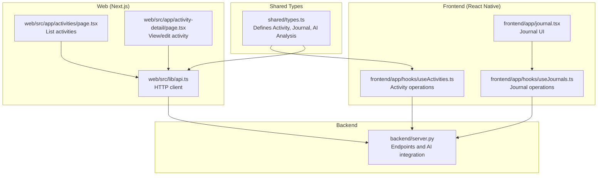
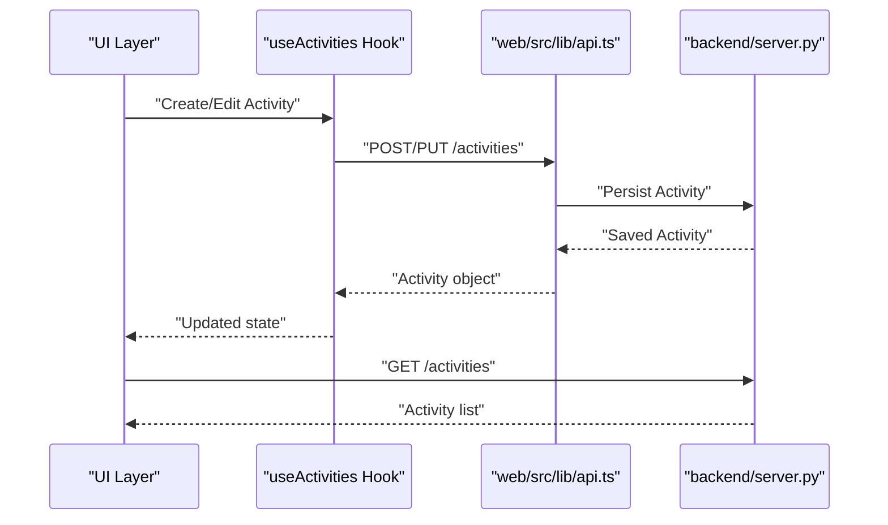
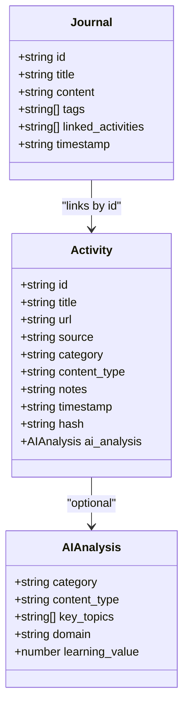
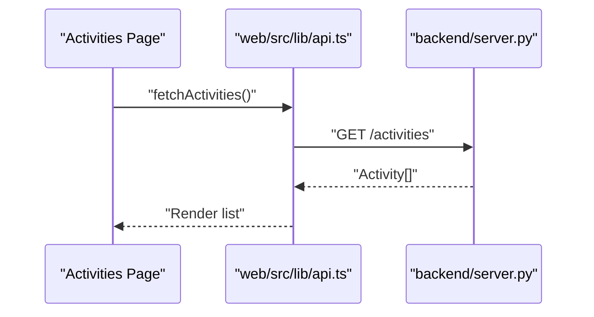
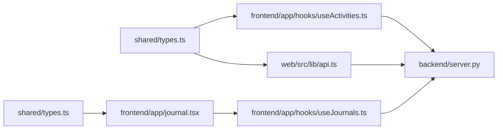

# Activity Schema

<cite>
**Referenced Files in This Document**
- [types.ts](file://shared/types.ts)
- [useActivities.ts](file://frontend/app/hooks/useActivities.ts)
- [activities page.tsx](file://web/src/app/activities/page.tsx)
- [activity-detail page.tsx](file://web/src/app/activity-detail/page.tsx)
- [journal.tsx](file://frontend/app/journal.tsx)
- [useJournals.ts](file://frontend/app/hooks/useJournals.ts)
- [api.ts](file://web/src/lib/api.ts)
- [backend.py](file://backend/server.py)
</cite>

## Table of Contents
1. [Introduction](#introduction)
2. [Project Structure](#project-structure)
3. [Core Components](#core-components)
4. [Architecture Overview](#architecture-overview)
5. [Detailed Component Analysis](#detailed-component-analysis)
6. [Dependency Analysis](#dependency-analysis)
7. [Performance Considerations](#performance-considerations)
8. [Troubleshooting Guide](#troubleshooting-guide)
9. [Conclusion](#conclusion)
10. [Appendices](#appendices)

## Introduction
This document defines the Activity data model for the learning activity tracking system. It explains the Activity interface structure, including all fields, their types, optionality, and validation rules. It also documents the AI analysis object, the role of the hash field for deduplication and integrity, and the relationship between activities and journals via the linked_activities field. Practical patterns for creating, updating, and querying activities are included, along with performance considerations and integration points with the AI analysis system.

## Project Structure
The Activity schema is defined in a shared TypeScript module and consumed by both the React Native frontend and Next.js web applications. The frontend hooks coordinate activity CRUD operations, while the backend server exposes endpoints for persistence and AI analysis.

**Diagram sources**
- [types.ts:1-27](file://shared/types.ts#L1-L27)
- [useActivities.ts](file://frontend/app/hooks/useActivities.ts)
- [journal.tsx](file://frontend/app/journal.tsx)
- [useJournals.ts](file://frontend/app/hooks/useJournals.ts)
- [activities page.tsx](file://web/src/app/activities/page.tsx)
- [activity-detail page.tsx](file://web/src/app/activity-detail/page.tsx)
- [api.ts](file://web/src/lib/api.ts)
- [backend.py](file://backend/server.py)

**Section sources**
- [types.ts:1-27](file://shared/types.ts#L1-L27)

## Core Components
This section documents the Activity interface and related structures, including required vs optional fields, data types, and validation rules.

- Activity interface fields
  - id: string (required)
  - title: string (required)
  - url: string (optional)
  - source: string (required)
  - category: string (optional)
  - content_type: string (optional)
  - notes: string (optional)
  - timestamp: string (ISO 8601 date-time string) (required)
  - hash: string (optional)
  - ai_analysis: object (optional)
    - category: string (required if ai_analysis present)
    - content_type: string (required if ai_analysis present)
    - key_topics: string[] (required if ai_analysis present)
    - domain: string (required if ai_analysis present)
    - learning_value: number (required if ai_analysis present)

- Journal interface fields
  - linked_activities: string[] (required; array of activity ids)

Validation rules
- Required fields: id, title, source, timestamp
- Optional fields: url, category, content_type, notes, hash, ai_analysis
- If ai_analysis is provided, all its fields must be present
- timestamp must be a valid ISO 8601 date-time string
- linked_activities must be a non-empty array of valid activity ids

Data type specifications
- Strings: UTF-8 encoded text
- Numbers: numeric types (integers or floats)
- Arrays: ordered collections
- Objects: structured JSON-compatible data

**Section sources**
- [types.ts:1-27](file://shared/types.ts#L1-L27)

## Architecture Overview
The Activity lifecycle spans creation, AI analysis, storage, retrieval, and linking to journals. The frontend and web apps use typed hooks and API clients to interact with the backend server.

**Diagram sources**
- [useActivities.ts](file://frontend/app/hooks/useActivities.ts)
- [api.ts](file://web/src/lib/api.ts)
- [backend.py](file://backend/server.py)

## Detailed Component Analysis

### Activity Interface and AI Analysis Object
The Activity interface defines the canonical shape for learning activities. The ai_analysis object encapsulates AI-derived insights.

**Diagram sources**
- [types.ts:1-27](file://shared/types.ts#L1-L27)

**Section sources**
- [types.ts:1-27](file://shared/types.ts#L1-L27)

### Hash Field: Deduplication and Integrity
The hash field serves two primary purposes:
- Deduplication: Compare hashes to avoid storing identical activities.
- Integrity verification: Recompute and compare hashes to detect tampering or corruption.

Recommended hashing strategy
- Compute a stable hash over normalized fields (e.g., title, url, source, content_type) after removing whitespace variations and normalizing encoding.
- Store the hash alongside the activity record.
- On insert/update, compute hash and compare with existing records; if equal, skip duplication or update minimal fields.

Practical pattern
- Pre-save normalization: Remove trailing spaces, lowercase URLs, and sort key_topics.
- Use a cryptographic hash (e.g., SHA-256) for robustness.

**Section sources**
- [types.ts:1-18](file://shared/types.ts#L1-L18)

### Relationship Between Activities and Journals
Activities can be linked to journals via the linked_activities array in the Journal model. This enables cross-referencing learning materials to reflective writing or study sessions.

Typical operations
- Add activity to journal: Push activity id to journal.linked_activities.
- Remove activity from journal: Filter out activity id.
- Query journal’s activities: Fetch journal and resolve activity ids.

Constraints
- linked_activities must reference valid activity ids.
- Maintain referential integrity at the application level.

**Section sources**
- [types.ts:20-27](file://shared/types.ts#L20-L27)

### Field Validation Rules and Optionality
Required vs optional fields
- Required: id, title, source, timestamp
- Optional: url, category, content_type, notes, hash, ai_analysis

AI analysis validation
- If ai_analysis is present, all its fields must be present and non-empty according to type expectations.

Timestamp validation
- Must be a valid ISO 8601 date-time string to ensure consistent sorting and comparisons.

**Section sources**
- [types.ts:1-18](file://shared/types.ts#L1-L18)

### Practical Examples: Creation, Updating, and Querying

- Creating an activity
  - Prepare an Activity object with required fields and optional metadata.
  - Optionally compute and set the hash.
  - Send a POST request to the activities endpoint.
  - Example reference: [useActivities.ts](file://frontend/app/hooks/useActivities.ts)

- Updating an activity
  - Send a PUT/PATCH request with partial updates.
  - Re-compute hash if content-relevant fields change.
  - Example reference: [useActivities.ts](file://frontend/app/hooks/useActivities.ts)

- Querying activities
  - GET all activities or filtered by source, category, or date range.
  - Example reference: [activities page.tsx](file://web/src/app/activities/page.tsx)

- Viewing activity details
  - Navigate to the activity detail page and fetch by id.
  - Example reference: [activity-detail page.tsx](file://web/src/app/activity-detail/page.tsx)

- Integrating with AI analysis
  - Submit activity content to the AI service endpoint.
  - Merge returned ai_analysis into the Activity object.
  - Example reference: [backend.py](file://backend/server.py)

**Section sources**
- [useActivities.ts](file://frontend/app/hooks/useActivities.ts)
- [activities page.tsx](file://web/src/app/activities/page.tsx)
- [activity-detail page.tsx](file://web/src/app/activity-detail/page.tsx)
- [backend.py](file://backend/server.py)

### Typical Activity Operations and Integration Patterns
- Frontend hooks orchestrate CRUD operations and maintain local state.
- Web pages consume hooks and render lists/details.
- Backend server persists data and optionally triggers AI analysis.

**Diagram sources**
- [activities page.tsx](file://web/src/app/activities/page.tsx)
- [api.ts](file://web/src/lib/api.ts)
- [backend.py](file://backend/server.py)

**Section sources**
- [activities page.tsx](file://web/src/app/activities/page.tsx)
- [api.ts](file://web/src/lib/api.ts)
- [backend.py](file://backend/server.py)

## Dependency Analysis
The Activity schema depends on shared types and is consumed by frontend and web layers. The backend server coordinates persistence and optional AI analysis.

**Diagram sources**
- [types.ts:1-27](file://shared/types.ts#L1-L27)
- [useActivities.ts](file://frontend/app/hooks/useActivities.ts)
- [useJournals.ts](file://frontend/app/hooks/useJournals.ts)
- [journal.tsx](file://frontend/app/journal.tsx)
- [api.ts](file://web/src/lib/api.ts)
- [backend.py](file://backend/server.py)

**Section sources**
- [types.ts:1-27](file://shared/types.ts#L1-L27)
- [useActivities.ts](file://frontend/app/hooks/useActivities.ts)
- [useJournals.ts](file://frontend/app/hooks/useJournals.ts)
- [journal.tsx](file://frontend/app/journal.tsx)
- [api.ts](file://web/src/lib/api.ts)
- [backend.py](file://backend/server.py)

## Performance Considerations
Indexing strategies for large datasets
- Primary keys: Ensure id is indexed.
- Search filters: Index source, category, content_type, and timestamp for fast filtering and sorting.
- Text search: For title and notes, consider full-text indexes if supported by the backend database.
- Hash lookups: Index hash for deduplication queries.
- Linked relationships: Index linked_activities in journals for efficient reverse lookups.

Query patterns
- Paginate activity lists with cursor-based pagination.
- Use selective field projection to minimize payload sizes.
- Batch operations for bulk inserts/updates.

Caching
- Cache frequently accessed activity details.
- Invalidate cache on write operations.

Scalability
- Sharding by source or timestamp ranges.
- Offload AI analysis to async workers and store results asynchronously.

[No sources needed since this section provides general guidance]

## Troubleshooting Guide
Common issues and resolutions
- Invalid timestamp format
  - Ensure timestamp is a valid ISO 8601 string.
  - Reference: [types.ts:1-18](file://shared/types.ts#L1-L18)

- Missing required fields
  - Verify id, title, source, and timestamp are present before saving.
  - Reference: [types.ts:1-18](file://shared/types.ts#L1-L18)

- AI analysis inconsistencies
  - Validate that ai_analysis contains all required fields when present.
  - Reference: [types.ts:11-17](file://shared/types.ts#L11-L17)

- Hash mismatches during deduplication
  - Normalize input fields before hashing.
  - Recompute and compare hashes to detect duplicates.
  - Reference: [types.ts:1-18](file://shared/types.ts#L1-L18)

- Journal-activity linkage errors
  - Confirm that linked_activities contains valid activity ids.
  - Reference: [types.ts:20-27](file://shared/types.ts#L20-L27)

**Section sources**
- [types.ts:1-27](file://shared/types.ts#L1-L27)

## Conclusion
The Activity schema provides a robust foundation for tracking learning activities with optional AI analysis and strong typing. By enforcing required fields, validating timestamps, leveraging the hash field for deduplication, and maintaining referential integrity with journals, the system supports scalable and reliable activity management. Following the recommended indexing and caching strategies ensures smooth performance as datasets grow.

[No sources needed since this section summarizes without analyzing specific files]

## Appendices

### Appendix A: Field Reference
- id: string (required)
- title: string (required)
- url: string (optional)
- source: string (required)
- category: string (optional)
- content_type: string (optional)
- notes: string (optional)
- timestamp: string (required; ISO 8601)
- hash: string (optional)
- ai_analysis: object (optional)
  - category: string (required if ai_analysis present)
  - content_type: string (required if ai_analysis present)
  - key_topics: string[] (required if ai_analysis present)
  - domain: string (required if ai_analysis present)
  - learning_value: number (required if ai_analysis present)

**Section sources**
- [types.ts:1-27](file://shared/types.ts#L1-L27)