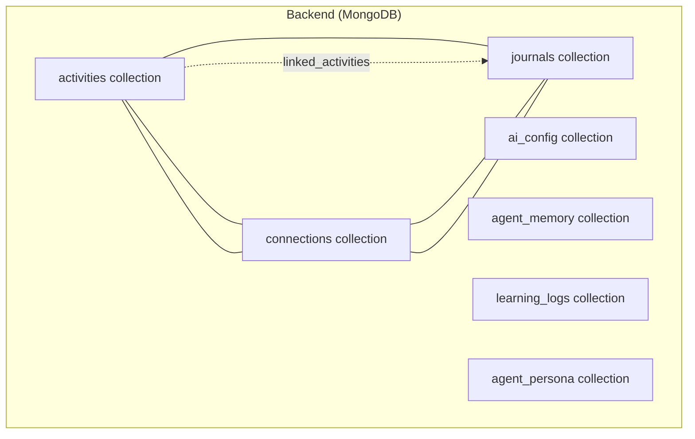
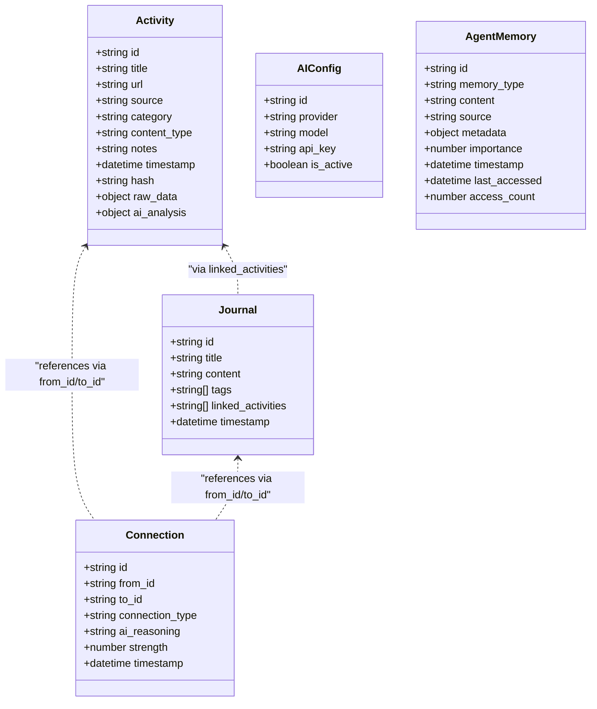
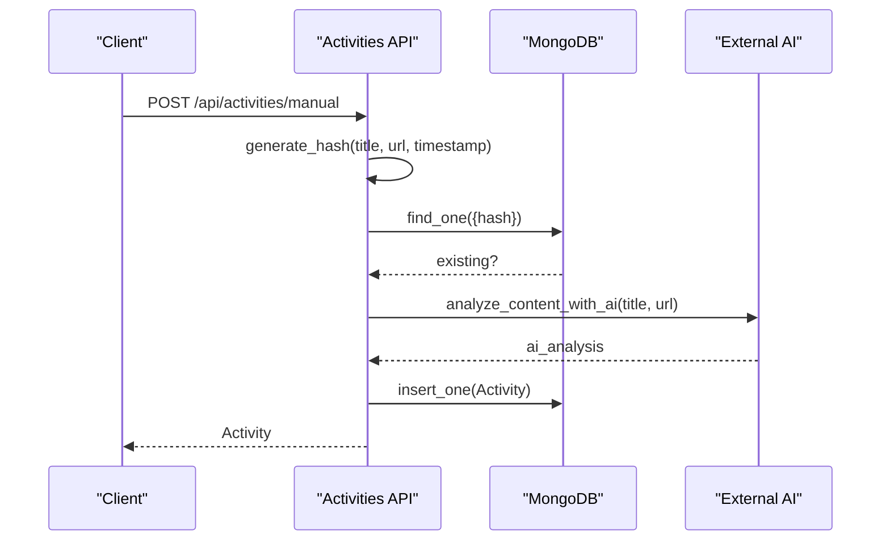
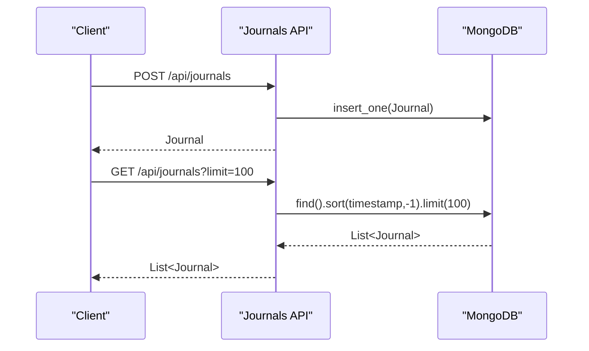
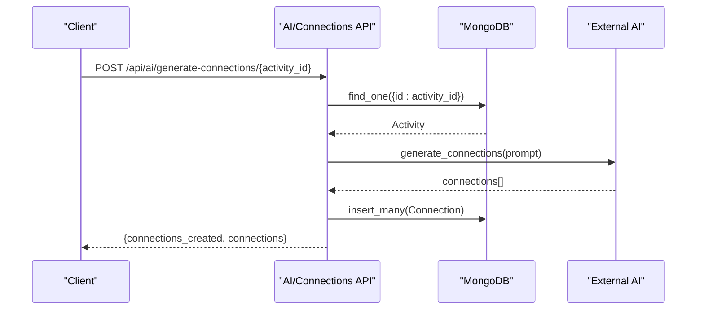
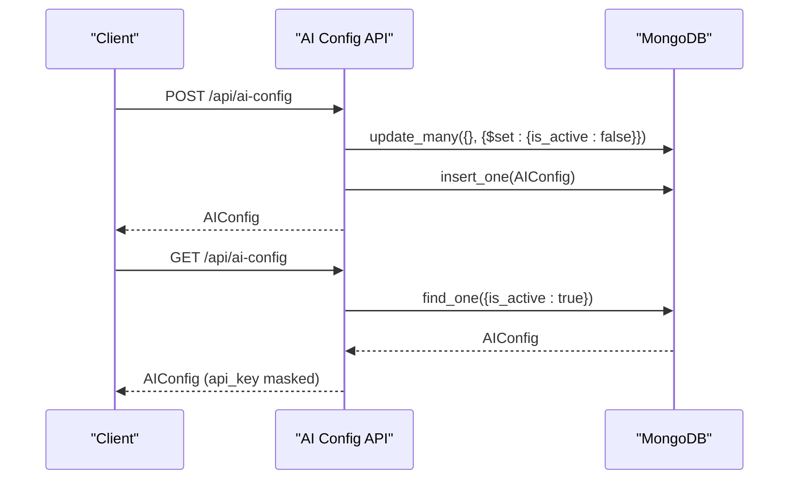
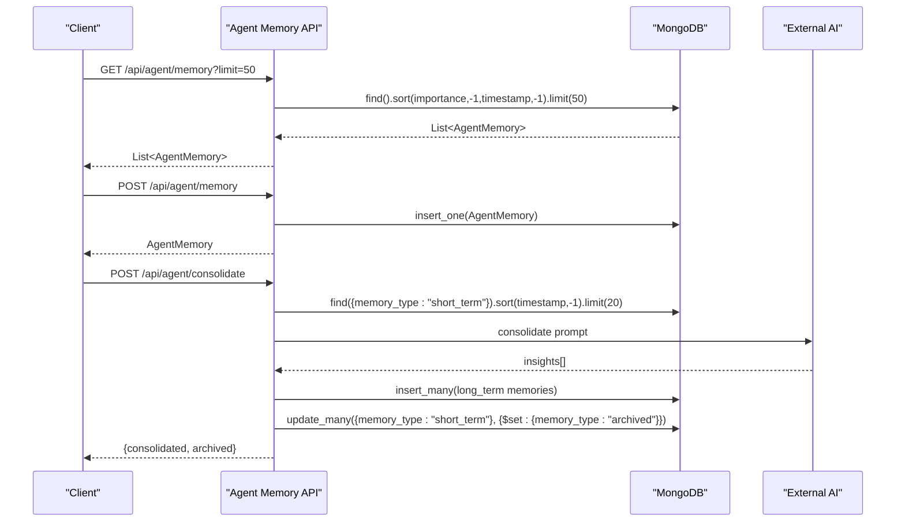
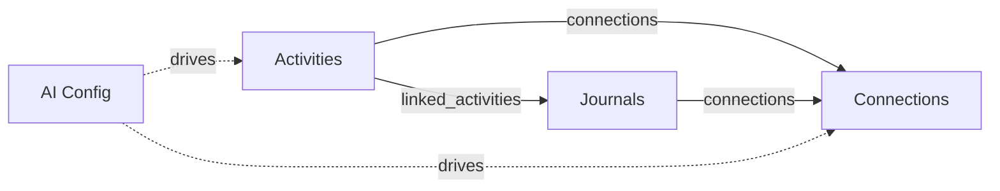

# Data Models and Schema

<cite>
**Referenced Files in This Document**
- [server.py](file://backend/server.py)
- [types.ts](file://shared/types.ts)
</cite>

## Table of Contents
1. [Introduction](#introduction)
2. [Project Structure](#project-structure)
3. [Core Components](#core-components)
4. [Architecture Overview](#architecture-overview)
5. [Detailed Component Analysis](#detailed-component-analysis)
6. [Dependency Analysis](#dependency-analysis)
7. [Performance Considerations](#performance-considerations)
8. [Troubleshooting Guide](#troubleshooting-guide)
9. [Conclusion](#conclusion)
10. [Appendices](#appendices)

## Introduction
This document defines the data models and schema for the application’s persistent storage. It focuses on four main collections: activities, journals, connections, and AI configuration. It explains entity relationships, field definitions, data types, validation rules, indexing strategies, constraints, data access patterns, caching strategies, performance considerations, data lifecycle, retention, archival, security and privacy controls, and access control mechanisms. Practical examples of data manipulation and query patterns are included.

## Project Structure
The backend uses MongoDB via Motor (async) and exposes REST endpoints. The frontend and shared libraries define TypeScript interfaces that align with the backend models. The database schema is implemented as collections with explicit fields and relationships described below.

**Diagram sources**
- [server.py:79-133](file://backend/server.py#L79-L133)
- [server.py:1036-1204](file://backend/server.py#L1036-L1204)

**Section sources**
- [server.py:43-47](file://backend/server.py#L43-L47)
- [server.py:79-133](file://backend/server.py#L79-L133)

## Core Components
This section documents the four main data models and their fields, types, and constraints.

- Activities
  - Purpose: Stores learning resources (manual entries or imported histories) with deduplication and AI analysis.
  - Fields:
    - id: string (UUID)
    - title: string
    - url: string (optional)
    - source: string (manual, youtube, google, upload)
    - category: string (optional)
    - content_type: string (optional)
    - notes: string (optional)
    - timestamp: datetime
    - hash: string (unique)
    - raw_data: object (optional)
    - ai_analysis: object (optional)
  - Constraints:
    - hash is unique and used for deduplication.
    - timestamp ordering is used for chronological queries.
  - Validation rules:
    - Duplicate detection via hash.
    - AI analysis enrichment performed during creation.
  - Indexing:
    - Unique index on hash.
    - Compound sort index on timestamp desc for listing.
    - Text-like fields indexed via regex search in queries.

- Journals
  - Purpose: Personal reflections and notes linked to activities.
  - Fields:
    - id: string (UUID)
    - title: string
    - content: string
    - tags: string[]
    - linked_activities: string[] (IDs of activities)
    - timestamp: datetime
  - Constraints:
    - linked_activities references activity IDs.
  - Validation rules:
    - linked_activities must correspond to existing activity IDs (enforced by application logic).
  - Indexing:
    - Sort by timestamp desc for listing.
    - Regex-based search across title, content, and tags.

- Connections
  - Purpose: Semantic links between activities and/or journals generated by AI.
  - Fields:
    - id: string (UUID)
    - from_id: string (activity or journal ID)
    - to_id: string (activity or journal ID)
    - connection_type: string
    - ai_reasoning: string
    - strength: number (0.0–1.0)
    - timestamp: datetime
  - Constraints:
    - from_id and to_id must reference existing entities (activities/journals).
    - strength constrained to a numeric range.
  - Validation rules:
    - Enforced by application logic and AI prompts.
  - Indexing:
    - Queries filter by from_id or to_id.
    - Sort by timestamp desc for recency.

- AI Configuration
  - Purpose: Provider settings for external AI services.
  - Fields:
    - id: string (UUID)
    - provider: string
    - model: string
    - api_key: string (masked in responses)
    - is_active: boolean
  - Constraints:
    - Only one active configuration at a time (deactivates previous).
  - Validation rules:
    - Required fields on creation.
  - Indexing:
    - Query by is_active flag.

- Agent Memory (supplementary)
  - Purpose: Internal agent memory for learning and recall.
  - Fields:
    - id: string (UUID)
    - memory_type: string (short_term, long_term, insight, pattern, archived)
    - content: string
    - source: string
    - metadata: object
    - importance: number (0.0–1.0)
    - timestamp: datetime
    - last_accessed: datetime
    - access_count: integer
  - Indexing:
    - Sort by importance desc, last_accessed desc, timestamp desc.

**Section sources**
- [server.py:79-133](file://backend/server.py#L79-L133)
- [server.py:182-190](file://backend/server.py#L182-L190)
- [server.py:613-621](file://backend/server.py#L613-L621)
- [server.py:641-683](file://backend/server.py#L641-L683)
- [server.py:818-822](file://backend/server.py#L818-L822)
- [server.py:860-883](file://backend/server.py#L860-L883)
- [server.py:1036-1204](file://backend/server.py#L1036-L1204)

## Architecture Overview
The backend defines Pydantic models for request/response shapes and uses MongoDB collections for persistence. The frontend and shared library define TypeScript interfaces aligned with backend models.

**Diagram sources**
- [server.py:79-133](file://backend/server.py#L79-L133)
- [types.ts:1-92](file://shared/types.ts#L1-L92)

**Section sources**
- [server.py:79-133](file://backend/server.py#L79-L133)
- [types.ts:1-92](file://shared/types.ts#L1-L92)

## Detailed Component Analysis

### Activities Collection
- Purpose: Central repository for learning resources with deduplication and enrichment.
- Key operations:
  - Manual creation with AI analysis and hash-based deduplication.
  - Batch upload parsing for YouTube and Google histories.
  - Listing with optional category filter and pagination.
  - Detail retrieval with related connections.
  - Deletion by ID.
- Validation and constraints:
  - Hash uniqueness prevents duplicates.
  - AI analysis enriches category, content_type, key_topics, domain, and learning_value.
- Indexing and performance:
  - Unique index on hash.
  - Sort by timestamp desc for listing.
  - Regex-based search across title, notes, category, content_type.

**Diagram sources**
- [server.py:524-551](file://backend/server.py#L524-L551)
- [server.py:182-190](file://backend/server.py#L182-L190)
- [server.py:192-233](file://backend/server.py#L192-L233)

**Section sources**
- [server.py:524-640](file://backend/server.py#L524-L640)
- [server.py:182-190](file://backend/server.py#L182-L190)
- [server.py:192-233](file://backend/server.py#L192-L233)

### Journals Collection
- Purpose: Personal notes and reflections associated with activities.
- Key operations:
  - Create/update/delete journals.
  - Link activities via linked_activities.
  - Listing and paginated retrieval.
  - Full-text search across title, content, and tags.
- Validation and constraints:
  - linked_activities must reference existing activity IDs (application-level enforcement).
- Indexing and performance:
  - Sort by timestamp desc.
  - Regex-based search across title, content, tags.

**Diagram sources**
- [server.py:740-786](file://backend/server.py#L740-L786)
- [server.py:613-621](file://backend/server.py#L613-L621)
- [server.py:641-683](file://backend/server.py#L641-L683)

**Section sources**
- [server.py:740-786](file://backend/server.py#L740-L786)
- [server.py:641-683](file://backend/server.py#L641-L683)

### Connections Collection
- Purpose: Semantic relationships between activities and/or journals, generated by AI.
- Key operations:
  - Generate connections for an activity via AI.
  - List all connections.
  - Retrieve connections for a given entity (by from_id or to_id).
- Validation and constraints:
  - from_id and to_id must reference existing entities.
  - Strength constrained to a numeric range.
- Indexing and performance:
  - Queries filter by from_id or to_id.
  - Sort by timestamp desc for recency.

**Diagram sources**
- [server.py:808-817](file://backend/server.py#L808-L817)
- [server.py:234-284](file://backend/server.py#L234-L284)

**Section sources**
- [server.py:808-822](file://backend/server.py#L808-L822)
- [server.py:234-284](file://backend/server.py#L234-L284)

### AI Configuration
- Purpose: Manage provider settings for AI services.
- Key operations:
  - Create new configuration and deactivate existing ones.
  - Retrieve active configuration (api_key masked).
- Validation and constraints:
  - Only one active configuration at a time.
  - Required fields on creation.

**Diagram sources**
- [server.py:860-883](file://backend/server.py#L860-L883)

**Section sources**
- [server.py:860-883](file://backend/server.py#L860-L883)

### Agent Memory (Supplementary)
- Purpose: Internal agent memory for learning and recall.
- Key operations:
  - Create, update, delete, and list agent memories.
  - Retrieve relevant memories by context and rank via AI.
  - Consolidate short-term memories into long-term insights.
- Validation and constraints:
  - memory_type constrained to predefined values.
  - importance constrained to a numeric range.
- Indexing and performance:
  - Sort by importance desc, last_accessed desc, timestamp desc.

**Diagram sources**
- [server.py:1036-1134](file://backend/server.py#L1036-L1134)
- [server.py:402-497](file://backend/server.py#L402-L497)

**Section sources**
- [server.py:1036-1134](file://backend/server.py#L1036-L1134)
- [server.py:402-497](file://backend/server.py#L402-L497)

## Dependency Analysis
- Collections and relationships:
  - Activities and Journals are loosely coupled; Journals can link to Activities via linked_activities.
  - Connections form a graph between Activities and Journals (from_id/to_id).
  - AI configuration is independent but enables AI-driven operations.
  - Agent Memory supports internal agent behavior and is not part of the core user data model.
- Coupling:
  - Activities depend on AI for enrichment.
  - Connections depend on Activities/Journals existence.
  - Journals depend on Activities via linked_activities.
- Cohesion:
  - Each collection encapsulates a cohesive domain concept with minimal cross-collection mutation.

**Diagram sources**
- [server.py:79-133](file://backend/server.py#L79-L133)
- [server.py:613-621](file://backend/server.py#L613-L621)
- [server.py:641-683](file://backend/server.py#L641-L683)
- [server.py:808-817](file://backend/server.py#L808-L817)
- [server.py:860-883](file://backend/server.py#L860-L883)

**Section sources**
- [server.py:79-133](file://backend/server.py#L79-L133)
- [server.py:613-621](file://backend/server.py#L613-L621)
- [server.py:641-683](file://backend/server.py#L641-L683)
- [server.py:808-817](file://backend/server.py#L808-L817)
- [server.py:860-883](file://backend/server.py#L860-L883)

## Performance Considerations
- Indexing strategies:
  - Activities: unique index on hash; sort by timestamp desc for listing.
  - Journals: sort by timestamp desc; regex-based search across title, content, tags.
  - Connections: filter by from_id/to_id; sort by timestamp desc.
  - AI Config: query by is_active.
  - Agent Memory: sort by importance desc, last_accessed desc, timestamp desc.
- Pagination and limits:
  - Listing endpoints use skip/limit and capped lists to control payload sizes.
- Caching:
  - No explicit caching layer is present in the backend; consider application-level caching for frequently accessed aggregates.
- Query patterns:
  - Regex-based full-text search is used; consider adding text indexes for improved performance.
  - Sorting by timestamp desc is common; ensure appropriate indexes exist.

[No sources needed since this section provides general guidance]

## Troubleshooting Guide
- Duplicate activity creation:
  - Symptom: HTTP 400 on manual creation.
  - Cause: Hash collision detected.
  - Resolution: Ensure unique combination of title, URL, and timestamp.
- Missing related connections:
  - Symptom: Activity detail lacks related_connections.
  - Cause: No connections found for the ID.
  - Resolution: Generate connections via AI endpoint.
- AI analysis failures:
  - Symptom: Empty or fallback ai_analysis.
  - Cause: AI response parsing errors.
  - Resolution: Verify AI service availability and prompt correctness.
- Active AI configuration:
  - Symptom: AI operations fail due to missing configuration.
  - Cause: No active AI configuration.
  - Resolution: POST to create AI config and set is_active.

**Section sources**
- [server.py:532-534](file://backend/server.py#L532-L534)
- [server.py:631-639](file://backend/server.py#L631-L639)
- [server.py:214-233](file://backend/server.py#L214-L233)
- [server.py:878-883](file://backend/server.py#L878-L883)

## Conclusion
The data model centers on activities, journals, and connections with AI-driven enrichment and graph generation. Strong constraints (hash uniqueness, active AI config) and clear validation rules ensure data integrity. Indexing and sorting strategies support efficient listing and search. Application-level logic enforces referential integrity for linked_activities and connection endpoints. Future enhancements could include text indexes, caching, and stricter schema validation.

[No sources needed since this section summarizes without analyzing specific files]

## Appendices

### Data Access Patterns and Examples
- Create activity (manual):
  - Endpoint: POST /api/activities/manual
  - Behavior: Deduplicate by hash, enrich with AI, persist.
- Upload history:
  - Endpoint: POST /api/activities/upload
  - Behavior: Parse YouTube/Google history, deduplicate, persist.
- List activities:
  - Endpoint: GET /api/activities
  - Behavior: Paginated, optionally filtered by category, sorted by timestamp desc.
- Search across domains:
  - Endpoint: GET /api/search?q=...
  - Behavior: Regex-based search across activities, journals, connections.
- Generate connections:
  - Endpoint: POST /api/ai/generate-connections/{activity_id}
  - Behavior: AI-driven discovery and insertion of connections.
- Journal CRUD:
  - Endpoints: POST/GET/PUT/DELETE /api/journals
  - Behavior: Create/update/delete; list with pagination.
- AI configuration:
  - Endpoints: POST/GET /api/ai-config
  - Behavior: Create new config; deactivate previous; retrieve active.

**Section sources**
- [server.py:524-640](file://backend/server.py#L524-L640)
- [server.py:641-683](file://backend/server.py#L641-L683)
- [server.py:808-817](file://backend/server.py#L808-L817)
- [server.py:740-786](file://backend/server.py#L740-L786)
- [server.py:860-883](file://backend/server.py#L860-L883)

### Data Lifecycle, Retention, and Archival
- Activities: Persisted indefinitely; deduplication prevents redundant storage.
- Journals: Persisted indefinitely; linked_activities remain until manually removed.
- Connections: Persisted indefinitely; generated AI links retained.
- Agent Memory: Short-term memories consolidated into long-term insights and archived; supports access_count and last_accessed metrics.
- Retention: No automatic deletion policies are implemented in the backend.

**Section sources**
- [server.py:450-497](file://backend/server.py#L450-L497)
- [server.py:1036-1134](file://backend/server.py#L1036-L1134)

### Security, Privacy, and Access Control
- API exposure:
  - AI configuration retrieval masks api_key.
  - ObjectId fields are stripped from responses to avoid leakage.
- CORS:
  - Permissive CORS middleware enabled for development.
- Authentication:
  - No built-in authentication or authorization is present in the backend.
- Recommendations:
  - Add API keys or JWT-based authentication.
  - Enforce RBAC for multi-user scenarios.
  - Encrypt sensitive fields at rest if required.

**Section sources**
- [server.py:878-883](file://backend/server.py#L878-L883)
- [server.py:892-900](file://backend/server.py#L892-L900)
- [server.py:1285-1291](file://backend/server.py#L1285-L1291)