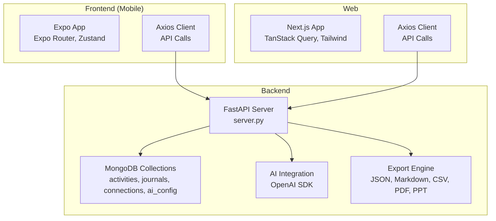
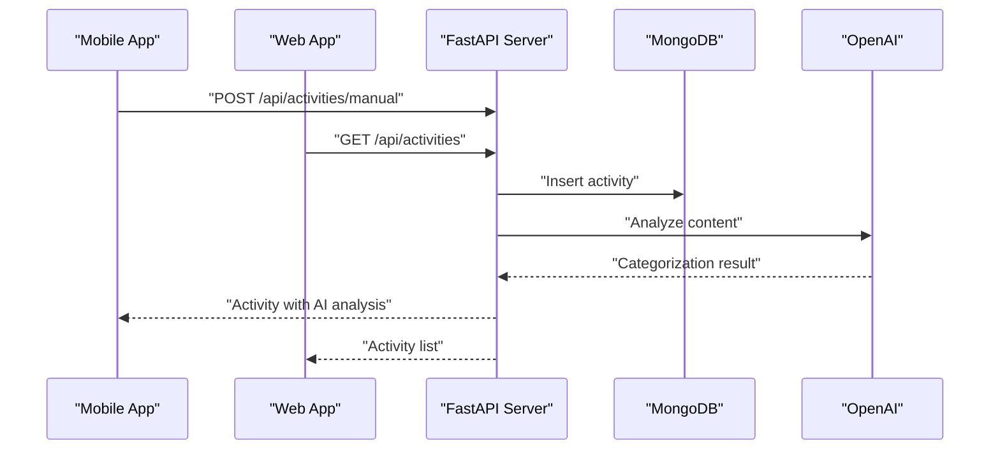
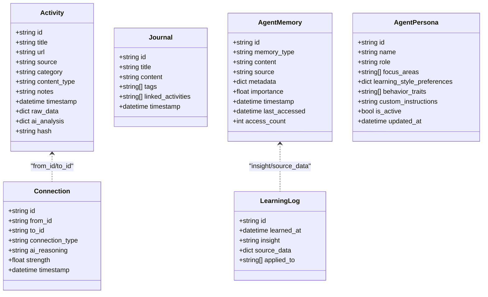
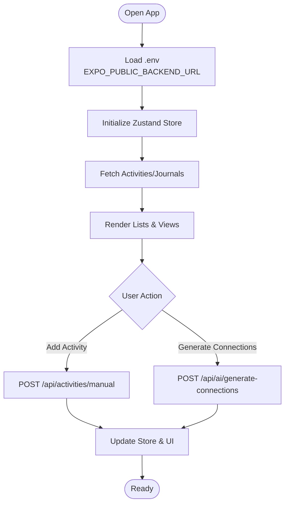
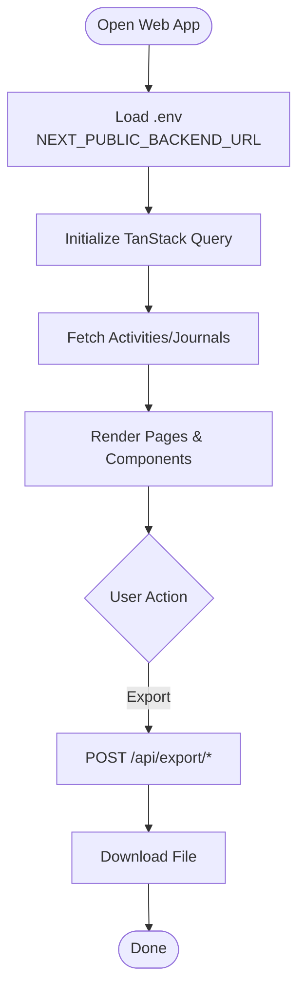
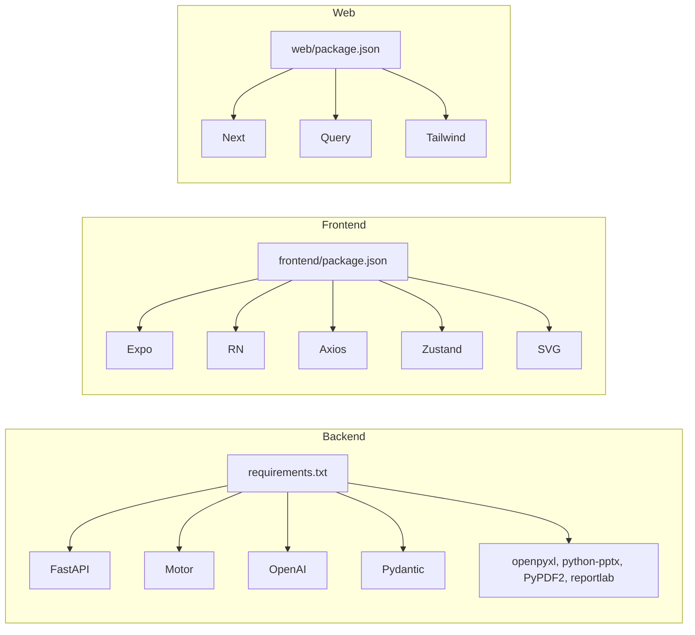
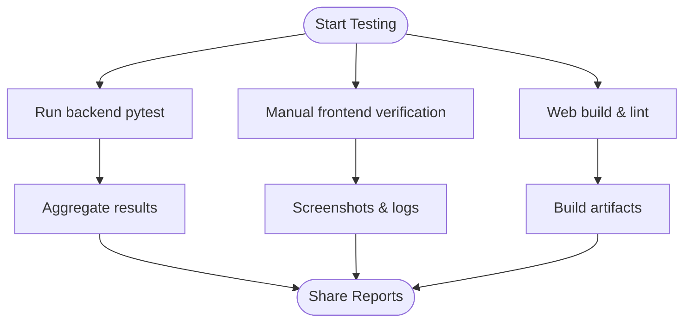
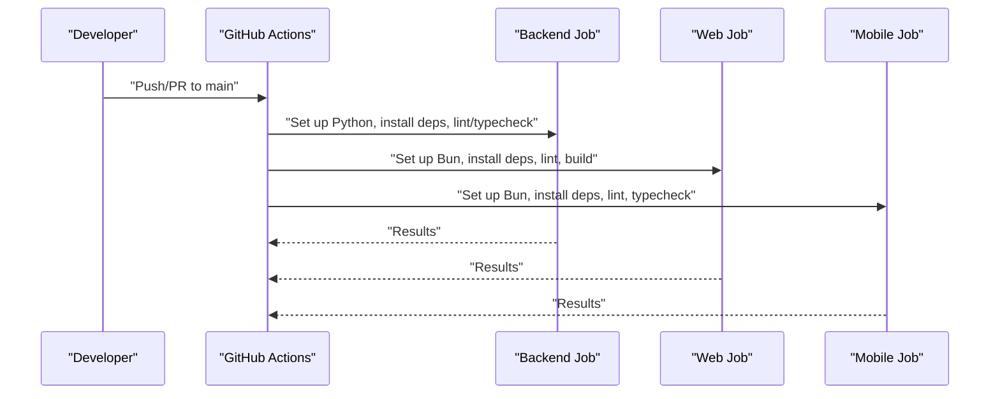

# Development Guide

<cite>
**Referenced Files in This Document**
- [README.md](file://README.md)
- [SETUP_GUIDE.md](file://SETUP_GUIDE.md)
- [ROADMAP.md](file://ROADMAP.md)
- [IMPLEMENTATION_SUMMARY.md](file://IMPLEMENTATION_SUMMARY.md)
- [backend/requirements.txt](file://backend/requirements.txt)
- [backend/server.py](file://backend/server.py)
- [backend_test.py](file://backend_test.py)
- [.github/workflows/ci.yml](file://.github/workflows/ci.yml)
- [.github/workflows/auto-commit.yml](file://.github/workflows/auto-commit.yml)
- [.github/workflows/openhands-agent.yml](file://.github/workflows/openhands-agent.yml)
- [frontend/package.json](file://frontend/package.json)
- [frontend/eslint.config.js](file://frontend/eslint.config.js)
- [web/package.json](file://web/package.json)
- [web/eslint.config.mjs](file://web/eslint.config.mjs)
</cite>

## Table of Contents
1. [Introduction](#introduction)
2. [Project Structure](#project-structure)
3. [Core Components](#core-components)
4. [Architecture Overview](#architecture-overview)
5. [Detailed Component Analysis](#detailed-component-analysis)
6. [Dependency Analysis](#dependency-analysis)
7. [Performance Considerations](#performance-considerations)
8. [Troubleshooting Guide](#troubleshooting-guide)
9. [Contribution Workflow](#contribution-workflow)
10. [Code Quality Standards](#code-quality-standards)
11. [Testing Strategies](#testing-strategies)
12. [CI/CD Pipeline](#cicd-pipeline)
13. [Deployment and Release](#deployment-and-release)
14. [Practical Development Tasks](#practical-development-tasks)
15. [Conclusion](#conclusion)

## Introduction
This development guide provides a complete, contributor-friendly roadmap for building, testing, and releasing Polymath OS across its mobile, web, and backend layers. It consolidates environment setup, dependency management, local stack execution, testing strategies, CI/CD automation, code quality standards, contribution practices, and deployment procedures. The guide balances accessibility for newcomers with the technical depth required by experienced developers.

## Project Structure
Polymath OS is organized into three primary layers:
- Backend: FastAPI application with async MongoDB access, AI integration, and export capabilities
- Frontend (Mobile): Expo Router-based React Native application with tabbed navigation and state management
- Web: Next.js application mirroring mobile features with responsive layouts and TanStack Query

**Diagram sources**
- [backend/server.py:1-200](file://backend/server.py#L1-L200)
- [frontend/package.json:1-67](file://frontend/package.json#L1-L67)
- [web/package.json:1-39](file://web/package.json#L1-L39)

**Section sources**
- [README.md:63-103](file://README.md#L63-L103)
- [SETUP_GUIDE.md:281-330](file://SETUP_GUIDE.md#L281-L330)

## Core Components
- Backend (FastAPI)
  - Async MongoDB access via Motor
  - AI integration using OpenAI SDK
  - Export engine supporting JSON, Markdown, CSV, plus PDF/PPT backend-ready
  - Sentry SDK for error tracking
- Frontend (Expo)
  - File-based routing with Expo Router
  - State management with Zustand
  - UI primitives and navigation with React Navigation
  - Axios for API communication
- Web (Next.js)
  - App Router with TanStack Query for data fetching
  - Responsive design with Tailwind CSS v4
  - Axios for API communication

**Section sources**
- [README.md:63-103](file://README.md#L63-L103)
- [backend/requirements.txt:1-129](file://backend/requirements.txt#L1-L129)
- [frontend/package.json:13-55](file://frontend/package.json#L13-L55)
- [web/package.json:11-18](file://web/package.json#L11-L18)

## Architecture Overview
The system follows a client-server architecture:
- Clients (mobile and web) communicate with the backend via RESTful endpoints
- The backend validates requests, interacts with MongoDB, and orchestrates AI operations
- Export endpoints produce multiple formats for backup and sharing

**Diagram sources**
- [backend/server.py:74-142](file://backend/server.py#L74-L142)
- [README.md:113-141](file://README.md#L113-L141)

**Section sources**
- [README.md:113-141](file://README.md#L113-L141)
- [backend/server.py:74-142](file://backend/server.py#L74-L142)

## Detailed Component Analysis

### Backend Server
Key responsibilities:
- Define Pydantic models for activities, journals, connections, AI configuration, agent memory, persona, and learning logs
- Implement helper functions for deduplication, AI analysis, and export formatting
- Expose REST endpoints for CRUD, AI operations, export/import, and agent memory management

**Diagram sources**
- [backend/server.py:79-179](file://backend/server.py#L79-L179)

**Section sources**
- [backend/server.py:79-179](file://backend/server.py#L79-L179)

### Mobile Frontend (Expo)
- Navigation: Expo Router with file-based routing and bottom tabs
- State: Zustand for global state management
- UI: React Native primitives with SVG-based visualizations
- Networking: Axios for API calls

**Diagram sources**
- [frontend/package.json:13-55](file://frontend/package.json#L13-L55)
- [README.md:113-141](file://README.md#L113-L141)

**Section sources**
- [frontend/package.json:13-55](file://frontend/package.json#L13-L55)
- [README.md:113-141](file://README.md#L113-L141)

### Web Frontend (Next.js)
- Responsive layout with adaptive sidebar and bottom navigation
- TanStack Query for data fetching and caching
- Tailwind CSS v4 for styling and theme switching

**Diagram sources**
- [web/package.json:11-18](file://web/package.json#L11-L18)
- [README.md:113-141](file://README.md#L113-L141)

**Section sources**
- [web/package.json:11-18](file://web/package.json#L11-L18)
- [README.md:113-141](file://README.md#L113-L141)

## Dependency Analysis
- Backend dependencies include FastAPI, Motor, OpenAI SDK, Pydantic, pytest, and export libraries (openpyxl, python-pptx, PyPDF2, reportlab)
- Frontend depends on Expo, React Navigation, Axios, Zustand, and react-native-svg
- Web depends on Next.js, TanStack Query, Axios, and Tailwind CSS v4

**Diagram sources**
- [backend/requirements.txt:1-129](file://backend/requirements.txt#L1-L129)
- [frontend/package.json:13-55](file://frontend/package.json#L13-L55)
- [web/package.json:11-18](file://web/package.json#L11-L18)

**Section sources**
- [backend/requirements.txt:1-129](file://backend/requirements.txt#L1-L129)
- [frontend/package.json:13-55](file://frontend/package.json#L13-L55)
- [web/package.json:11-18](file://web/package.json#L11-L18)

## Performance Considerations
- Use async database operations to avoid blocking the event loop
- Leverage indexing on frequently queried fields (hash, timestamps, categories)
- Minimize payload sizes by requesting only necessary fields
- Cache data on the client using TanStack Query or Zustand to reduce redundant network calls
- Batch operations for file uploads and exports to improve throughput

## Troubleshooting Guide
Common issues and resolutions:
- Backend not reachable
  - Ensure the backend is started with the correct host and port
  - Verify CORS settings and firewall rules
- Frontend cannot connect to backend
  - Use LAN IP instead of localhost in EXPO_PUBLIC_BACKEND_URL
  - Enable tunnel mode if on restricted networks
- MongoDB connection failures
  - Confirm MONGO_URL and DB_NAME in backend .env
  - Whitelist IPs for Atlas or start local service
- AI features disabled
  - Set OPENAI_API_KEY in backend .env
- Memory issues during bundling
  - Increase NODE_OPTIONS memory limit for Metro

**Section sources**
- [SETUP_GUIDE.md:211-277](file://SETUP_GUIDE.md#L211-L277)
- [README.md:142-160](file://README.md#L142-L160)

## Contribution Workflow
Recommended process:
1. Fork and branch from main
2. Set up environments locally (backend uv venv, frontend bun install)
3. Implement feature with clear commit messages
4. Run linters and typechecks
5. Add or update tests
6. Open a pull request with a clear description and screenshots if applicable

**Section sources**
- [.github/workflows/ci.yml:13-100](file://.github/workflows/ci.yml#L13-L100)
- [SETUP_GUIDE.md:256-277](file://SETUP_GUIDE.md#L256-L277)

## Code Quality Standards
- Linting
  - Frontend: ESLint with expo config
  - Web: ESLint with next config
- Formatting
  - Use TypeScript and ESLint rules consistently across platforms
- Type safety
  - Prefer TypeScript and Pydantic models for runtime validation
- Error handling
  - Return appropriate HTTP status codes and structured error messages
- Logging and monitoring
  - Integrate Sentry for error tracking in backend and web apps

**Section sources**
- [frontend/eslint.config.js:1-11](file://frontend/eslint.config.js#L1-L11)
- [web/eslint.config.mjs:1-19](file://web/eslint.config.mjs#L1-L19)
- [backend/server.py:29-41](file://backend/server.py#L29-L41)

## Testing Strategies
- Backend
  - Unit/integration tests using pytest
  - Dedicated test script for agent memory system endpoints
- Frontend
  - Manual verification and automated smoke tests
- Web
  - Build and lint checks in CI
- Test report analysis
  - Collect and review pass/fail outcomes; maintain a test summary

**Diagram sources**
- [backend/requirements.txt:90](file://backend/requirements.txt#L90)
- [backend_test.py:1-456](file://backend_test.py#L1-L456)
- [.github/workflows/ci.yml:35-44](file://.github/workflows/ci.yml#L35-L44)

**Section sources**
- [backend/requirements.txt:90](file://backend/requirements.txt#L90)
- [backend_test.py:1-456](file://backend_test.py#L1-L456)
- [IMPLEMENTATION_SUMMARY.md:348-371](file://IMPLEMENTATION_SUMMARY.md#L348-L371)

## CI/CD Pipeline
Automated workflows:
- CI — Build & Lint
  - Backend: Python linting and optional type checking
  - Web: Bun install, lint, and build
  - Mobile: Bun install, lint, and typecheck
- Auto-Commit Agent Work
  - AI agent performs edits and auto-creates PRs
- OpenHands AI Agent
  - Responds to labeled issues by generating code and opening PRs

**Diagram sources**
- [.github/workflows/ci.yml:13-100](file://.github/workflows/ci.yml#L13-L100)

**Section sources**
- [.github/workflows/ci.yml:1-100](file://.github/workflows/ci.yml#L1-L100)
- [.github/workflows/auto-commit.yml:1-91](file://.github/workflows/auto-commit.yml#L1-L91)
- [.github/workflows/openhands-agent.yml:1-38](file://.github/workflows/openhands-agent.yml#L1-L38)

## Deployment and Release
- Backend
  - Host on a platform that supports Python and uvicorn (e.g., free tiers)
- Mobile
  - Preview builds via EAS internal distribution
  - Production builds via AAB for Play Store
  - Local builds supported via prebuild and Gradle
- Web
  - Deploy via Git push to Vercel
- Environment management
  - Use environment variables for backend (MongoDB, AI keys) and frontend (backend URL)
- Release processes
  - Follow roadmap phases for feature stabilization and distribution

**Section sources**
- [ROADMAP.md:113-230](file://ROADMAP.md#L113-L230)
- [README.md:142-160](file://README.md#L142-L160)

## Practical Development Tasks
- Local development setup
  - Backend: create uv venv, install requirements, configure .env, run uvicorn
  - Frontend: install dependencies, configure .env, start Expo dev server
  - Web: install dependencies, configure .env, run dev server
- Running the complete stack
  - Start backend, then frontend, then web; verify endpoints and UI
- Debugging techniques
  - Inspect API responses, enable Sentry, check logs, and use tunnel mode for remote debugging
- Common tasks
  - Add new endpoints, extend models, integrate new export formats, add UI components

**Section sources**
- [SETUP_GUIDE.md:80-132](file://SETUP_GUIDE.md#L80-L132)
- [SETUP_GUIDE.md:135-208](file://SETUP_GUIDE.md#L135-L208)
- [README.md:142-160](file://README.md#L142-L160)

## Conclusion
This guide consolidates Polymath OS development practices across mobile, web, and backend layers. By following the setup instructions, adhering to code quality standards, leveraging CI/CD automation, and implementing robust testing strategies, contributors can efficiently develop, iterate, and release features while maintaining a high-quality, production-ready codebase.