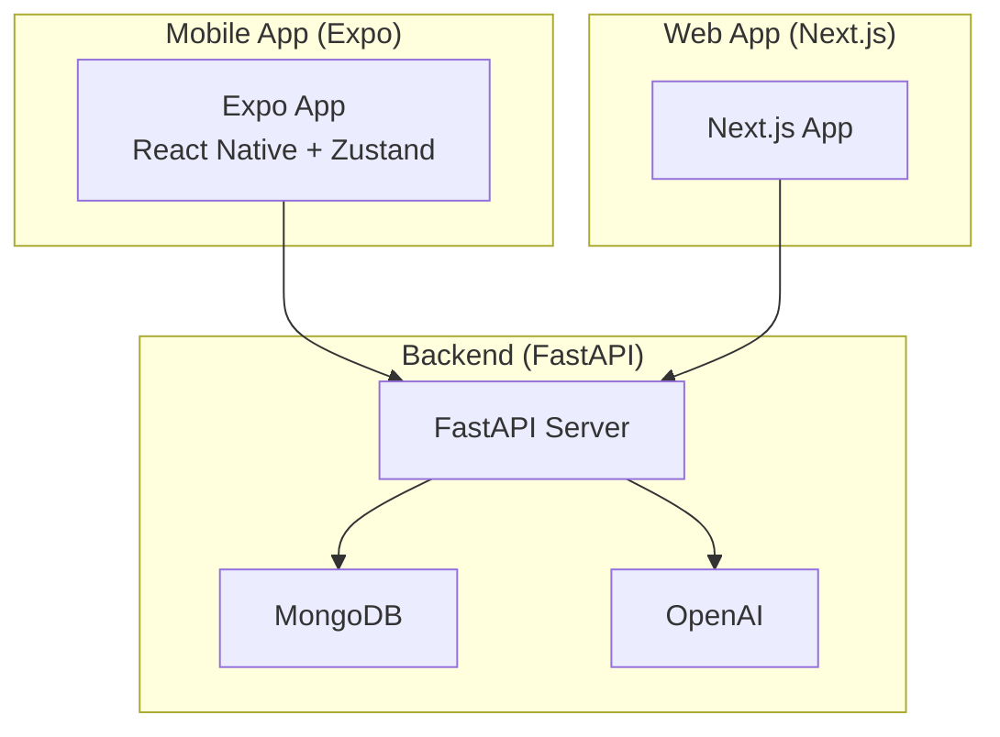

# Getting Started

<cite>
**Referenced Files in This Document**
- [README.md](file://README.md)
- [SETUP_GUIDE.md](file://SETUP_GUIDE.md)
- [backend/requirements.txt](file://backend/requirements.txt)
- [backend/server.py](file://backend/server.py)
- [backend/.env.example](file://backend/.env.example)
- [frontend/package.json](file://frontend/package.json)
- [frontend/app.json](file://frontend/app.json)
- [frontend/.env](file://frontend/.env)
- [frontend/store/useStore.ts](file://frontend/store/useStore.ts)
- [frontend/app/journal.tsx](file://frontend/app/journal.tsx)
- [web/package.json](file://web/package.json)
- [shared/package.json](file://shared/package.json)
</cite>

## Table of Contents
1. [Introduction](#introduction)
2. [Prerequisites](#prerequisites)
3. [Environment Configuration](#environment-configuration)
4. [Installation and Setup](#installation-and-setup)
5. [Basic Usage Patterns](#basic-usage-patterns)
6. [Architecture Overview](#architecture-overview)
7. [Deployment Scenarios](#deployment-scenarios)
8. [Troubleshooting Guide](#troubleshooting-guide)
9. [Conclusion](#conclusion)

## Introduction
This guide helps you set up Polymath OS for the first time, whether you're building the mobile app, the web interface, or both. You will configure prerequisites, environment variables, install dependencies, start the backend and frontend, and perform common tasks like adding activities, creating journal entries, and generating connections. The guide also covers local development, preview deployments, and production considerations.

## Prerequisites
Before installing, ensure these tools are available on your machine:
- Node.js: Version 18+ recommended (20+ preferred)
- Python: Version 3.10+ recommended
- MongoDB: Local instance or Atlas cluster
- Expo CLI: For running the mobile app in development
- Bun: Recommended for fast frontend installs and builds
- uv: Recommended for fast Python virtual environments and installs

Notes:
- The project assumes Windows in parts of the setup guide, but the backend and frontend can run on macOS and Linux with minor adjustments.
- The mobile app requires an Android emulator or a physical device connected via USB or a QR scanner.

**Section sources**
- [SETUP_GUIDE.md:22-31](file://SETUP_GUIDE.md#L22-L31)
- [README.md:3](file://README.md#L3)

## Environment Configuration
Configure environment variables for both backend and frontend.

Backend (.env):
- Required variables:
  - MONGO_URL: MongoDB connection string
  - DB_NAME: Database name
  - OPENAI_API_KEY: API key for AI features (optional if you skip AI)
- Optional variables:
  - SENTRY_DSN: Sentry error tracking
  - SENTRY_ENV: Environment name for Sentry
  - SENTRY_RELEASE: Release identifier for Sentry

Frontend (.env):
- EXPO_PUBLIC_BACKEND_URL: Base URL of your backend server (must be reachable from your phone)

Notes:
- The backend loads environment variables from a .env file located in the backend directory.
- The frontend reads environment variables prefixed with EXPO_PUBLIC_ at build time.

**Section sources**
- [backend/.env.example:1-17](file://backend/.env.example#L1-L17)
- [README.md:144-156](file://README.md#L144-L156)
- [frontend/.env:1-2](file://frontend/.env#L1-L2)

## Installation and Setup
Follow these steps to run the full stack locally.

Step 1: Install Bun and uv
- Bun: Use the official installer or npm.
- uv: Use the official installer or pip.

Step 2: Clone the repository
- Clone the repository and navigate into the project directory.

Step 3: Backend setup (FastAPI)
- Create a Python virtual environment using uv.
- Install dependencies from requirements.txt.
- Create .env from the example and fill in values.
- Start the backend server with Uvicorn.

Step 4: Frontend setup (Expo)
- Install dependencies using Bun.
- Create .env with EXPO_PUBLIC_BACKEND_URL pointing to your backend.
- Start the Expo dev server and scan the QR code with the Expo Go app on your phone.

Optional: Web interface
- Install dependencies in the web folder.
- Start Next.js in development mode.

Notes:
- The backend server runs on port 8001 by default.
- The frontend dev server runs on port 8081 by default.
- Ensure firewall rules allow connections to these ports.

**Section sources**
- [SETUP_GUIDE.md:35-67](file://SETUP_GUIDE.md#L35-L67)
- [SETUP_GUIDE.md:71-132](file://SETUP_GUIDE.md#L71-L132)
- [SETUP_GUIDE.md:135-184](file://SETUP_GUIDE.md#L135-L184)
- [SETUP_GUIDE.md:188-208](file://SETUP_GUIDE.md#L188-L208)
- [web/package.json:1-39](file://web/package.json#L1-L39)

## Basic Usage Patterns
After starting the backend and frontend, you can perform these tasks:

Add a manual activity
- Navigate to the Activities screen.
- Create a new activity with a title, optional URL, source, and timestamp.
- The backend automatically analyzes the content and deduplicates based on a hash.

Create a journal entry
- Navigate to the Journal screen.
- Open the editor modal, enter a title and content, optionally add tags.
- Save the entry; the frontend calls the backend to persist it.

Generate connections
- From the Connections screen, trigger connection generation for a selected activity.
- The backend queries AI to propose relationships and stores them in the database.

Notes:
- The frontend uses Zustand for state management and Axios for API calls.
- The backend exposes REST endpoints for activities, journals, AI operations, and exports.

**Section sources**
- [frontend/app/journal.tsx:59-104](file://frontend/app/journal.tsx#L59-L104)
- [backend/server.py:524-551](file://backend/server.py#L524-L551)
- [backend/server.py:787-806](file://backend/server.py#L787-L806)
- [frontend/store/useStore.ts:1-135](file://frontend/store/useStore.ts#L1-L135)

## Architecture Overview
High-level architecture for local development:
- Backend: FastAPI server exposing REST endpoints, connecting to MongoDB, and integrating with OpenAI for AI features.
- Frontend: Expo app using React Native and Zustand for state, communicating with the backend via HTTP.
- Web: Next.js app sharing common logic with the backend through a shared package.

**Diagram sources**
- [backend/server.py:43-50](file://backend/server.py#L43-L50)
- [frontend/package.json:13-55](file://frontend/package.json#L13-L55)
- [web/package.json:11-19](file://web/package.json#L11-L19)

## Deployment Scenarios
Local development
- Run the backend with Uvicorn and the frontend with Expo start.
- Use LAN IP for EXPO_PUBLIC_BACKEND_URL so your phone can reach the backend over Wi-Fi.

Preview deployments
- Use Expo tunnel mode to expose your local backend and frontend to devices on different networks.
- Ensure ports 8001 (backend) and 8081 (Expo) are reachable.

Production environments
- Backend: Deploy the FastAPI app behind a reverse proxy or container orchestration platform. Set environment variables accordingly.
- Frontend: Build and host the Expo app via EAS Build and distribution channels, or build a native app.
- Web: Build and deploy the Next.js app to your hosting provider.

Notes:
- The project includes EAS configuration files and app.json for mobile builds.
- Sentry can be enabled by setting SENTRY_DSN in the backend environment.

**Section sources**
- [SETUP_GUIDE.md:195-208](file://SETUP_GUIDE.md#L195-L208)
- [frontend/app.json:1-49](file://frontend/app.json#L1-L49)
- [backend/.env.example:13-17](file://backend/.env.example#L13-L17)

## Troubleshooting Guide
Common issues and resolutions:
- Bun warns about packageManager field: This is safe to ignore; Bun is compatible with Yarn lockfiles.
- Metro bundler crashes or runs out of memory: Increase Node heap size via NODE_OPTIONS.
- MONGO_URL connection refused: Start your local MongoDB service or whitelist your IP in Atlas.
- Expo Go cannot connect to the dev server: Ensure both devices are on the same Wi-Fi network; try tunnel mode; check firewall rules for ports 8081 and 8001.
- OPENAI_API_KEY not set: Provide the key in backend .env to enable AI features.
- Python module not found: Activate the uv virtual environment before running the backend.

**Section sources**
- [SETUP_GUIDE.md:213-253](file://SETUP_GUIDE.md#L213-L253)

## Conclusion
You now have the essentials to install, configure, and run Polymath OS locally, along with guidance for preview and production deployments. Start with the backend and frontend commands, verify connectivity, and explore the Activities, Journal, and Connections screens to become familiar with the core workflows.