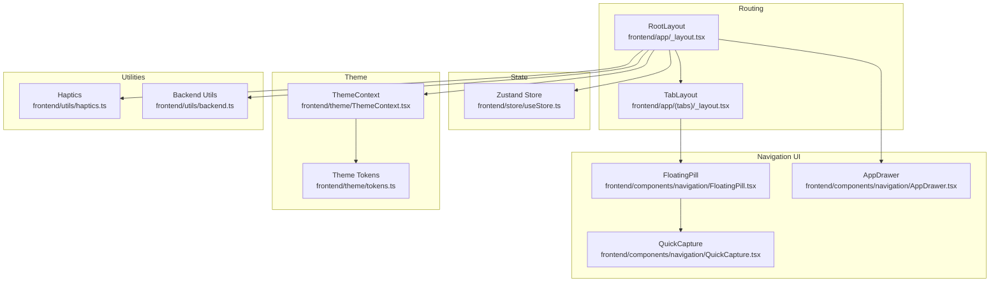
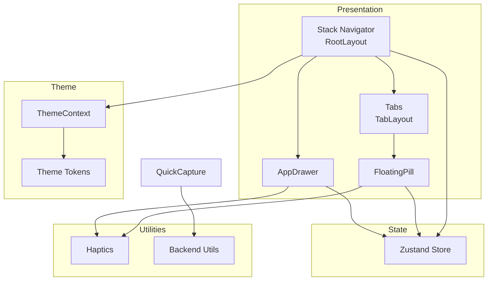
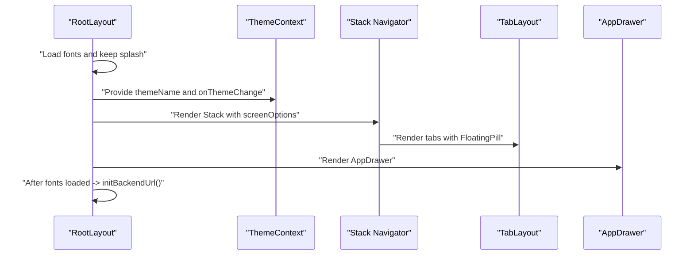
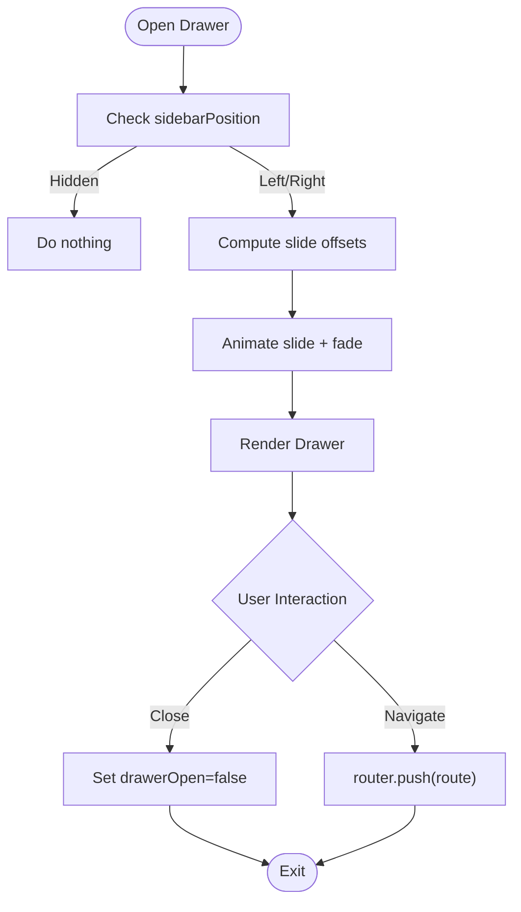
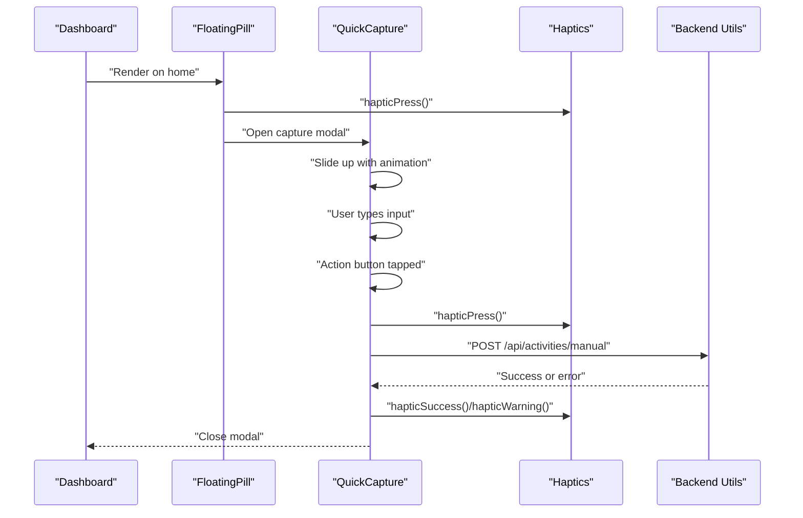
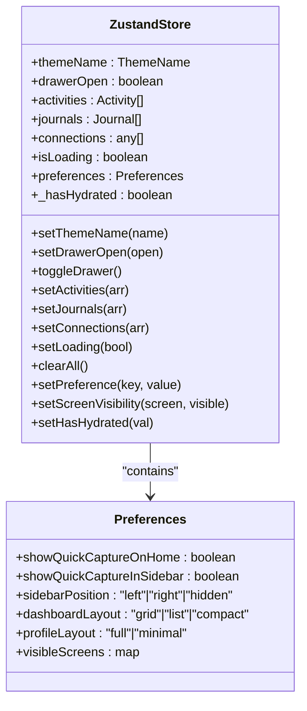
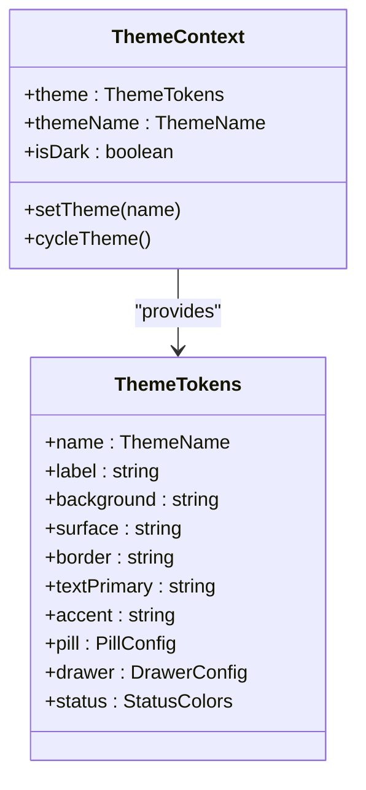
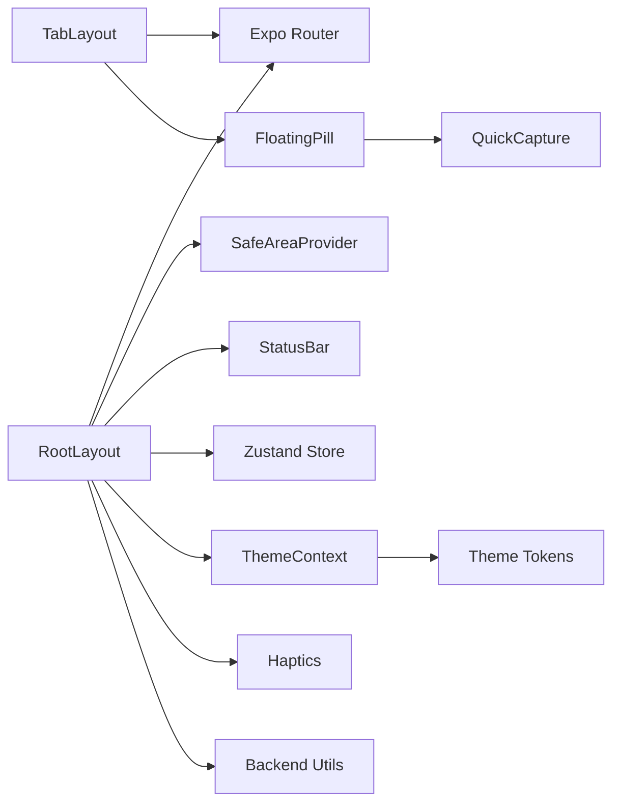

# Mobile Application

<cite>
**Referenced Files in This Document**
- [RootLayout](file://frontend/app/_layout.tsx)
- [TabLayout](file://frontend/app/(tabs)/_layout.tsx)
- [Dashboard](file://frontend/app/(tabs)/index.tsx)
- [AppDrawer](file://frontend/components/navigation/AppDrawer.tsx)
- [FloatingPill](file://frontend/components/navigation/FloatingPill.tsx)
- [QuickCapture](file://frontend/components/navigation/QuickCapture.tsx)
- [ThemeContext](file://frontend/theme/ThemeContext.tsx)
- [Theme Tokens](file://frontend/theme/tokens.ts)
- [Theme Index](file://frontend/theme/index.ts)
- [Zustand Store](file://frontend/store/useStore.ts)
- [Haptics Utils](file://frontend/utils/haptics.ts)
- [Backend Utils](file://frontend/utils/backend.ts)
- [App Config](file://frontend/app.json)
- [Package Dependencies](file://frontend/package.json)
</cite>

## Table of Contents
1. [Introduction](#introduction)
2. [Project Structure](#project-structure)
3. [Core Components](#core-components)
4. [Architecture Overview](#architecture-overview)
5. [Detailed Component Analysis](#detailed-component-analysis)
6. [Dependency Analysis](#dependency-analysis)
7. [Performance Considerations](#performance-considerations)
8. [Troubleshooting Guide](#troubleshooting-guide)
9. [Conclusion](#conclusion)
10. [Appendices](#appendices)

## Introduction
This document explains the mobile application built with Expo and React Native. It focuses on the architectural approach using Expo Router for file-based routing, React Navigation for the tabbed interface, and Zustand for state management. It documents the component structure, navigation patterns, UI components, and the theme system. It also covers platform-specific features such as touch interactions, the floating action “floating pill,” and native integrations via Expo APIs. Practical examples demonstrate component usage, state management patterns, and navigation flows. Finally, it outlines cross-platform considerations between mobile and web, and performance optimization techniques.

## Project Structure
The mobile app is organized under the frontend directory with a clear separation of concerns:
- Routing and entry points: app/_layout.tsx and app/(tabs)/_layout.tsx
- Screens: app/(tabs)/index.tsx and other pages under app/
- Navigation: components/navigation/AppDrawer.tsx, FloatingPill.tsx, QuickCapture.tsx
- State: store/useStore.ts
- Theme: theme/ThemeContext.tsx, theme/tokens.ts, theme/index.ts
- Utilities: utils/haptics.ts, utils/backend.ts
- Configuration: app.json, package.json

**Diagram sources**
- [RootLayout:1-101](file://frontend/app/_layout.tsx#L1-L101)
- [TabLayout](file://frontend/app/(tabs)/_layout.tsx#L1-L32)
- [FloatingPill:1-153](file://frontend/components/navigation/FloatingPill.tsx#L1-L153)
- [AppDrawer:1-376](file://frontend/components/navigation/AppDrawer.tsx#L1-L376)
- [QuickCapture:1-426](file://frontend/components/navigation/QuickCapture.tsx#L1-L426)
- [Zustand Store:1-135](file://frontend/store/useStore.ts#L1-L135)
- [ThemeContext:1-54](file://frontend/theme/ThemeContext.tsx#L1-L54)
- [Theme Tokens:1-586](file://frontend/theme/tokens.ts#L1-L586)
- [Haptics Utils:1-90](file://frontend/utils/haptics.ts#L1-L90)
- [Backend Utils:1-76](file://frontend/utils/backend.ts#L1-L76)

**Section sources**
- [RootLayout:1-101](file://frontend/app/_layout.tsx#L1-L101)
- [TabLayout](file://frontend/app/(tabs)/_layout.tsx#L1-L32)
- [App Config:1-49](file://frontend/app.json#L1-L49)
- [Package Dependencies:1-67](file://frontend/package.json#L1-L67)

## Core Components
- Routing and Shell
  - RootLayout configures the stack navigator, splash screen, fonts, theme provider, and app-wide drawer. It also initializes the backend URL and manages theme background prevention of white flash.
  - TabLayout integrates the floating pill into the tabbed interface and sets screen options based on theme.

- Navigation UI
  - AppDrawer is a full-screen slide-in drawer with animated entrance, filtering by visibility preferences, and theme-aware styling.
  - FloatingPill renders a persistent “floating pill” (quick capture) anchored at the center bottom of the home screen, with fade-in animation and haptic feedback.
  - QuickCapture is a bottom sheet overlay triggered by the floating pill, supporting text input, actions, and submission to the backend.

- State Management
  - Zustand store centralizes theme, drawer state, data arrays, loading flags, and personalization preferences. It includes helpers to update preferences and manage hydration.

- Theme System
  - ThemeContext provides a theme provider and consumer hook, exposing theme tokens and a theme cycling mechanism.
  - Theme tokens define seven themes with consistent semantic colors, typography, drawer, and pill configurations.

- Utilities
  - Haptics provides platform-aware haptic feedback functions for various interactions.
  - Backend utilities resolve and persist the backend URL, expose a configured HTTP client, and initialize the URL at startup.

**Section sources**
- [RootLayout:1-101](file://frontend/app/_layout.tsx#L1-L101)
- [TabLayout](file://frontend/app/(tabs)/_layout.tsx#L1-L32)
- [AppDrawer:1-376](file://frontend/components/navigation/AppDrawer.tsx#L1-L376)
- [FloatingPill:1-153](file://frontend/components/navigation/FloatingPill.tsx#L1-L153)
- [QuickCapture:1-426](file://frontend/components/navigation/QuickCapture.tsx#L1-L426)
- [Zustand Store:1-135](file://frontend/store/useStore.ts#L1-L135)
- [ThemeContext:1-54](file://frontend/theme/ThemeContext.tsx#L1-L54)
- [Theme Tokens:1-586](file://frontend/theme/tokens.ts#L1-L586)
- [Haptics Utils:1-90](file://frontend/utils/haptics.ts#L1-L90)
- [Backend Utils:1-76](file://frontend/utils/backend.ts#L1-L76)

## Architecture Overview
The mobile app follows a layered architecture:
- Presentation Layer: Expo Router-based screens and tabbed interface, with custom tab bar rendering via FloatingPill.
- Navigation Layer: AppDrawer complements the stack navigator for global navigation and settings.
- State Layer: Zustand store encapsulates UI state, preferences, and data.
- Theme Layer: ThemeContext and theme tokens provide a cohesive design system across screens.
- Utility Layer: Haptics and backend utilities integrate native capabilities and network operations.

**Diagram sources**
- [RootLayout:1-101](file://frontend/app/_layout.tsx#L1-L101)
- [TabLayout](file://frontend/app/(tabs)/_layout.tsx#L1-L32)
- [FloatingPill:1-153](file://frontend/components/navigation/FloatingPill.tsx#L1-L153)
- [AppDrawer:1-376](file://frontend/components/navigation/AppDrawer.tsx#L1-L376)
- [Zustand Store:1-135](file://frontend/store/useStore.ts#L1-L135)
- [ThemeContext:1-54](file://frontend/theme/ThemeContext.tsx#L1-L54)
- [Theme Tokens:1-586](file://frontend/theme/tokens.ts#L1-L586)
- [Haptics Utils:1-90](file://frontend/utils/haptics.ts#L1-L90)
- [Backend Utils:1-76](file://frontend/utils/backend.ts#L1-L76)

## Detailed Component Analysis

### Routing and Shell: RootLayout and TabLayout
- RootLayout orchestrates:
  - Splash screen and font loading lifecycle
  - Theme provider with theme name and theme change callback
  - Stack navigator with hidden headers and fade/slide animations
  - AppDrawer inclusion
  - Backend URL initialization after fonts load
- TabLayout:
  - Uses Expo Router Tabs
  - Renders FloatingPill as the tab bar
  - Applies theme-based background and scene styles

**Diagram sources**
- [RootLayout:1-101](file://frontend/app/_layout.tsx#L1-L101)
- [TabLayout](file://frontend/app/(tabs)/_layout.tsx#L1-L32)
- [ThemeContext:1-54](file://frontend/theme/ThemeContext.tsx#L1-L54)
- [AppDrawer:1-376](file://frontend/components/navigation/AppDrawer.tsx#L1-L376)

**Section sources**
- [RootLayout:1-101](file://frontend/app/_layout.tsx#L1-L101)
- [TabLayout](file://frontend/app/(tabs)/_layout.tsx#L1-L32)

### Navigation UI: AppDrawer
- Features:
  - Slide-in/out animation with spring and timing
  - Filtering of navigation items based on preferences.visibleScreens
  - Theme-aware colors and icons
  - Cycle theme action integrated in the footer
- Behavior:
  - Controlled by Zustand store drawerOpen flag
  - Respects sidebar position preference (left/right/hidden)
  - Uses haptic feedback for interactions

**Diagram sources**
- [AppDrawer:1-376](file://frontend/components/navigation/AppDrawer.tsx#L1-L376)
- [Zustand Store:1-135](file://frontend/store/useStore.ts#L1-L135)

**Section sources**
- [AppDrawer:1-376](file://frontend/components/navigation/AppDrawer.tsx#L1-L376)
- [Zustand Store:1-135](file://frontend/store/useStore.ts#L1-L135)

### Navigation UI: FloatingPill and QuickCapture
- FloatingPill:
  - Centered pill with theme-aware border/shadow
  - Visibility controlled by preferences.showQuickCaptureOnHome
  - Fade-in animation after app readiness
  - Opens QuickCapture modal on press
- QuickCapture:
  - Bottom sheet with slide-up animation
  - Input area with character counter and keyboard handling
  - Action buttons (voice, link, scan, file) with haptic feedback
  - Submission to backend endpoint with error handling and alerts

**Diagram sources**
- [FloatingPill:1-153](file://frontend/components/navigation/FloatingPill.tsx#L1-L153)
- [QuickCapture:1-426](file://frontend/components/navigation/QuickCapture.tsx#L1-L426)
- [Haptics Utils:1-90](file://frontend/utils/haptics.ts#L1-L90)
- [Backend Utils:1-76](file://frontend/utils/backend.ts#L1-L76)

**Section sources**
- [FloatingPill:1-153](file://frontend/components/navigation/FloatingPill.tsx#L1-L153)
- [QuickCapture:1-426](file://frontend/components/navigation/QuickCapture.tsx#L1-L426)
- [Haptics Utils:1-90](file://frontend/utils/haptics.ts#L1-L90)
- [Backend Utils:1-76](file://frontend/utils/backend.ts#L1-L76)

### State Management: Zustand Store
- Responsibilities:
  - Theme management (themeName, setThemeName)
  - Drawer state (drawerOpen, setDrawerOpen, toggleDrawer)
  - Data arrays (activities, journals, connections) and loading state
  - Preferences (showQuickCaptureOnHome, sidebarPosition, dashboardLayout, visibleScreens)
  - Hydration flag for async theme persistence
- Patterns:
  - Slice-based selectors for efficient re-renders
  - Setters for nested preferences and visibility toggles

**Diagram sources**
- [Zustand Store:1-135](file://frontend/store/useStore.ts#L1-L135)

**Section sources**
- [Zustand Store:1-135](file://frontend/store/useStore.ts#L1-L135)

### Theme System: ThemeContext and Tokens
- ThemeContext:
  - Exposes theme, themeName, setTheme, cycleTheme, and isDark
  - Provider accepts themeName and onThemeChange callbacks
- Theme Tokens:
  - Seven themes with consistent semantic colors, typography, drawer, and pill configurations
  - Helper to compute next theme in rotation
- Integration:
  - RootLayout passes themeName and onThemeChange to ThemeProvider
  - Components consume useTheme for colors and styling

**Diagram sources**
- [ThemeContext:1-54](file://frontend/theme/ThemeContext.tsx#L1-L54)
- [Theme Tokens:1-586](file://frontend/theme/tokens.ts#L1-L586)

**Section sources**
- [ThemeContext:1-54](file://frontend/theme/ThemeContext.tsx#L1-L54)
- [Theme Tokens:1-586](file://frontend/theme/tokens.ts#L1-L586)
- [Theme Index:1-7](file://frontend/theme/index.ts#L1-L7)

### Platform-Specific Features and Integrations
- Touch Interactions and Feedback:
  - Haptics utilities provide consistent feedback for presses, selections, drawers, and notifications.
- Floating Action “Floating Pill”:
  - Persistent, theme-aware pill rendered only on home and after app readiness.
- Native Integrations:
  - Expo Clipboard for pasting URLs
  - Expo Haptics for impact/notification feedback
  - Async storage for backend URL persistence
  - Safe area and status bar integration
- Backend Integration:
  - Runtime resolution of backend URL with environment variable override and platform defaults
  - Axios client creation with timeout and base URL

**Section sources**
- [Haptics Utils:1-90](file://frontend/utils/haptics.ts#L1-L90)
- [FloatingPill:1-153](file://frontend/components/navigation/FloatingPill.tsx#L1-L153)
- [QuickCapture:1-426](file://frontend/components/navigation/QuickCapture.tsx#L1-L426)
- [Backend Utils:1-76](file://frontend/utils/backend.ts#L1-L76)

### Practical Examples
- Navigating from FloatingPill to QuickCapture:
  - The pill triggers a modal that slides up; on submit, it posts to the backend and closes.
- Drawer Navigation:
  - AppDrawer filters visible screens based on preferences and navigates via router.push.
- Theme Cycling:
  - AppDrawer’s footer triggers theme cycling through ThemeContext.

**Section sources**
- [FloatingPill:1-153](file://frontend/components/navigation/FloatingPill.tsx#L1-L153)
- [QuickCapture:1-426](file://frontend/components/navigation/QuickCapture.tsx#L1-L426)
- [AppDrawer:1-376](file://frontend/components/navigation/AppDrawer.tsx#L1-L376)
- [ThemeContext:1-54](file://frontend/theme/ThemeContext.tsx#L1-L54)

## Dependency Analysis
- Routing and Navigation:
  - RootLayout depends on Expo Router Stack, SafeAreaProvider, and StatusBar.
  - TabLayout depends on Expo Router Tabs and FloatingPill.
- State:
  - Components depend on Zustand store via selectors.
- Theme:
  - ThemeContext depends on theme tokens; components consume useTheme.
- Utilities:
  - Haptics wraps Expo haptics; Backend utils wrap AsyncStorage and axios.

**Diagram sources**
- [RootLayout:1-101](file://frontend/app/_layout.tsx#L1-L101)
- [TabLayout](file://frontend/app/(tabs)/_layout.tsx#L1-L32)
- [FloatingPill:1-153](file://frontend/components/navigation/FloatingPill.tsx#L1-L153)
- [QuickCapture:1-426](file://frontend/components/navigation/QuickCapture.tsx#L1-L426)
- [Zustand Store:1-135](file://frontend/store/useStore.ts#L1-L135)
- [ThemeContext:1-54](file://frontend/theme/ThemeContext.tsx#L1-L54)
- [Theme Tokens:1-586](file://frontend/theme/tokens.ts#L1-L586)
- [Haptics Utils:1-90](file://frontend/utils/haptics.ts#L1-L90)
- [Backend Utils:1-76](file://frontend/utils/backend.ts#L1-L76)

**Section sources**
- [Package Dependencies:1-67](file://frontend/package.json#L1-L67)
- [App Config:1-49](file://frontend/app.json#L1-L49)

## Performance Considerations
- Rendering and Animations
  - Use native driver for animations where possible (as seen in FloatingPill and QuickCapture).
  - Minimize layout thrashing by avoiding unnecessary re-renders; leverage Zustand selectors.
- Network and Data
  - Batch requests when feasible; the dashboard loads stats, activities, and journals concurrently.
  - Persist backend URL to avoid repeated lookups.
- Fonts and Splash
  - Prevent auto-hide splash until fonts are loaded to avoid white flashes.
- Theme and Styles
  - Compute theme once per provider render and memoize derived values.
- Platform Differences
  - Adjust keyboard and backdrop handling per platform to avoid gaps or overlap issues.

[No sources needed since this section provides general guidance]

## Troubleshooting Guide
- Backend URL Issues
  - Verify environment variable and platform defaults; use initBackendUrl during app startup.
  - Persist and reset backend URL using AsyncStorage-backed utilities.
- Haptics Not Triggering
  - Ensure platform is not web; haptics are conditionally executed.
- Drawer Not Appearing
  - Confirm sidebar position is not set to hidden and drawerOpen is true.
- QuickCapture Not Opening
  - Ensure preferences.allowQuickCaptureOnHome is enabled and app is hydrated.
- Theme Not Changing
  - Confirm ThemeProvider receives themeName and onThemeChange; cycleTheme should call onThemeChange.

**Section sources**
- [Backend Utils:1-76](file://frontend/utils/backend.ts#L1-L76)
- [Haptics Utils:1-90](file://frontend/utils/haptics.ts#L1-L90)
- [AppDrawer:1-376](file://frontend/components/navigation/AppDrawer.tsx#L1-L376)
- [FloatingPill:1-153](file://frontend/components/navigation/FloatingPill.tsx#L1-L153)
- [ThemeContext:1-54](file://frontend/theme/ThemeContext.tsx#L1-L54)

## Conclusion
The mobile application leverages Expo Router for structured routing, React Navigation for the tabbed interface, and Zustand for efficient state management. The theme system ensures a consistent design language across screens, while native integrations and haptics enhance the user experience. The floating pill and drawer provide streamlined navigation and quick capture workflows. Cross-platform considerations and performance optimizations are integrated throughout the architecture to support both mobile and web environments.

[No sources needed since this section summarizes without analyzing specific files]

## Appendices

### Cross-Platform Considerations
- Web vs. Mobile
  - Web bundler and output are configured; platform differences are handled in haptics and backend URL resolution.
- Edge-to-edge and Safe Area
  - SafeAreaProvider and platform-specific safe area insets are used across components.
- Backend Connectivity
  - Android emulator uses a special loopback address; iOS simulator uses localhost.

**Section sources**
- [App Config:1-49](file://frontend/app.json#L1-L49)
- [Package Dependencies:1-67](file://frontend/package.json#L1-L67)
- [Backend Utils:1-76](file://frontend/utils/backend.ts#L1-L76)