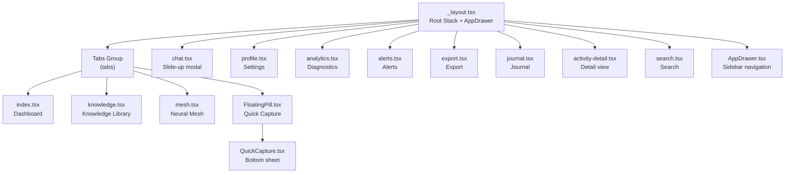
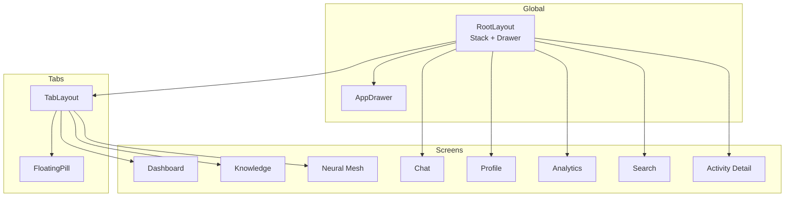
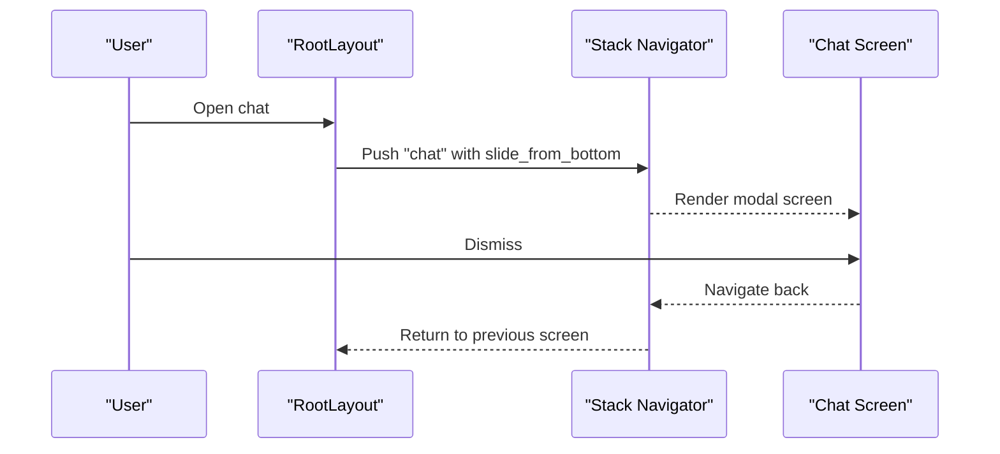
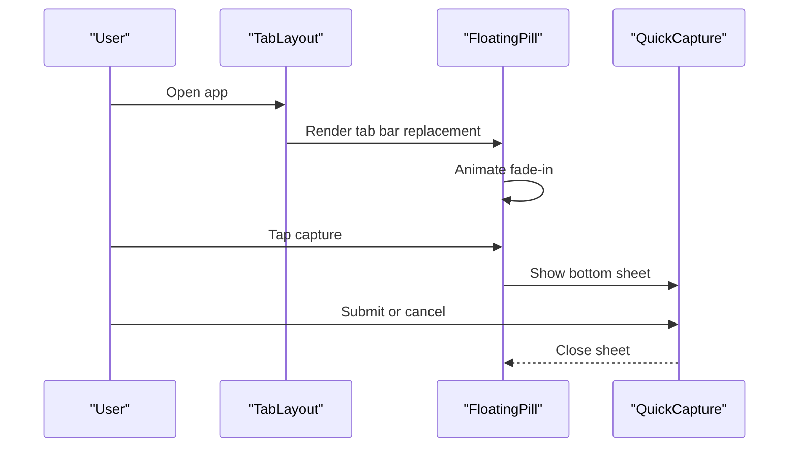
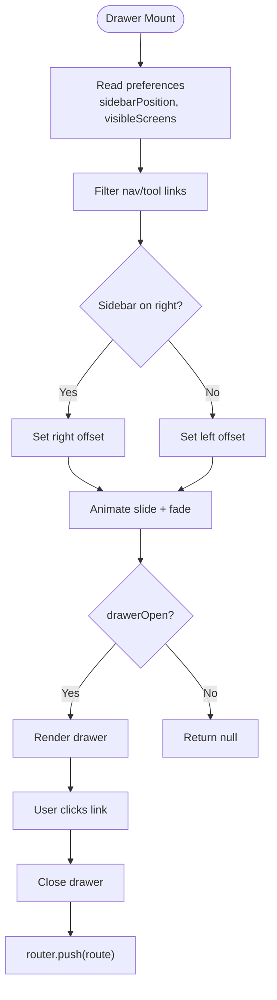
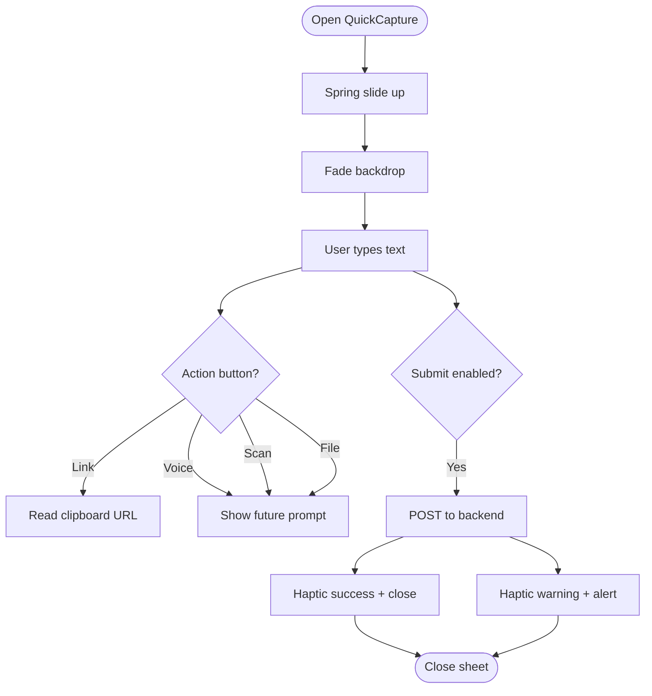
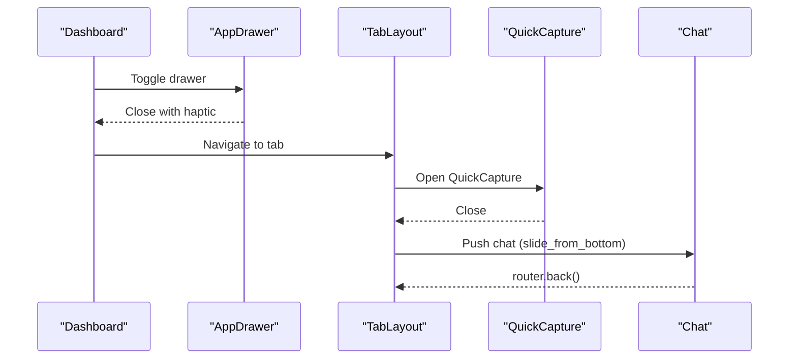
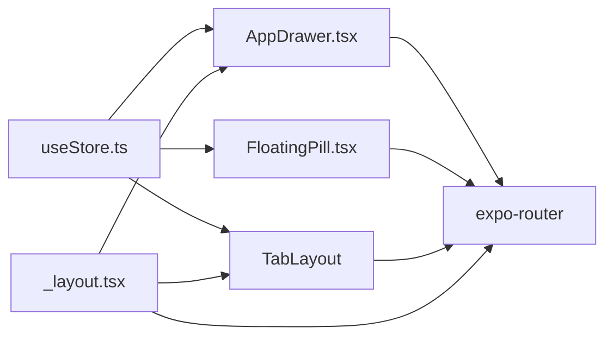

# Navigation System

<cite>
**Referenced Files in This Document**
- [RootLayout](file://frontend/app/_layout.tsx)
- [TabLayout](file://frontend/app/(tabs)/_layout.tsx)
- [Index](file://frontend/app/(tabs)/index.tsx)
- [Knowledge](file://frontend/app/(tabs)/knowledge.tsx)
- [Mesh](file://frontend/app/(tabs)/mesh.tsx)
- [AppDrawer](file://frontend/components/navigation/AppDrawer.tsx)
- [FloatingPill](file://frontend/components/navigation/FloatingPill.tsx)
- [QuickCapture](file://frontend/components/navigation/QuickCapture.tsx)
- [Chat](file://frontend/app/chat.tsx)
- [Profile](file://frontend/app/profile.tsx)
- [Analytics](file://frontend/app/analytics.tsx)
- [Search](file://frontend/app/search.tsx)
- [ActivityDetail](file://frontend/app/activity-detail.tsx)
- [useStore](file://frontend/store/useStore.ts)
</cite>

## Table of Contents
1. [Introduction](#introduction)
2. [Project Structure](#project-structure)
3. [Core Components](#core-components)
4. [Architecture Overview](#architecture-overview)
5. [Detailed Component Analysis](#detailed-component-analysis)
6. [Dependency Analysis](#dependency-analysis)
7. [Performance Considerations](#performance-considerations)
8. [Troubleshooting Guide](#troubleshooting-guide)
9. [Conclusion](#conclusion)

## Introduction
This document explains the navigation system built with Expo Router and React Navigation. It covers file-based routing, Stack navigation for modal-like screens, and a tabbed interface for primary navigation. It documents the AppDrawer component for sidebar navigation, the floating pill and QuickCapture for instant activity entry, and the screen transitions and modal presentations. Practical guidance is included for adding new routes, customizing navigation behavior, and managing navigation state.

## Project Structure
The navigation system centers around:
- Root layout orchestrating global Stack navigation and the AppDrawer.
- Tab groups under a dedicated folder for tabbed navigation.
- Navigation components for drawer, floating pill, and quick capture.
- Individual screens for each route, integrated via Expo Router’s file-based routing.

**Diagram sources**
- [RootLayout:36-58](file://frontend/app/_layout.tsx#L36-L58)
- [TabLayout](file://frontend/app/(tabs)/_layout.tsx#L9-L29)
- [Index](file://frontend/app/(tabs)/index.tsx#L117-L135)
- [Knowledge](file://frontend/app/(tabs)/knowledge.tsx#L155-L177)
- [Mesh](file://frontend/app/(tabs)/mesh.tsx#L183-L199)
- [AppDrawer:132-136](file://frontend/components/navigation/AppDrawer.tsx#L132-L136)
- [FloatingPill:61-64](file://frontend/components/navigation/FloatingPill.tsx#L61-L64)
- [QuickCapture:125-152](file://frontend/components/navigation/QuickCapture.tsx#L125-L152)

**Section sources**
- [RootLayout:36-58](file://frontend/app/_layout.tsx#L36-L58)
- [TabLayout](file://frontend/app/(tabs)/_layout.tsx#L9-L29)

## Core Components
- Root Stack and Drawer: The root layout defines global Stack screens and mounts the AppDrawer. It sets up theme-aware backgrounds and animations for stack screens, including a slide-from-bottom animation for the chat modal.
- Tabbed Interface: The tabs group configures the tab bar and injects the floating pill component as the tab bar renderer.
- AppDrawer: A full-screen slide-in drawer with animated backdrop and slide-in panel. It reads preferences to filter visible screens and supports theme cycling.
- Floating Pill and QuickCapture: A floating action pill that triggers a bottom sheet overlay for quick capture. It handles keyboard-aware animations and submission to the backend.

**Section sources**
- [RootLayout:36-58](file://frontend/app/_layout.tsx#L36-L58)
- [TabLayout](file://frontend/app/(tabs)/_layout.tsx#L9-L29)
- [AppDrawer:58-125](file://frontend/components/navigation/AppDrawer.tsx#L58-L125)
- [FloatingPill:33-68](file://frontend/components/navigation/FloatingPill.tsx#L33-L68)
- [QuickCapture:45-116](file://frontend/components/navigation/QuickCapture.tsx#L45-L116)

## Architecture Overview
The navigation architecture combines file-based routing with explicit Stack and Tabs configurations:
- File-based routing maps files under the app directory to routes.
- Stack screens define global modals and transitions.
- Tabs define the main tabbed interface.
- Drawer and floating components integrate with the store for state-driven behavior.

**Diagram sources**
- [RootLayout:36-58](file://frontend/app/_layout.tsx#L36-L58)
- [TabLayout](file://frontend/app/(tabs)/_layout.tsx#L9-L29)
- [AppDrawer:144-248](file://frontend/components/navigation/AppDrawer.tsx#L144-L248)
- [FloatingPill:69-122](file://frontend/components/navigation/FloatingPill.tsx#L69-L122)

## Detailed Component Analysis

### Root Stack and Modals
- Defines Stack screens for the entire app, including the tabs group and several standalone screens.
- Sets global screen options such as header visibility and background color.
- Configures a slide-from-bottom animation for the chat screen to present it as a modal.
- Integrates the AppDrawer beneath the Stack so it overlays the current screen.

**Diagram sources**
- [RootLayout:44-47](file://frontend/app/_layout.tsx#L44-L47)
- [Chat:182-199](file://frontend/app/chat.tsx#L182-L199)

**Section sources**
- [RootLayout:36-58](file://frontend/app/_layout.tsx#L36-L58)
- [Chat:30-140](file://frontend/app/chat.tsx#L30-L140)

### Tabbed Interface and Floating Pill
- The tabs group configures three tabs: Dashboard, Knowledge, and Neural Mesh.
- The tab bar is replaced with the FloatingPill component, which renders a pill with animated fade-in and a centered capture action.
- The pill conditionally renders based on preferences and app hydration state.

**Diagram sources**
- [TabLayout](file://frontend/app/(tabs)/_layout.tsx#L9-L29)
- [FloatingPill:33-68](file://frontend/components/navigation/FloatingPill.tsx#L33-L68)
- [QuickCapture:83-114](file://frontend/components/navigation/QuickCapture.tsx#L83-L114)

**Section sources**
- [TabLayout](file://frontend/app/(tabs)/_layout.tsx#L9-L29)
- [FloatingPill:33-68](file://frontend/components/navigation/FloatingPill.tsx#L33-L68)
- [QuickCapture:45-116](file://frontend/components/navigation/QuickCapture.tsx#L45-L116)

### AppDrawer: State, Filtering, and Animation
- Reads drawerOpen from the store to control visibility.
- Filters navigation items based on preferences for screen visibility and sidebar position.
- Uses Animated springs and timings to animate slide and fade.
- Provides a theme toggle and closes the drawer on navigation.

**Diagram sources**
- [AppDrawer:58-125](file://frontend/components/navigation/AppDrawer.tsx#L58-L125)
- [useStore:103-107](file://frontend/store/useStore.ts#L103-L107)

**Section sources**
- [AppDrawer:58-125](file://frontend/components/navigation/AppDrawer.tsx#L58-L125)
- [useStore:103-107](file://frontend/store/useStore.ts#L103-L107)

### QuickCapture: Gesture Handling and Animations
- Presents a bottom sheet with spring and timing animations.
- Handles keyboard events to adjust spacing and avoid overlap.
- Submits captured text to the backend and shows feedback via alerts and haptics.
- Supports action buttons for voice, link, scan, and file.

**Diagram sources**
- [QuickCapture:83-114](file://frontend/components/navigation/QuickCapture.tsx#L83-L114)
- [QuickCapture:125-152](file://frontend/components/navigation/QuickCapture.tsx#L125-L152)

**Section sources**
- [QuickCapture:45-116](file://frontend/components/navigation/QuickCapture.tsx#L45-L116)
- [QuickCapture:125-152](file://frontend/components/navigation/QuickCapture.tsx#L125-L152)

### Navigation Flow Patterns and Transitions
- Stack transitions:
  - Default fade for most screens.
  - Slide-from-bottom for chat modal.
- Tab transitions:
  - Standard tab switching within the tabs group.
- Drawer navigation:
  - Drawer slides in/out with spring/fade animations.
  - Navigation after drawer close uses a small delay to ensure animation completes.
- Back navigation:
  - Screens use router.back() to return to previous views.

**Diagram sources**
- [Index](file://frontend/app/(tabs)/index.tsx#L117-L135)
- [AppDrawer:127-136](file://frontend/components/navigation/AppDrawer.tsx#L127-L136)
- [TabLayout](file://frontend/app/(tabs)/_layout.tsx#L9-L29)
- [QuickCapture:176-180](file://frontend/components/navigation/QuickCapture.tsx#L176-L180)
- [Chat:182-199](file://frontend/app/chat.tsx#L182-L199)

**Section sources**
- [RootLayout:36-58](file://frontend/app/_layout.tsx#L36-L58)
- [Index](file://frontend/app/(tabs)/index.tsx#L117-L135)
- [Chat:182-199](file://frontend/app/chat.tsx#L182-L199)

### Adding New Routes and Customizing Behavior
- Add a new route:
  - Create a new file under the app directory (e.g., frontend/app/new-screen.tsx).
  - For tabbed screens, place them under the tabs group folder (e.g., frontend/app/(tabs)/new-screen.tsx).
  - Register the route in the Stack navigator if it should appear globally.
- Customize transitions:
  - Modify screen options in the Stack configuration for global animations.
  - Use route-specific options for individual screens.
- Drawer visibility and filtering:
  - Update preferences in the store to control sidebar position and visible screens.
  - The drawer filters links based on preferences and sidebar position.

Practical steps:
- To add a new tab: create a new file under the tabs group and add a Tabs.Screen entry.
- To add a new global modal: add a Stack.Screen with desired animation options.
- To change drawer behavior: update preferences in the store and rely on the drawer’s filtering logic.

**Section sources**
- [RootLayout:44-57](file://frontend/app/_layout.tsx#L44-L57)
- [TabLayout](file://frontend/app/(tabs)/_layout.tsx#L17-L29)
- [useStore:80-96](file://frontend/store/useStore.ts#L80-L96)
- [AppDrawer:70-82](file://frontend/components/navigation/AppDrawer.tsx#L70-L82)

## Dependency Analysis
The navigation system relies on:
- Expo Router for file-based routing and Stack/Tabs configuration.
- React Native Animated for drawer and sheet animations.
- Zustand store for global state (drawer state, preferences).
- Theme provider for consistent theming across components.

**Diagram sources**
- [useStore:98-134](file://frontend/store/useStore.ts#L98-L134)
- [AppDrawer:58-125](file://frontend/components/navigation/AppDrawer.tsx#L58-L125)
- [FloatingPill:33-68](file://frontend/components/navigation/FloatingPill.tsx#L33-L68)
- [TabLayout](file://frontend/app/(tabs)/_layout.tsx#L9-L29)
- [RootLayout:36-58](file://frontend/app/_layout.tsx#L36-L58)

**Section sources**
- [useStore:98-134](file://frontend/store/useStore.ts#L98-L134)
- [AppDrawer:58-125](file://frontend/components/navigation/AppDrawer.tsx#L58-L125)
- [FloatingPill:33-68](file://frontend/components/navigation/FloatingPill.tsx#L33-L68)
- [TabLayout](file://frontend/app/(tabs)/_layout.tsx#L9-L29)
- [RootLayout:36-58](file://frontend/app/_layout.tsx#L36-L58)

## Performance Considerations
- Prefer native driver for animations where possible to reduce JS thread load.
- Defer rendering of the floating pill until the app is hydrated to avoid unnecessary animations.
- Use spring animations judiciously; balance responsiveness with performance.
- Keep drawer content optimized; avoid heavy computations during open/close animations.

## Troubleshooting Guide
- Drawer does not appear:
  - Verify sidebar position preference is not set to hidden.
  - Confirm drawerOpen state is toggled correctly.
- QuickCapture not opening:
  - Ensure the floating pill is visible and hydrated.
  - Check keyboard listeners and animation timing.
- Navigation feels sluggish:
  - Review animation durations and easing.
  - Ensure animations use native driver when applicable.
- Drawer navigation delay:
  - The drawer introduces a short delay before navigating to allow animation completion.

**Section sources**
- [AppDrawer:124-136](file://frontend/components/navigation/AppDrawer.tsx#L124-L136)
- [FloatingPill:48-59](file://frontend/components/navigation/FloatingPill.tsx#L48-L59)
- [QuickCapture:96-114](file://frontend/components/navigation/QuickCapture.tsx#L96-L114)

## Conclusion
The navigation system leverages Expo Router’s file-based routing with explicit Stack and Tabs configurations. The AppDrawer and floating pill provide efficient navigation and quick capture workflows, while animations and theme integration deliver a polished user experience. By centralizing state in the store and keeping components modular, the system remains extensible and maintainable.