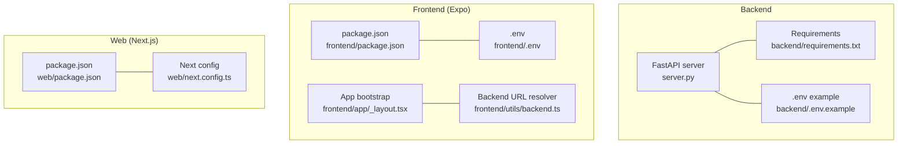
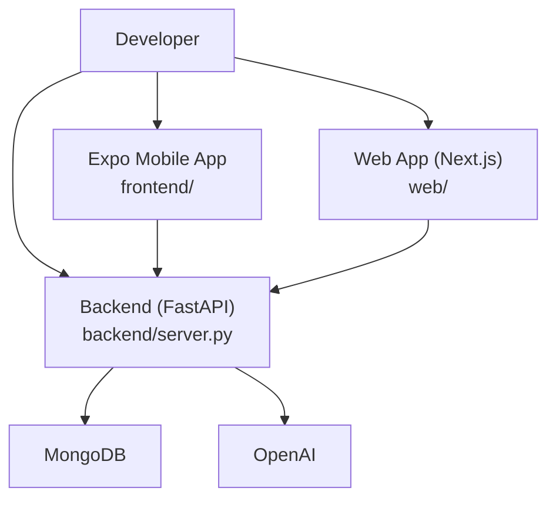
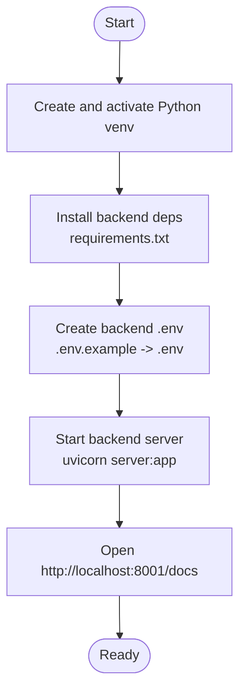
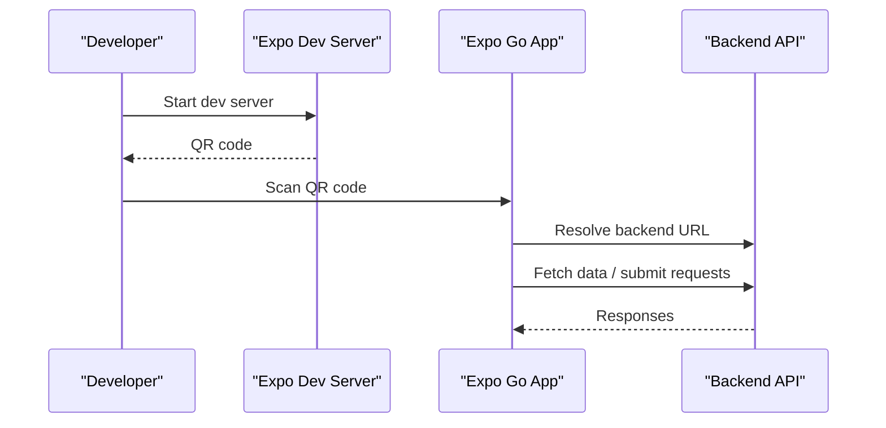
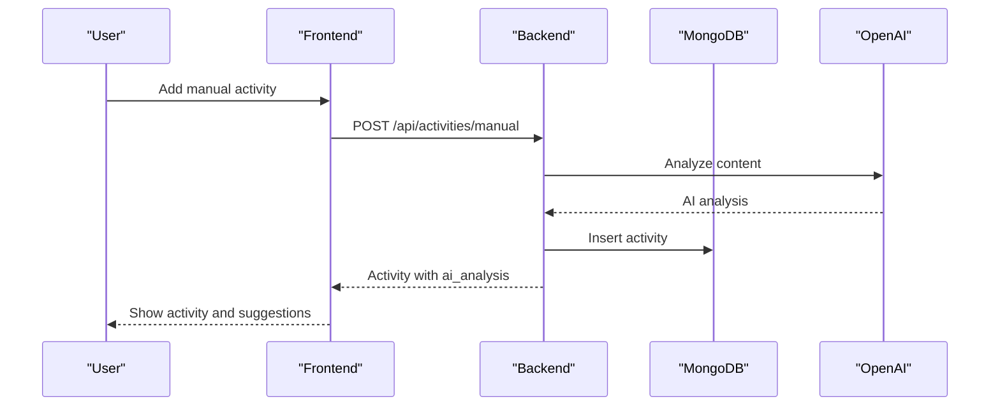
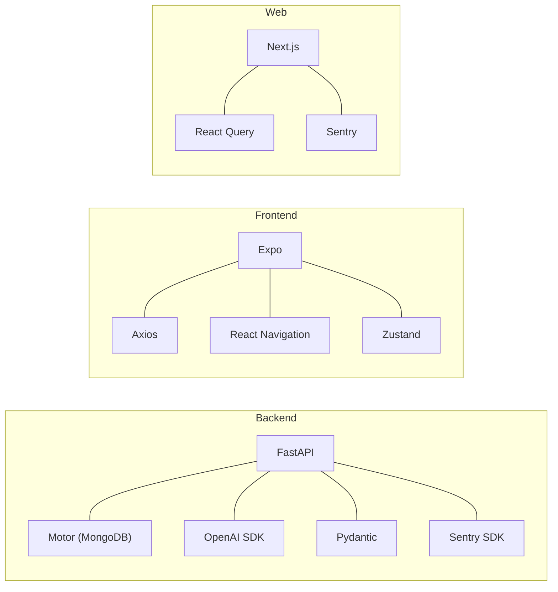

# Getting Started

<cite>
**Referenced Files in This Document**
- [README.md](file://README.md)
- [SETUP_GUIDE.md](file://SETUP_GUIDE.md)
- [backend/requirements.txt](file://backend/requirements.txt)
- [backend/server.py](file://backend/server.py)
- [backend/.env.example](file://backend/.env.example)
- [backend/tunnel.py](file://backend/tunnel.py)
- [frontend/package.json](file://frontend/package.json)
- [frontend/.env](file://frontend/.env)
- [frontend/app.json](file://frontend/app.json)
- [frontend/utils/backend.ts](file://frontend/utils/backend.ts)
- [frontend/app/_layout.tsx](file://frontend/app/_layout.tsx)
- [web/package.json](file://web/package.json)
- [web/next.config.ts](file://web/next.config.ts)
- [shared/constants.ts](file://shared/constants.ts)
</cite>

## Table of Contents
1. [Introduction](#introduction)
2. [Project Structure](#project-structure)
3. [Core Components](#core-components)
4. [Architecture Overview](#architecture-overview)
5. [Detailed Component Analysis](#detailed-component-analysis)
6. [Dependency Analysis](#dependency-analysis)
7. [Performance Considerations](#performance-considerations)
8. [Troubleshooting Guide](#troubleshooting-guide)
9. [Conclusion](#conclusion)
10. [Appendices](#appendices)

## Introduction
This guide helps you install and run Polymath OS quickly on Windows. You will set up the backend (FastAPI), configure environment variables, install frontend dependencies, and launch both the mobile app (via Expo) and the web interface. You will also learn how to verify the setup, connect mobile and web clients, and troubleshoot common issues like port conflicts and database connectivity.

## Project Structure
Polymath OS consists of:
- Backend: FastAPI server with async MongoDB access and AI integration
- Frontend: Expo (React Native) mobile app with file-based routing
- Web: Next.js app for desktop browsing
- Shared: Common constants and types used across platforms

**Diagram sources**
- [backend/server.py:1-120](file://backend/server.py#L1-L120)
- [backend/requirements.txt:1-129](file://backend/requirements.txt#L1-L129)
- [backend/.env.example:1-17](file://backend/.env.example#L1-L17)
- [frontend/package.json:1-67](file://frontend/package.json#L1-L67)
- [frontend/.env:1-2](file://frontend/.env#L1-L2)
- [frontend/app/_layout.tsx:1-101](file://frontend/app/_layout.tsx#L1-L101)
- [frontend/utils/backend.ts:1-76](file://frontend/utils/backend.ts#L1-L76)
- [web/package.json:1-39](file://web/package.json#L1-L39)
- [web/next.config.ts:1-21](file://web/next.config.ts#L1-L21)

**Section sources**
- [README.md:1-242](file://README.md#L1-L242)
- [SETUP_GUIDE.md:281-330](file://SETUP_GUIDE.md#L281-L330)

## Core Components
- Backend server: Provides REST endpoints for activities, journals, AI analysis, connections, and agent memory. It connects to MongoDB and integrates with OpenAI for content analysis and suggestions.
- Frontend (Expo): Mobile app that communicates with the backend using Axios. It resolves the backend URL from environment variables, with platform-specific defaults for simulators.
- Web (Next.js): Desktop/web interface mirroring core views and state management.

Key capabilities:
- Activity tracking with AI-powered categorization and deduplication
- Journaling with tagging and linking to activities
- Knowledge visualization (timeline, graph, suggestions)
- Export/import in multiple formats
- Agent memory system with insights and persona configuration

**Section sources**
- [README.md:57-141](file://README.md#L57-L141)
- [backend/server.py:74-180](file://backend/server.py#L74-L180)
- [frontend/utils/backend.ts:16-76](file://frontend/utils/backend.ts#L16-L76)

## Architecture Overview
High-level flow:
- Developer runs backend and frontend servers
- Mobile app (Expo) and web app resolve the backend URL and call REST endpoints
- Backend persists data to MongoDB and optionally calls OpenAI for AI features
- Agent memory system enhances personalization and insights

**Diagram sources**
- [backend/server.py:43-51](file://backend/server.py#L43-L51)
- [frontend/utils/backend.ts:56-65](file://frontend/utils/backend.ts#L56-L65)
- [web/package.json:11-19](file://web/package.json#L11-L19)

## Detailed Component Analysis

### Backend Setup (FastAPI)
Steps:
1. Create a Python virtual environment and activate it
2. Install dependencies from requirements.txt
3. Create and edit the backend .env file with MongoDB and OpenAI credentials
4. Start the backend server on port 8001

Verification:
- Open the interactive API docs at http://localhost:8001/docs
- Health endpoint confirms database and AI configuration status

**Diagram sources**
- [SETUP_GUIDE.md:80-132](file://SETUP_GUIDE.md#L80-L132)
- [backend/requirements.txt:1-129](file://backend/requirements.txt#L1-L129)
- [backend/.env.example:1-17](file://backend/.env.example#L1-L17)

**Section sources**
- [SETUP_GUIDE.md:80-132](file://SETUP_GUIDE.md#L80-L132)
- [backend/.env.example:1-17](file://backend/.env.example#L1-L17)
- [backend/server.py:43-51](file://backend/server.py#L43-L51)

### Frontend Setup (Expo / React Native)
Steps:
1. Install dependencies using Bun
2. Create frontend .env with EXPO_PUBLIC_BACKEND_URL pointing to your backend
3. Start the Expo dev server and scan the QR code with Expo Go on your phone
4. Optionally run in browser for quick checks

Notes:
- The app resolves the backend URL from EXPO_PUBLIC_BACKEND_URL, with platform-specific defaults for simulators
- If your phone is on a different network, use tunnel mode or set a LAN IP

**Diagram sources**
- [SETUP_GUIDE.md:135-184](file://SETUP_GUIDE.md#L135-L184)
- [frontend/utils/backend.ts:23-38](file://frontend/utils/backend.ts#L23-L38)
- [frontend/.env:1-2](file://frontend/.env#L1-L2)

**Section sources**
- [SETUP_GUIDE.md:135-184](file://SETUP_GUIDE.md#L135-L184)
- [frontend/.env:1-2](file://frontend/.env#L1-L2)
- [frontend/utils/backend.ts:16-76](file://frontend/utils/backend.ts#L16-L76)

### Web App Setup (Next.js)
Steps:
1. Install dependencies using Bun
2. Start the Next.js dev server
3. Browse to http://localhost:3000

Optional Sentry integration:
- Configure NEXT_PUBLIC_SENTRY_DSN in environment to enable error tracking

**Section sources**
- [web/package.json:5-10](file://web/package.json#L5-L10)
- [web/next.config.ts:8-20](file://web/next.config.ts#L8-L20)

### Environment Variables

Backend (.env):
- MONGO_URL: MongoDB connection string
- DB_NAME: Database name
- OPENAI_API_KEY: Required for AI features (categorization, connections, agent)
- SENTRY_DSN (optional): Enable error tracking

Frontend (.env):
- EXPO_PUBLIC_BACKEND_URL: URL of the backend server (LAN IP recommended for device testing)

Tunnel automation:
- backend/tunnel.py can start a Cloudflare tunnel and automatically update frontend/.env

**Section sources**
- [backend/.env.example:1-17](file://backend/.env.example#L1-L17)
- [frontend/.env:1-2](file://frontend/.env#L1-L2)
- [backend/tunnel.py:17-38](file://backend/tunnel.py#L17-L38)

### Running the Development Servers
- Backend: uvicorn server:app --host 0.0.0.0 --port 8001 --reload
- Frontend (Expo): npx expo start
- Frontend (Expo tunnel): npx expo start --tunnel
- Web: npm run dev (or equivalent with Bun)

Verification:
- Backend docs: http://localhost:8001/docs
- Mobile: scan QR code from Expo terminal
- Web: open http://localhost:3000

**Section sources**
- [README.md:157-160](file://README.md#L157-L160)
- [SETUP_GUIDE.md:256-277](file://SETUP_GUIDE.md#L256-L277)

### Basic Workflow: First Activity and AI Analysis
1. Open the Activities screen in the mobile app or web app
2. Add a manual activity (title, URL, notes)
3. The backend automatically performs AI analysis (categorization, content type)
4. View the activity in the list and drill into details
5. Explore AI suggestions and connections from the dashboard

**Diagram sources**
- [backend/server.py:524-551](file://backend/server.py#L524-L551)
- [backend/server.py:192-233](file://backend/server.py#L192-L233)

**Section sources**
- [backend/server.py:524-551](file://backend/server.py#L524-L551)
- [backend/server.py:192-233](file://backend/server.py#L192-L233)

### Connecting Mobile and Web Clients
- Ensure both devices are on the same network or use tunnel mode
- Set EXPO_PUBLIC_BACKEND_URL to your backend’s LAN IP or tunnel URL
- Restart the Expo dev server after changing frontend/.env

**Section sources**
- [SETUP_GUIDE.md:169-177](file://SETUP_GUIDE.md#L169-L177)
- [frontend/utils/backend.ts:23-38](file://frontend/utils/backend.ts#L23-L38)
- [backend/tunnel.py:40-54](file://backend/tunnel.py#L40-L54)

## Dependency Analysis
Backend dependencies include FastAPI, Motor (async MongoDB), OpenAI SDK, Pydantic, and Sentry SDK. Frontend depends on Expo, React Navigation, Axios, and Zustand. Web uses Next.js, React Query, and Sentry.

**Diagram sources**
- [backend/requirements.txt:21-123](file://backend/requirements.txt#L21-L123)
- [frontend/package.json:13-55](file://frontend/package.json#L13-L55)
- [web/package.json:11-19](file://web/package.json#L11-L19)

**Section sources**
- [backend/requirements.txt:1-129](file://backend/requirements.txt#L1-L129)
- [frontend/package.json:1-67](file://frontend/package.json#L1-L67)
- [web/package.json:1-39](file://web/package.json#L1-L39)

## Performance Considerations
- Use Bun for fast frontend installs and builds
- Use uv for rapid Python dependency management
- Keep backend and frontend on the same local network to avoid latency
- Monitor memory usage during Metro bundling; increase Node heap if needed

[No sources needed since this section provides general guidance]

## Troubleshooting Guide
Common issues and fixes:
- Port conflicts: Change backend port or stop conflicting services
- Dependency errors: Reinstall with Bun and uv; ensure venv is activated
- Database connectivity: Start local MongoDB service or whitelist IPs for Atlas
- Expo Go connection: Same network or tunnel mode; check firewall for ports 8081 and 8001
- Missing AI features: Set OPENAI_API_KEY in backend/.env
- Metro crashes: Increase NODE_OPTIONS memory

**Section sources**
- [SETUP_GUIDE.md:211-254](file://SETUP_GUIDE.md#L211-L254)

## Conclusion
You now have the essentials to install, configure, and run Polymath OS locally. Start the backend, install frontend dependencies, connect your devices, and explore activities, AI analysis, and the dashboard. Use the troubleshooting section for quick fixes and refer to the architecture overview for system context.

[No sources needed since this section summarizes without analyzing specific files]

## Appendices

### Quick Reference Commands
- Backend: uvicorn server:app --host 0.0.0.0 --port 8001 --reload
- Frontend: npx expo start
- Frontend tunnel: npx expo start --tunnel
- Web: npm run dev
- Health check: http://localhost:8001/docs

**Section sources**
- [README.md:157-160](file://README.md#L157-L160)
- [SETUP_GUIDE.md:256-277](file://SETUP_GUIDE.md#L256-L277)

### Environment Variable Reference
Backend:
- MONGO_URL: MongoDB connection string
- DB_NAME: Database name
- OPENAI_API_KEY: OpenAI API key
- SENTRY_DSN: Optional Sentry DSN

Frontend:
- EXPO_PUBLIC_BACKEND_URL: Backend URL for the app

**Section sources**
- [backend/.env.example:1-17](file://backend/.env.example#L1-L17)
- [frontend/.env:1-2](file://frontend/.env#L1-L2)