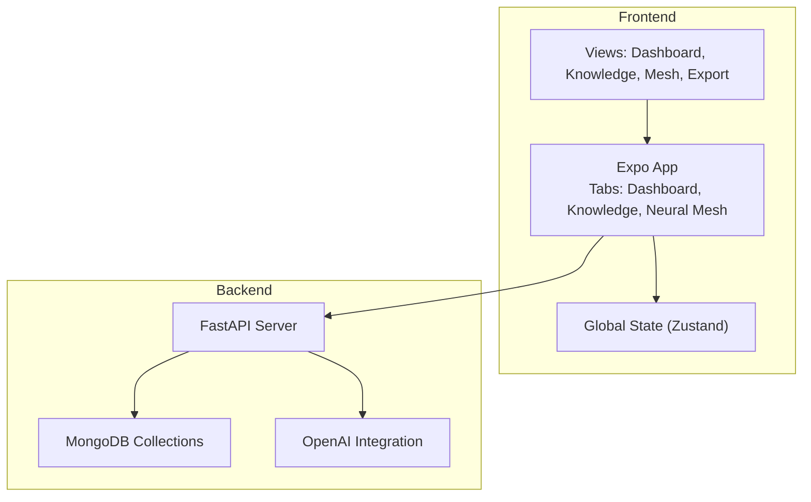
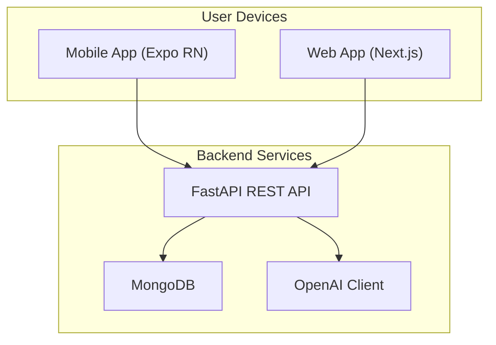
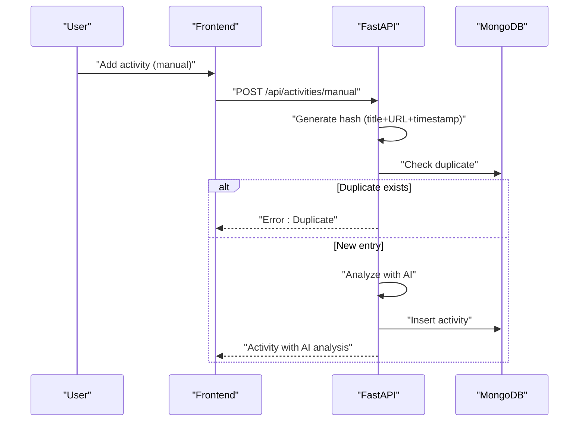
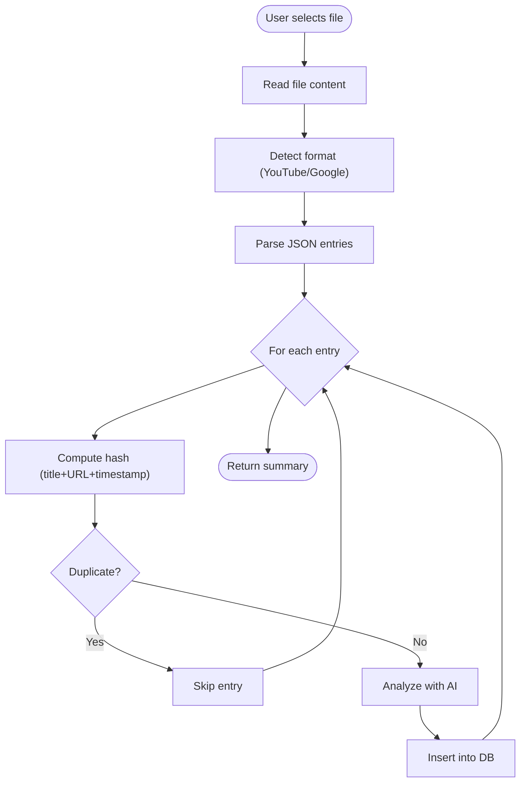
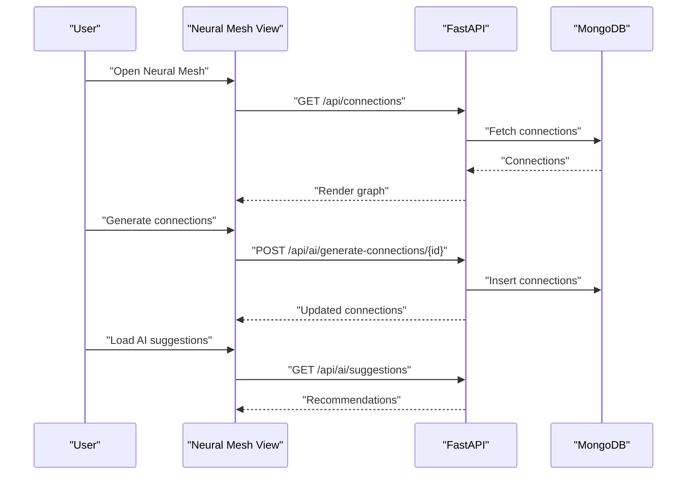
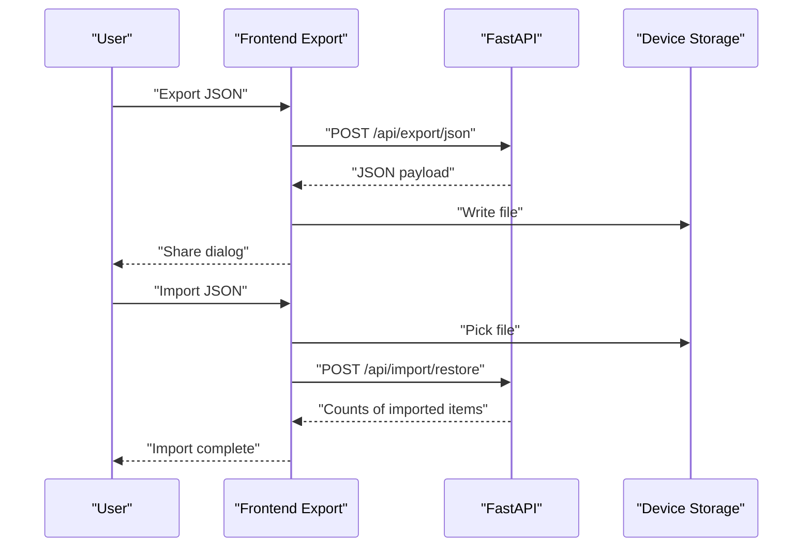
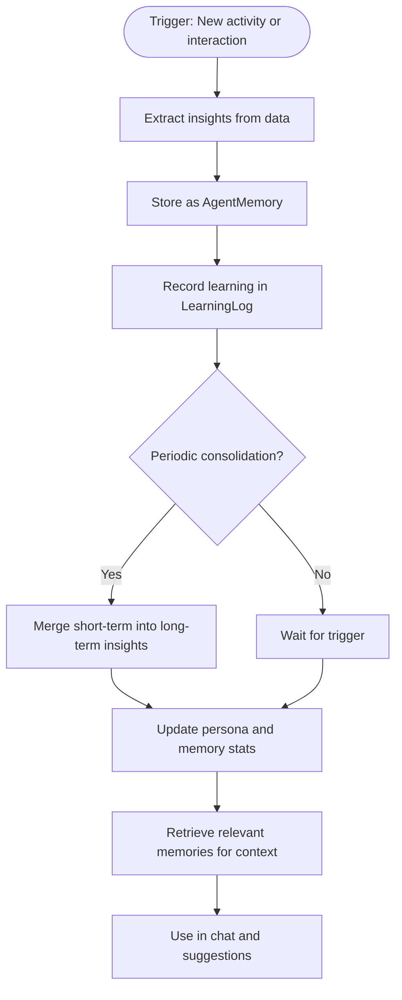
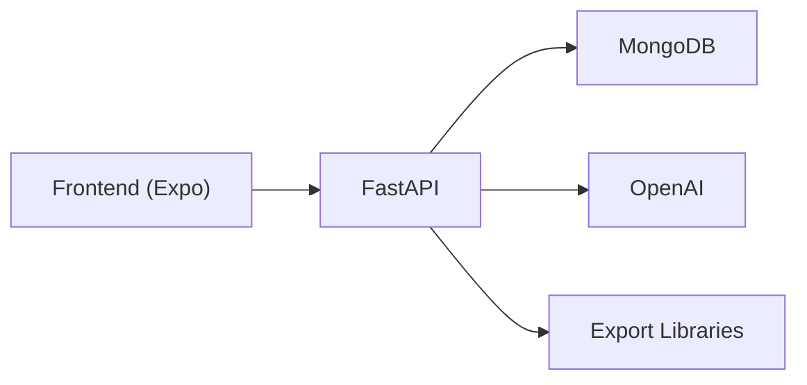

# Project Overview

<cite>
**Referenced Files in This Document**
- [README.md](file://README.md)
- [IMPLEMENTATION_SUMMARY.md](file://IMPLEMENTATION_SUMMARY.md)
- [ROADMAP.md](file://ROADMAP.md)
- [docs/00_USER_GUIDE.md](file://docs/00_USER_GUIDE.md)
- [docs/05_COMPLETE_TECHNICAL_DOCS.md](file://docs/05_COMPLETE_TECHNICAL_DOCS.md)
- [backend/server.py](file://backend/server.py)
- [backend/requirements.txt](file://backend/requirements.txt)
- [frontend/app/(tabs)/_layout.tsx](file://frontend/app/(tabs)/_layout.tsx)
- [frontend/app/(tabs)/index.tsx](file://frontend/app/(tabs)/index.tsx)
- [frontend/app/(tabs)/knowledge.tsx](file://frontend/app/(tabs)/knowledge.tsx)
- [frontend/app/(tabs)/mesh.tsx](file://frontend/app/(tabs)/mesh.tsx)
- [frontend/app/export.tsx](file://frontend/app/export.tsx)
- [frontend/store/useStore.ts](file://frontend/store/useStore.ts)
</cite>

## Table of Contents
1. [Introduction](#introduction)
2. [Project Structure](#project-structure)
3. [Core Components](#core-components)
4. [Architecture Overview](#architecture-overview)
5. [Detailed Component Analysis](#detailed-component-analysis)
6. [Dependency Analysis](#dependency-analysis)
7. [Performance Considerations](#performance-considerations)
8. [Troubleshooting Guide](#troubleshooting-guide)
9. [Conclusion](#conclusion)
10. [Appendices](#appendices)

## Introduction
Polymath OS is a comprehensive learning tracking platform designed to help you monitor, organize, and visualize knowledge acquisition across multiple domains. As a cross-platform application, it enables you to capture learning from diverse sources—manual entries, file uploads, and planned API integrations—and transform them into actionable insights through AI-powered analysis. Its core value proposition centers on three pillars:
- AI-powered content analysis that automatically categorizes and enriches learning materials
- Intelligent knowledge mapping that reveals connections and suggests next steps
- Cross-platform accessibility that lets you track and explore your learning journey from mobile, web, and desktop environments

The platform introduces advanced capabilities like “dots to connect” visualization modes (timeline, graph, AI suggestions), a robust export/import system for complete data portability, and an Agent Memory System that evolves with your learning patterns to provide personalized, context-aware assistance.

## Project Structure
Polymath OS follows a modern, layered architecture:
- Frontend (Expo React Native) for mobile and web experiences
- Backend (FastAPI) for data orchestration, AI integration, and persistence
- Shared data models and APIs enabling seamless communication
- A responsive design system supporting multiple themes and platforms

**Diagram sources**
- [frontend/app/(tabs)/_layout.tsx](file://frontend/app/(tabs)/_layout.tsx#L1-L32)
- [frontend/store/useStore.ts:49-78](file://frontend/store/useStore.ts#L49-L78)
- [backend/server.py:74-75](file://backend/server.py#L74-L75)

**Section sources**
- [README.md:63-177](file://README.md#L63-L177)
- [docs/05_COMPLETE_TECHNICAL_DOCS.md:5-26](file://docs/05_COMPLETE_TECHNICAL_DOCS.md#L5-L26)

## Core Components
- Activity Tracking: Capture learning from manual entries, file uploads (YouTube/Google history), and future API integrations. Automatic AI categorization and deduplication ensure quality and uniqueness.
- Journaling: Create reflective entries, tag them for organization, and link them to activities for richer context.
- Knowledge Visualization (“Dots to Connect”): Explore your learning journey through:
  - Timeline view: chronological display with category badges
  - Graph view: interactive network of connections with AI reasoning
  - AI Suggestions: personalized recommendations based on your history
- Export & Import: Back up your entire dataset in multiple formats (JSON, Markdown, CSV) and restore it seamlessly across devices.
- Agent Memory System: A persistent AI agent that learns from your activities and interactions, consolidating insights over time and enhancing future responses.

**Section sources**
- [README.md:5-62](file://README.md#L5-L62)
- [README.md:211-242](file://README.md#L211-L242)
- [docs/05_COMPLETE_TECHNICAL_DOCS.md:151-187](file://docs/05_COMPLETE_TECHNICAL_DOCS.md#L151-L187)

## Architecture Overview
At a high level, Polymath OS integrates a mobile-first frontend with a FastAPI backend and MongoDB for persistence. AI-driven enrichment and connection discovery are powered by OpenAI, while the export engine supports multiple formats.

**Diagram sources**
- [docs/05_COMPLETE_TECHNICAL_DOCS.md:433-441](file://docs/05_COMPLETE_TECHNICAL_DOCS.md#L433-L441)
- [backend/server.py:48-51](file://backend/server.py#L48-L51)

**Section sources**
- [docs/05_COMPLETE_TECHNICAL_DOCS.md:433-441](file://docs/05_COMPLETE_TECHNICAL_DOCS.md#L433-L441)
- [backend/server.py:43-51](file://backend/server.py#L43-L51)

## Detailed Component Analysis

### Activity Tracking Workflow
This workflow covers manual entry, file upload, AI analysis, deduplication, and storage.

**Diagram sources**
- [docs/05_COMPLETE_TECHNICAL_DOCS.md:84-103](file://docs/05_COMPLETE_TECHNICAL_DOCS.md#L84-L103)
- [backend/server.py:525-551](file://backend/server.py#L525-L551)

**Section sources**
- [docs/05_COMPLETE_TECHNICAL_DOCS.md:84-103](file://docs/05_COMPLETE_TECHNICAL_DOCS.md#L84-L103)
- [backend/server.py:525-551](file://backend/server.py#L525-L551)

### File Upload Processing
File uploads (YouTube/Google history) are parsed, deduplicated, and enriched with AI analysis.

**Diagram sources**
- [docs/05_COMPLETE_TECHNICAL_DOCS.md:96-103](file://docs/05_COMPLETE_TECHNICAL_DOCS.md#L96-L103)
- [backend/server.py:553-611](file://backend/server.py#L553-L611)

**Section sources**
- [docs/05_COMPLETE_TECHNICAL_DOCS.md:96-103](file://docs/05_COMPLETE_TECHNICAL_DOCS.md#L96-L103)
- [backend/server.py:553-611](file://backend/server.py#L553-L611)

### Knowledge Visualization Views
The Neural Mesh screen renders a dynamic SVG graph of connections, with controls to generate connections and load AI suggestions.

**Diagram sources**
- [frontend/app/(tabs)/mesh.tsx](file://frontend/app/(tabs)/mesh.tsx#L64-L126)
- [docs/05_COMPLETE_TECHNICAL_DOCS.md:176-187](file://docs/05_COMPLETE_TECHNICAL_DOCS.md#L176-L187)
- [backend/server.py:787-806](file://backend/server.py#L787-L806)

**Section sources**
- [frontend/app/(tabs)/mesh.tsx](file://frontend/app/(tabs)/mesh.tsx#L64-L126)
- [docs/05_COMPLETE_TECHNICAL_DOCS.md:176-187](file://docs/05_COMPLETE_TECHNICAL_DOCS.md#L176-L187)
- [backend/server.py:787-806](file://backend/server.py#L787-L806)

### Export and Import Lifecycle
Export generates a complete backup; Import restores state from a previously exported JSON file.

**Diagram sources**
- [frontend/app/export.tsx:47-96](file://frontend/app/export.tsx#L47-L96)
- [docs/05_COMPLETE_TECHNICAL_DOCS.md:218-251](file://docs/05_COMPLETE_TECHNICAL_DOCS.md#L218-L251)
- [backend/server.py:646-659](file://backend/server.py#L646-L659)

**Section sources**
- [frontend/app/export.tsx:47-96](file://frontend/app/export.tsx#L47-L96)
- [docs/05_COMPLETE_TECHNICAL_DOCS.md:218-251](file://docs/05_COMPLETE_TECHNICAL_DOCS.md#L218-L251)
- [backend/server.py:646-659](file://backend/server.py#L646-L659)

### Agent Memory System
The Agent Memory System learns from activities, journals, and interactions, consolidating insights over time and enabling memory-aware chat and recommendations.

**Diagram sources**
- [backend/server.py:320-497](file://backend/server.py#L320-L497)

**Section sources**
- [README.md:211-242](file://README.md#L211-L242)
- [backend/server.py:320-497](file://backend/server.py#L320-L497)

## Dependency Analysis
- Frontend dependencies include Expo, React Navigation, Zustand for state, and UI libraries for cross-platform components.
- Backend depends on FastAPI, Motor (async MongoDB driver), OpenAI client, and export libraries for multiple formats.
- AI integration leverages OpenAI directly for content analysis, connection discovery, and suggestions.

**Diagram sources**
- [docs/05_COMPLETE_TECHNICAL_DOCS.md:365-394](file://docs/05_COMPLETE_TECHNICAL_DOCS.md#L365-L394)
- [backend/requirements.txt:21-129](file://backend/requirements.txt#L21-L129)

**Section sources**
- [docs/05_COMPLETE_TECHNICAL_DOCS.md:365-394](file://docs/05_COMPLETE_TECHNICAL_DOCS.md#L365-L394)
- [backend/requirements.txt:21-129](file://backend/requirements.txt#L21-L129)

## Performance Considerations
- Asynchronous operations: Backend uses async/await for database and AI calls to avoid blocking.
- Efficient queries: MongoDB indexes on hash, timestamps, and categories optimize lookups.
- Client-side caching: Zustand manages global state to minimize redundant API calls.
- Deduplication: SHA-256 hashing ensures minimal duplicate processing and storage overhead.
- Scalability: Modular backend endpoints and shared models support incremental feature additions.

[No sources needed since this section provides general guidance]

## Troubleshooting Guide
Common issues and resolutions:
- Routing errors on initial load: Fixed by adjusting navigation setup and ensuring proper layout mounting.
- AI integration import issues: Corrected import statements to use the proper module path for AI clients.
- Backend AI function syntax: Updated to use async/await with the correct client interface.
- Environment configuration: Ensure backend .env variables (MongoDB connection, API keys) and frontend .env (backend URL) are correctly set.

**Section sources**
- [IMPLEMENTATION_SUMMARY.md:583-603](file://IMPLEMENTATION_SUMMARY.md#L583-L603)
- [ROADMAP.md:20-54](file://ROADMAP.md#L20-L54)

## Conclusion
Polymath OS delivers a cohesive, AI-enhanced learning tracking experience across platforms. Its “dots to connect” visualization, robust export/import pipeline, and evolving Agent Memory System position it as a powerful companion for lifelong learners who want to track, reflect, and grow their knowledge systematically. The architecture balances simplicity and scalability, enabling rapid iteration and cross-platform deployment.

[No sources needed since this section summarizes without analyzing specific files]

## Appendices

### Practical Data Lifecycle Examples
- Track: Add a manual activity or upload YouTube/Google history; AI categorizes content and deduplication prevents repeats.
- Analyze: View category badges and AI analysis on each activity.
- Connect: Generate connections between activities and review reasoning in the Graph view; load AI suggestions for next steps.
- Visualize: Switch between Timeline, Graph, and Suggestions views to explore your knowledge journey.
- Export: Generate JSON/Markdown/CSV backups; import them later to restore your entire state.

**Section sources**
- [README.md:161-201](file://README.md#L161-L201)
- [docs/00_USER_GUIDE.md:21-56](file://docs/00_USER_GUIDE.md#L21-L56)

### Key Features Summary
- Activity Tracking: Manual, file upload, AI categorization, deduplication, chronological sorting
- Journaling: CRUD operations, tagging, linking to activities
- Knowledge Visualization: Timeline, Graph, AI Suggestions
- Export & Import: JSON, Markdown, CSV (PDF/PPT backend ready)
- AI Integration: Content analysis, connection discovery, suggestions
- Agent Memory System: Persistent AI agent with memory consolidation and persona configuration

**Section sources**
- [README.md:5-62](file://README.md#L5-L62)
- [README.md:211-242](file://README.md#L211-L242)