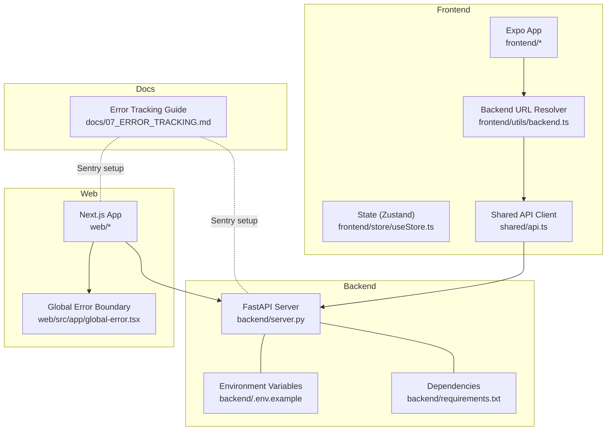
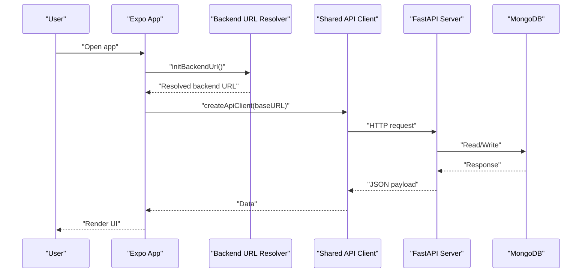
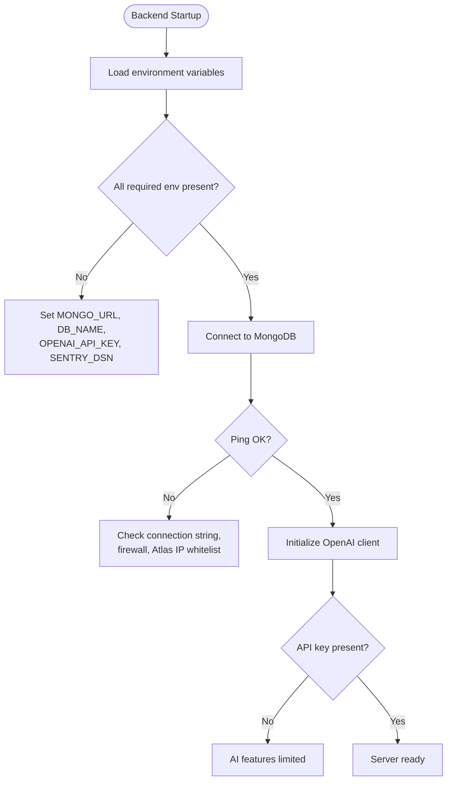
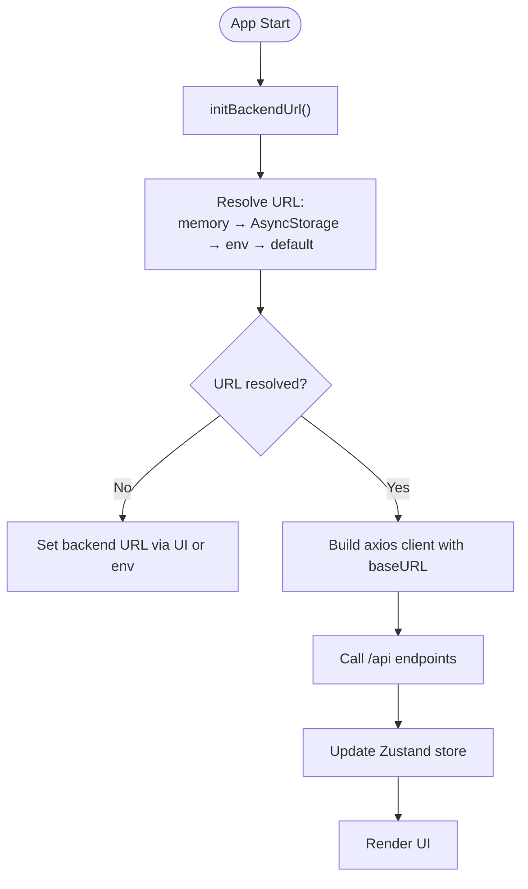
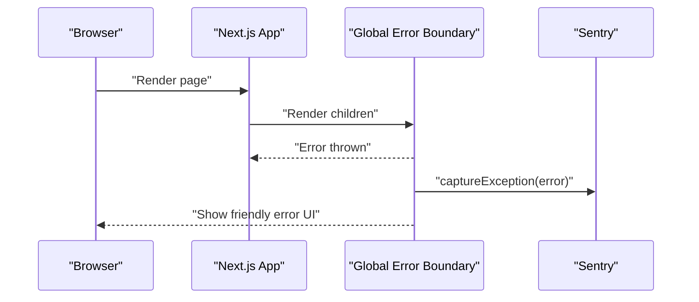
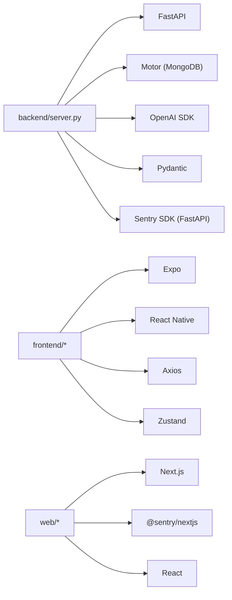

# Troubleshooting

<cite>
**Referenced Files in This Document**
- [README.md](file://README.md)
- [SETUP_GUIDE.md](file://SETUP_GUIDE.md)
- [backend/server.py](file://backend/server.py)
- [backend/requirements.txt](file://backend/requirements.txt)
- [backend/.env.example](file://backend/.env.example)
- [frontend/package.json](file://frontend/package.json)
- [frontend/.env](file://frontend/.env)
- [frontend/store/useStore.ts](file://frontend/store/useStore.ts)
- [frontend/utils/backend.ts](file://frontend/utils/backend.ts)
- [shared/api.ts](file://shared/api.ts)
- [web/package.json](file://web/package.json)
- [web/src/app/global-error.tsx](file://web/src/app/global-error.tsx)
- [docs/07_ERROR_TRACKING.md](file://docs/07_ERROR_TRACKING.md)
</cite>

## Table of Contents
1. [Introduction](#introduction)
2. [Project Structure](#project-structure)
3. [Core Components](#core-components)
4. [Architecture Overview](#architecture-overview)
5. [Detailed Component Analysis](#detailed-component-analysis)
6. [Dependency Analysis](#dependency-analysis)
7. [Performance Considerations](#performance-considerations)
8. [Troubleshooting Guide](#troubleshooting-guide)
9. [Conclusion](#conclusion)
10. [Appendices](#appendices)

## Introduction
This Troubleshooting guide focuses on practical, step-by-step solutions for common issues across Polymath OS components: environment configuration, database connectivity, dependency conflicts, frontend debugging (React Native), backend error handling and AI integration, performance diagnostics, recovery procedures, and logging/monitoring. It is designed for both end users and developers.

## Project Structure
Polymath OS comprises:
- Backend (FastAPI): API server, AI operations, export/import, agent memory, and MongoDB integration
- Frontend (Expo/React Native): Mobile app with state management, API client, and environment-driven backend URL resolution
- Shared: Cross-platform API client definitions
- Web: Next.js app with Sentry error boundary
- Docs: Error tracking and monitoring setup

**Diagram sources**
- [backend/server.py:1-120](file://backend/server.py#L1-L120)
- [backend/.env.example:1-17](file://backend/.env.example#L1-L17)
- [backend/requirements.txt:1-129](file://backend/requirements.txt#L1-L129)
- [frontend/store/useStore.ts:1-135](file://frontend/store/useStore.ts#L1-L135)
- [frontend/utils/backend.ts:1-76](file://frontend/utils/backend.ts#L1-L76)
- [shared/api.ts:1-74](file://shared/api.ts#L1-L74)
- [web/src/app/global-error.tsx:1-40](file://web/src/app/global-error.tsx#L1-L40)
- [docs/07_ERROR_TRACKING.md:1-195](file://docs/07_ERROR_TRACKING.md#L1-L195)

**Section sources**
- [README.md:142-202](file://README.md#L142-L202)
- [SETUP_GUIDE.md:281-330](file://SETUP_GUIDE.md#L281-L330)

## Core Components
- Backend server initializes Sentry, connects to MongoDB, exposes health checks, and provides AI analysis and export endpoints.
- Frontend resolves backend URL from environment, persists it, and uses a shared API client to communicate with the backend.
- Web app wraps error handling with a global error boundary and integrates Sentry.

Key troubleshooting anchors:
- Environment variables for backend and frontend
- Health endpoint for backend status
- Sentry configuration for error tracking across layers
- API client base URL resolution and timeouts

**Section sources**
- [backend/server.py:29-51](file://backend/server.py#L29-L51)
- [backend/server.py:500-518](file://backend/server.py#L500-L518)
- [frontend/utils/backend.ts:16-76](file://frontend/utils/backend.ts#L16-L76)
- [shared/api.ts:14-74](file://shared/api.ts#L14-L74)
- [web/src/app/global-error.tsx:1-40](file://web/src/app/global-error.tsx#L1-L40)
- [docs/07_ERROR_TRACKING.md:28-121](file://docs/07_ERROR_TRACKING.md#L28-L121)

## Architecture Overview
High-level flow for typical operations and where issues commonly arise:
- Setup: Environment variables, backend start, frontend backend URL resolution
- Runtime: API calls, AI analysis, MongoDB operations, export/import
- Observability: Sentry reporting, health checks, global error boundaries

**Diagram sources**
- [frontend/utils/backend.ts:67-76](file://frontend/utils/backend.ts#L67-L76)
- [shared/api.ts:14-16](file://shared/api.ts#L14-L16)
- [backend/server.py:524-551](file://backend/server.py#L524-L551)

## Detailed Component Analysis

### Backend Troubleshooting (FastAPI)
Common backend issues and resolutions:
- Environment variables not loaded or incorrect
  - Validate MONGO_URL, DB_NAME, OPENAI_API_KEY, and optional SENTRY_DSN
  - Confirm .env presence and values per the example
- Database connectivity failures
  - Use the health endpoint to confirm DB ping and AI configuration status
  - Check firewall, local service status, or Atlas IP whitelist
- AI integration failures
  - Ensure OPENAI_API_KEY is set; otherwise categorization and connection generation degrade gracefully
- Export/import and deduplication
  - Upload handlers parse YouTube/Google history; unsupported formats return structured errors
  - Deduplication uses SHA-256 hashing; duplicates are skipped with counts returned

**Diagram sources**
- [backend/.env.example:1-17](file://backend/.env.example#L1-L17)
- [backend/server.py:43-50](file://backend/server.py#L43-L50)
- [backend/server.py:500-518](file://backend/server.py#L500-L518)

**Section sources**
- [backend/.env.example:1-17](file://backend/.env.example#L1-L17)
- [backend/server.py:43-50](file://backend/server.py#L43-L50)
- [backend/server.py:500-518](file://backend/server.py#L500-L518)
- [backend/server.py:553-611](file://backend/server.py#L553-L611)
- [backend/server.py:182-190](file://backend/server.py#L182-L190)
- [SETUP_GUIDE.md:229-244](file://SETUP_GUIDE.md#L229-L244)

### Frontend Troubleshooting (Expo/React Native)
Common frontend issues and resolutions:
- Backend URL misconfiguration
  - The resolver reads in-memory, AsyncStorage, env, and platform defaults; ensure EXPO_PUBLIC_BACKEND_URL is correct
  - Use runtime setters to persist a corrected URL
- Network request failures
  - The API client sets a 15-second timeout; retry or adjust URL
- State management problems
  - Zustand store holds activities, journals, connections, and preferences; clear state to recover from corrupted UI state
- React Native debugging
  - Use Flipper, React DevTools, and console logs; Sentry SDK can be integrated for production error capture

**Diagram sources**
- [frontend/utils/backend.ts:16-76](file://frontend/utils/backend.ts#L16-L76)
- [shared/api.ts:14-16](file://shared/api.ts#L14-L16)
- [frontend/store/useStore.ts:98-135](file://frontend/store/useStore.ts#L98-L135)

**Section sources**
- [frontend/.env:1-2](file://frontend/.env#L1-L2)
- [frontend/utils/backend.ts:16-76](file://frontend/utils/backend.ts#L16-L76)
- [shared/api.ts:14-74](file://shared/api.ts#L14-L74)
- [frontend/store/useStore.ts:98-135](file://frontend/store/useStore.ts#L98-L135)
- [SETUP_GUIDE.md:161-177](file://SETUP_GUIDE.md#L161-L177)

### Web App Troubleshooting (Next.js)
Common web issues and resolutions:
- Global error boundary captures unhandled React rendering errors and logs them to Sentry
- Ensure Sentry DSN is configured for client/server/edge environments
- Verify API calls route through the backend and handle timeouts appropriately

**Diagram sources**
- [web/src/app/global-error.tsx:1-40](file://web/src/app/global-error.tsx#L1-L40)
- [docs/07_ERROR_TRACKING.md:62-90](file://docs/07_ERROR_TRACKING.md#L62-L90)

**Section sources**
- [web/src/app/global-error.tsx:1-40](file://web/src/app/global-error.tsx#L1-L40)
- [docs/07_ERROR_TRACKING.md:62-90](file://docs/07_ERROR_TRACKING.md#L62-L90)

## Dependency Analysis
- Backend depends on FastAPI, Motor (async MongoDB), OpenAI SDK, Pydantic models, Sentry SDK, and export libraries (OpenPyXL, python-pptx, PyPDF2, ReportLab)
- Frontend depends on Expo, React Navigation, Axios, Zustand, and platform-specific storage
- Web depends on Next.js, @sentry/nextjs, and React

**Diagram sources**
- [backend/requirements.txt:21-106](file://backend/requirements.txt#L21-L106)
- [frontend/package.json:13-55](file://frontend/package.json#L13-L55)
- [web/package.json:11-19](file://web/package.json#L11-L19)

**Section sources**
- [backend/requirements.txt:1-129](file://backend/requirements.txt#L1-L129)
- [frontend/package.json:1-67](file://frontend/package.json#L1-L67)
- [web/package.json:1-39](file://web/package.json#L1-L39)

## Performance Considerations
- Backend
  - Use the health endpoint to detect degraded states (database vs. AI configuration)
  - Monitor slow database queries and AI latency; Sentry supports performance tracing and profiling
- Frontend
  - Reduce render work, memoize selectors, and avoid unnecessary re-renders in Zustand
  - Use pagination and lazy loading for lists
- Web
  - Enable Sentry performance monitoring for page loads and API calls

**Section sources**
- [backend/server.py:500-518](file://backend/server.py#L500-L518)
- [docs/07_ERROR_TRACKING.md:40-61](file://docs/07_ERROR_TRACKING.md#L40-L61)
- [docs/07_ERROR_TRACKING.md:62-90](file://docs/07_ERROR_TRACKING.md#L62-L90)

## Troubleshooting Guide

### Environment Variable Configuration
- Backend
  - Ensure MONGO_URL, DB_NAME, OPENAI_API_KEY, and optional SENTRY_DSN are set
  - Use the provided example as a template
- Frontend
  - EXPO_PUBLIC_BACKEND_URL must point to the running backend
  - If using tunneling or LAN, confirm the URL matches the host’s reachable address

Step-by-step:
1. Create backend .env from the example and fill required values
2. Start backend and verify health endpoint
3. Set EXPO_PUBLIC_BACKEND_URL to the backend address
4. Restart frontend and confirm app loads data

**Section sources**
- [backend/.env.example:1-17](file://backend/.env.example#L1-L17)
- [SETUP_GUIDE.md:103-124](file://SETUP_GUIDE.md#L103-L124)
- [SETUP_GUIDE.md:161-177](file://SETUP_GUIDE.md#L161-L177)

### Database Connectivity Issues
Symptoms:
- Health endpoint reports database disconnected
- Uploads fail with connection errors
- Queries timeout

Resolutions:
- Local MongoDB: ensure the service is started
- MongoDB Atlas: whitelist your IP in Network Access
- Verify MONGO_URL and DB_NAME
- Check firewall and port accessibility

**Section sources**
- [backend/server.py:500-518](file://backend/server.py#L500-L518)
- [SETUP_GUIDE.md:229-233](file://SETUP_GUIDE.md#L229-L233)

### Dependency Conflicts
Symptoms:
- Metro bundler crashes or runs out of memory
- Python install fails or modules not found

Resolutions:
- Increase Node heap size for Metro
- Ensure Python venv is activated and dependencies installed via uv
- Use Bun for frontend installs and verify compatibility

**Section sources**
- [SETUP_GUIDE.md:222-228](file://SETUP_GUIDE.md#L222-L228)
- [SETUP_GUIDE.md:245-253](file://SETUP_GUIDE.md#L245-L253)

### Frontend Debugging (React Native)
Common issues:
- Backend URL mismatch causing API failures
- State inconsistencies leading to blank lists or stale data
- Network timeouts or CORS errors

Debugging steps:
- Confirm backend URL resolution and persistence
- Inspect API client base URL and timeout
- Clear Zustand state to reset UI state
- Use Flipper/React DevTools and console logs
- Integrate Sentry for production error capture

**Section sources**
- [frontend/utils/backend.ts:16-76](file://frontend/utils/backend.ts#L16-L76)
- [shared/api.ts:14-16](file://shared/api.ts#L14-L16)
- [frontend/store/useStore.ts:98-135](file://frontend/store/useStore.ts#L98-L135)
- [docs/07_ERROR_TRACKING.md:91-121](file://docs/07_ERROR_TRACKING.md#L91-L121)

### Backend Error Handling and AI Integration
Common issues:
- AI analysis or connection generation failures
- Missing OPENAI_API_KEY impacts categorization and suggestions
- Export/import endpoints may fail on malformed data

Resolutions:
- Verify OPENAI_API_KEY is set
- Review AI response parsing and fallbacks
- Validate uploaded file formats and timestamps
- Use health endpoint to confirm operational status

**Section sources**
- [backend/server.py:48-50](file://backend/server.py#L48-L50)
- [backend/server.py:192-233](file://backend/server.py#L192-L233)
- [backend/server.py:234-284](file://backend/server.py#L234-L284)
- [backend/server.py:553-611](file://backend/server.py#L553-L611)
- [backend/server.py:500-518](file://backend/server.py#L500-L518)

### Performance Diagnostics
- Backend
  - Use health endpoint to detect degraded states
  - Enable Sentry performance traces and profiles
- Frontend
  - Monitor render performance and reduce unnecessary updates
  - Paginate lists and defer heavy computations
- Web
  - Enable Sentry performance monitoring for page loads and API calls

**Section sources**
- [backend/server.py:500-518](file://backend/server.py#L500-L518)
- [docs/07_ERROR_TRACKING.md:40-61](file://docs/07_ERROR_TRACKING.md#L40-L61)
- [docs/07_ERROR_TRACKING.md:62-90](file://docs/07_ERROR_TRACKING.md#L62-L90)

### Recovery Procedures
- Data corruption or inconsistent state
  - Clear Zustand state and reload data from backend
  - Re-fetch activities/journals/connections
- Export/import failures
  - Validate JSON structure and supported keys
  - Retry with smaller batches if memory constrained
- System crashes
  - Restart backend and frontend
  - Reinitialize backend URL in the app if needed

**Section sources**
- [frontend/store/useStore.ts:112-118](file://frontend/store/useStore.ts#L112-L118)
- [frontend/utils/backend.ts:41-54](file://frontend/utils/backend.ts#L41-L54)

### Step-by-Step Solutions for Common User-Reported Issues
- Duplicate entries
  - Deduplication uses SHA-256 on title, URL, and timestamp; verify inputs
  - Skip duplicates and rely on counts returned by upload handler
- Missing connections
  - Connections are generated on demand; trigger generation from the UI
  - Ensure sufficient activities exist for meaningful suggestions
- Export format problems
  - Use supported formats and verify backend availability
  - Confirm file integrity and retry if interrupted

**Section sources**
- [backend/server.py:182-190](file://backend/server.py#L182-L190)
- [backend/server.py:553-611](file://backend/server.py#L553-L611)
- [README.md:113-141](file://README.md#L113-L141)

### Logging Strategies, Error Monitoring, and Diagnostic Tools
- Backend
  - Sentry SDK initialized with DSN; configure environment and release
  - Health endpoint provides operational status
- Frontend
  - Integrate Sentry React Native SDK and wrap root layout
- Web
  - Global error boundary captures React errors and sends to Sentry
  - Configure DSN for client/server/edge

**Section sources**
- [backend/server.py:29-41](file://backend/server.py#L29-L41)
- [docs/07_ERROR_TRACKING.md:28-121](file://docs/07_ERROR_TRACKING.md#L28-L121)
- [web/src/app/global-error.tsx:1-40](file://web/src/app/global-error.tsx#L1-L40)

## Conclusion
This guide consolidates environment setup, connectivity, debugging, performance tuning, recovery, and observability for Polymath OS. Use the health endpoint, Sentry configuration, and the backend/frontend URL resolution mechanisms to quickly isolate and resolve most issues.

## Appendices

### Quick Reference: Environment Variables
- Backend
  - MONGO_URL, DB_NAME, OPENAI_API_KEY, SENTRY_DSN, SENTRY_ENV
- Frontend
  - EXPO_PUBLIC_BACKEND_URL

**Section sources**
- [backend/.env.example:1-17](file://backend/.env.example#L1-L17)
- [frontend/.env:1-2](file://frontend/.env#L1-L2)