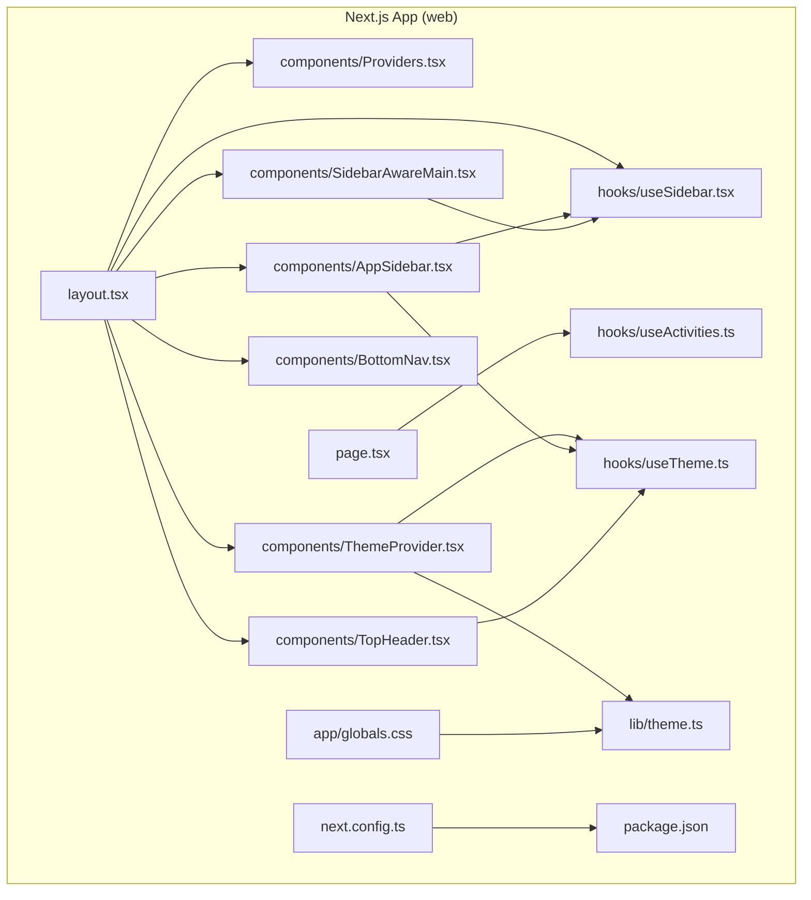
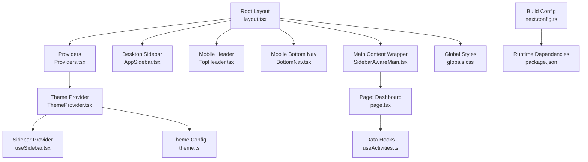
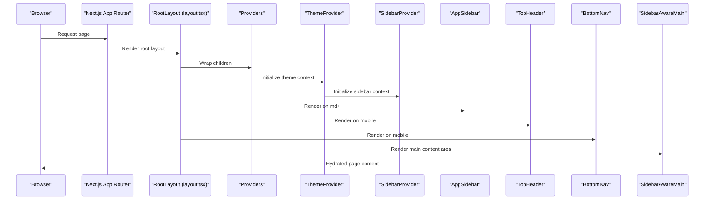
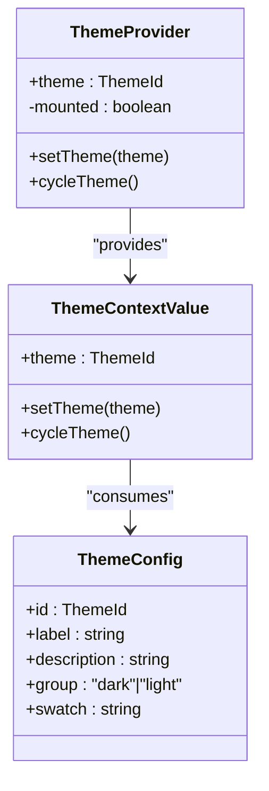
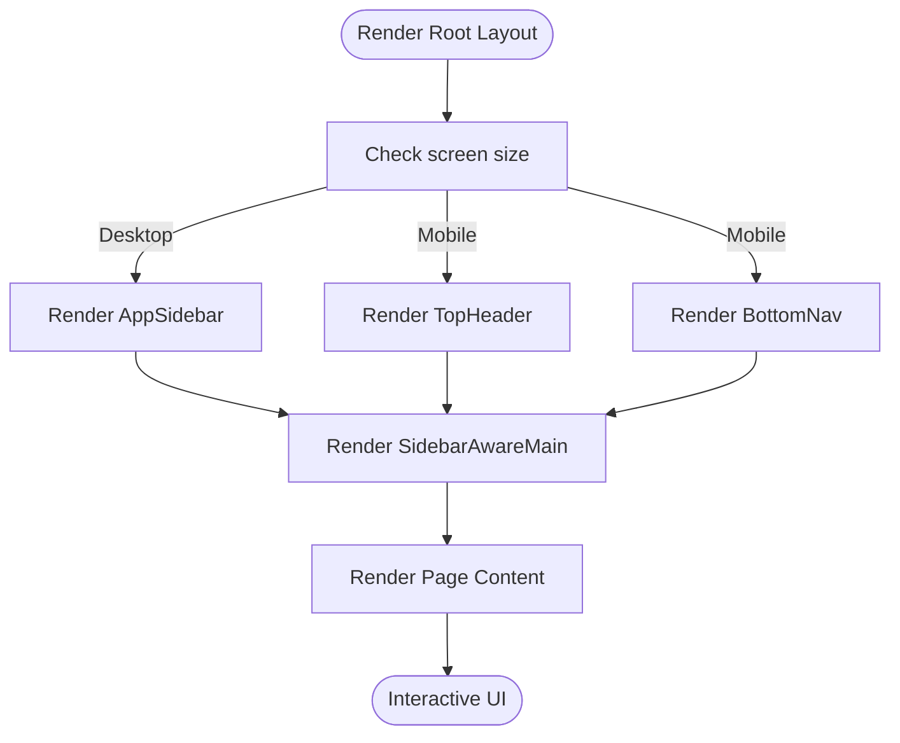
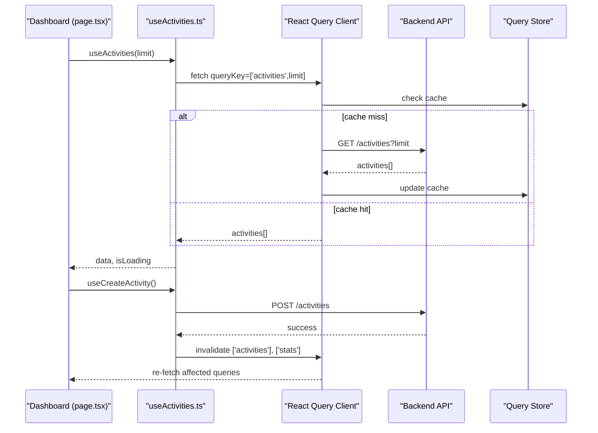
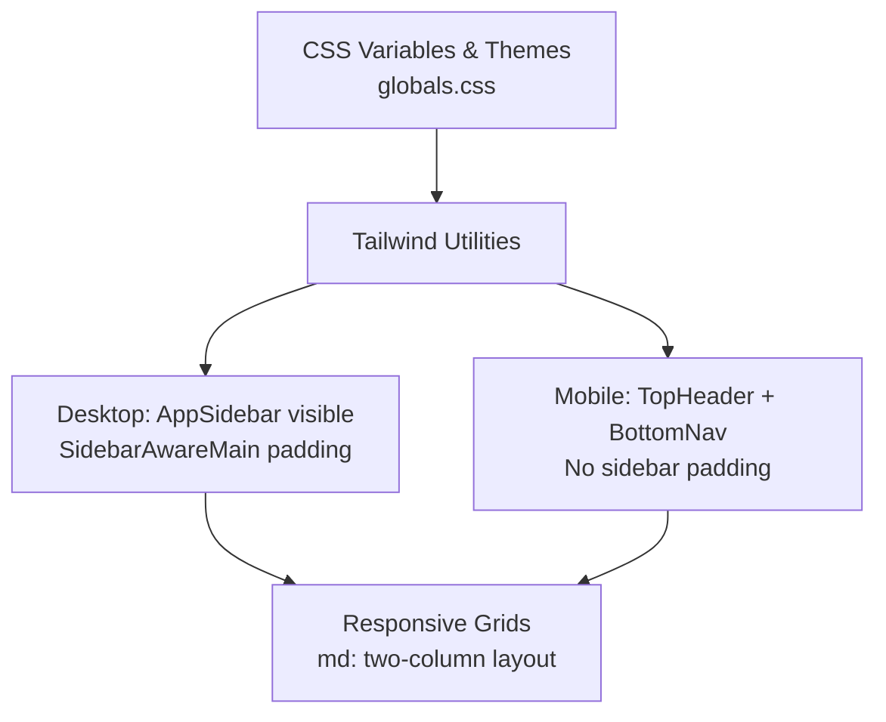
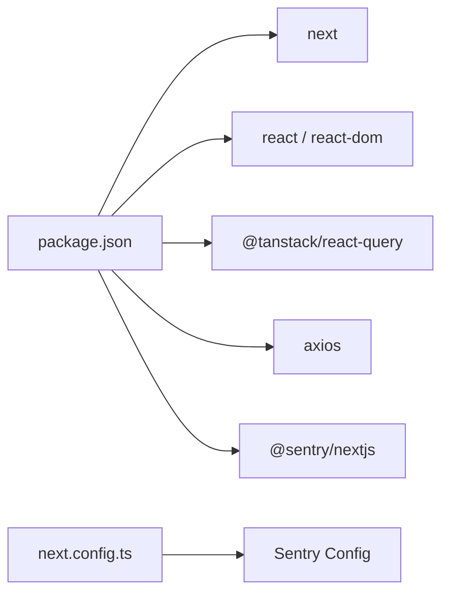

# Web Application

<cite>
**Referenced Files in This Document**
- [layout.tsx](file://web/src/app/layout.tsx)
- [page.tsx](file://web/src/app/page.tsx)
- [Providers.tsx](file://web/src/components/Providers.tsx)
- [ThemeProvider.tsx](file://web/src/components/ThemeProvider.tsx)
- [AppSidebar.tsx](file://web/src/components/AppSidebar.tsx)
- [TopHeader.tsx](file://web/src/components/TopHeader.tsx)
- [BottomNav.tsx](file://web/src/components/BottomNav.tsx)
- [SidebarAwareMain.tsx](file://web/src/components/SidebarAwareMain.tsx)
- [useSidebar.tsx](file://web/src/hooks/useSidebar.tsx)
- [useTheme.ts](file://web/src/hooks/useTheme.ts)
- [useActivities.ts](file://web/src/hooks/useActivities.ts)
- [theme.ts](file://web/src/lib/theme.ts)
- [globals.css](file://web/src/app/globals.css)
- [next.config.ts](file://web/next.config.ts)
- [package.json](file://web/package.json)
</cite>

## Table of Contents
1. [Introduction](#introduction)
2. [Project Structure](#project-structure)
3. [Core Components](#core-components)
4. [Architecture Overview](#architecture-overview)
5. [Detailed Component Analysis](#detailed-component-analysis)
6. [Dependency Analysis](#dependency-analysis)
7. [Performance Considerations](#performance-considerations)
8. [Troubleshooting Guide](#troubleshooting-guide)
9. [Conclusion](#conclusion)
10. [Appendices](#appendices)

## Introduction
This document explains the web application built with Next.js App Router. It covers the architectural approach using server-side rendering, responsive design patterns, and cross-platform UI adaptations. It documents the component structure, data-fetching hooks, and web-specific features such as desktop navigation, responsive breakpoints, and browser-based operations. It also clarifies how the web implementation differs from the mobile app and outlines shared state management and synchronization mechanisms.

## Project Structure
The web application resides under the web directory and follows Next.js conventions:
- App Router pages under web/src/app
- Shared UI components under web/src/components
- Hooks under web/src/hooks
- Theme and design tokens under web/src/lib
- Global styles and theme CSS under web/src/app/globals.css
- Build and runtime configuration under web/next.config.ts and web/package.json

**Diagram sources**
- [layout.tsx:1-76](file://web/src/app/layout.tsx#L1-L76)
- [page.tsx:1-268](file://web/src/app/page.tsx#L1-L268)
- [Providers.tsx:1-24](file://web/src/components/Providers.tsx#L1-L24)
- [ThemeProvider.tsx:1-55](file://web/src/components/ThemeProvider.tsx#L1-L55)
- [AppSidebar.tsx:1-177](file://web/src/components/AppSidebar.tsx#L1-L177)
- [TopHeader.tsx:1-88](file://web/src/components/TopHeader.tsx#L1-L88)
- [BottomNav.tsx:1-75](file://web/src/components/BottomNav.tsx#L1-L75)
- [SidebarAwareMain.tsx:1-21](file://web/src/components/SidebarAwareMain.tsx#L1-L21)
- [useSidebar.tsx:1-27](file://web/src/hooks/useSidebar.tsx#L1-L27)
- [useTheme.ts:1-21](file://web/src/hooks/useTheme.ts#L1-L21)
- [useActivities.ts:1-44](file://web/src/hooks/useActivities.ts#L1-L44)
- [theme.ts:1-26](file://web/src/lib/theme.ts#L1-L26)
- [globals.css:1-289](file://web/src/app/globals.css#L1-L289)
- [next.config.ts:1-21](file://web/next.config.ts#L1-L21)
- [package.json:1-39](file://web/package.json#L1-L39)

**Section sources**
- [layout.tsx:1-76](file://web/src/app/layout.tsx#L1-L76)
- [globals.css:1-289](file://web/src/app/globals.css#L1-L289)
- [next.config.ts:1-21](file://web/next.config.ts#L1-L21)
- [package.json:1-39](file://web/package.json#L1-L39)

## Core Components
- Providers: Wraps the app with React Query client for caching and optimistic updates.
- ThemeProvider: Manages theme selection, persistence, and DOM class switching with hydration safeguards.
- AppSidebar: Desktop-only persistent sidebar with navigation, quick actions, and theme selector.
- TopHeader: Mobile-only top bar with hamburger menu and live status indicator.
- BottomNav: Mobile-only bottom pill navigation with a quick capture action.
- SidebarAwareMain: Main content container that adapts horizontal padding based on sidebar collapsed state.
- useSidebar: Context provider for sidebar collapsed state.
- useTheme: Context provider for theme state and helpers.
- useActivities: TanStack Query hooks for activity data, creation, upload, and deletion.
- theme: Theme definitions, labels, and storage keys.
- globals.css: Tailwind-based design tokens mapped to CSS variables and theme classes.

Practical usage examples:
- Data fetching pattern: use the activity hooks to load and mutate data in pages.
- Responsive adaptation: use Tailwind breakpoints and CSS utilities to adapt layouts.
- Cross-platform UI: mobile-only components (TopHeader, BottomNav) are hidden on desktop; desktop-only AppSidebar is hidden on mobile.

**Section sources**
- [Providers.tsx:1-24](file://web/src/components/Providers.tsx#L1-L24)
- [ThemeProvider.tsx:1-55](file://web/src/components/ThemeProvider.tsx#L1-L55)
- [AppSidebar.tsx:1-177](file://web/src/components/AppSidebar.tsx#L1-L177)
- [TopHeader.tsx:1-88](file://web/src/components/TopHeader.tsx#L1-L88)
- [BottomNav.tsx:1-75](file://web/src/components/BottomNav.tsx#L1-L75)
- [SidebarAwareMain.tsx:1-21](file://web/src/components/SidebarAwareMain.tsx#L1-L21)
- [useSidebar.tsx:1-27](file://web/src/hooks/useSidebar.tsx#L1-L27)
- [useTheme.ts:1-21](file://web/src/hooks/useTheme.ts#L1-L21)
- [useActivities.ts:1-44](file://web/src/hooks/useActivities.ts#L1-L44)
- [theme.ts:1-26](file://web/src/lib/theme.ts#L1-L26)
- [globals.css:1-289](file://web/src/app/globals.css#L1-L289)

## Architecture Overview
The web app uses Next.js App Router with:
- Server-side rendering and static generation for pages.
- Client-side hydration for interactive components.
- A centralized theme system and responsive layout.
- TanStack Query for data fetching and caching.
- Sentry integration controlled by environment configuration.

**Diagram sources**
- [layout.tsx:1-76](file://web/src/app/layout.tsx#L1-L76)
- [Providers.tsx:1-24](file://web/src/components/Providers.tsx#L1-L24)
- [ThemeProvider.tsx:1-55](file://web/src/components/ThemeProvider.tsx#L1-L55)
- [useSidebar.tsx:1-27](file://web/src/hooks/useSidebar.tsx#L1-L27)
- [AppSidebar.tsx:1-177](file://web/src/components/AppSidebar.tsx#L1-L177)
- [TopHeader.tsx:1-88](file://web/src/components/TopHeader.tsx#L1-L88)
- [BottomNav.tsx:1-75](file://web/src/components/BottomNav.tsx#L1-L75)
- [SidebarAwareMain.tsx:1-21](file://web/src/components/SidebarAwareMain.tsx#L1-L21)
- [page.tsx:1-268](file://web/src/app/page.tsx#L1-L268)
- [useActivities.ts:1-44](file://web/src/hooks/useActivities.ts#L1-L44)
- [theme.ts:1-26](file://web/src/lib/theme.ts#L1-L26)
- [globals.css:1-289](file://web/src/app/globals.css#L1-L289)
- [next.config.ts:1-21](file://web/next.config.ts#L1-L21)
- [package.json:1-39](file://web/package.json#L1-L39)

## Detailed Component Analysis

### Layout and Routing
Root layout composes providers, theme, sidebar, and responsive navigation. It injects fonts, Material Symbols, and applies theme classes to the html element. The layout conditionally renders:
- Mobile-only: Drawer, TopHeader, BottomNav
- Desktop-only: AppSidebar
- Shared: SidebarAwareMain wrapping page content

**Diagram sources**
- [layout.tsx:1-76](file://web/src/app/layout.tsx#L1-L76)
- [Providers.tsx:1-24](file://web/src/components/Providers.tsx#L1-L24)
- [ThemeProvider.tsx:1-55](file://web/src/components/ThemeProvider.tsx#L1-L55)
- [useSidebar.tsx:1-27](file://web/src/hooks/useSidebar.tsx#L1-L27)
- [AppSidebar.tsx:1-177](file://web/src/components/AppSidebar.tsx#L1-L177)
- [TopHeader.tsx:1-88](file://web/src/components/TopHeader.tsx#L1-L88)
- [BottomNav.tsx:1-75](file://web/src/components/BottomNav.tsx#L1-L75)
- [SidebarAwareMain.tsx:1-21](file://web/src/components/SidebarAwareMain.tsx#L1-L21)

**Section sources**
- [layout.tsx:1-76](file://web/src/app/layout.tsx#L1-L76)

### Theme System
The theme system defines multiple themes, persists the selected theme in localStorage, and applies CSS classes to the root element. It prevents hydration flashes by deferring class application until mounted.

**Diagram sources**
- [ThemeProvider.tsx:1-55](file://web/src/components/ThemeProvider.tsx#L1-L55)
- [useTheme.ts:1-21](file://web/src/hooks/useTheme.ts#L1-L21)
- [theme.ts:1-26](file://web/src/lib/theme.ts#L1-L26)

**Section sources**
- [ThemeProvider.tsx:1-55](file://web/src/components/ThemeProvider.tsx#L1-L55)
- [useTheme.ts:1-21](file://web/src/hooks/useTheme.ts#L1-L21)
- [theme.ts:1-26](file://web/src/lib/theme.ts#L1-L26)

### Sidebar and Responsive Navigation
The desktop AppSidebar provides persistent navigation and quick actions. The mobile TopHeader and BottomNav provide alternative navigation affordances. SidebarAwareMain adjusts padding based on sidebar collapsed state.

**Diagram sources**
- [layout.tsx:1-76](file://web/src/app/layout.tsx#L1-L76)
- [AppSidebar.tsx:1-177](file://web/src/components/AppSidebar.tsx#L1-L177)
- [TopHeader.tsx:1-88](file://web/src/components/TopHeader.tsx#L1-L88)
- [BottomNav.tsx:1-75](file://web/src/components/BottomNav.tsx#L1-L75)
- [SidebarAwareMain.tsx:1-21](file://web/src/components/SidebarAwareMain.tsx#L1-L21)

**Section sources**
- [AppSidebar.tsx:1-177](file://web/src/components/AppSidebar.tsx#L1-L177)
- [TopHeader.tsx:1-88](file://web/src/components/TopHeader.tsx#L1-L88)
- [BottomNav.tsx:1-75](file://web/src/components/BottomNav.tsx#L1-L75)
- [SidebarAwareMain.tsx:1-21](file://web/src/components/SidebarAwareMain.tsx#L1-L21)

### Data Fetching and Mutations
TanStack Query is configured globally to cache data, refetch on window focus, and retry failed requests. The dashboard page consumes useStats and useActivities hooks to render summaries and recent activity. The useActivities hooks encapsulate CRUD operations and invalidate related queries after mutations.

**Diagram sources**
- [page.tsx:1-268](file://web/src/app/page.tsx#L1-L268)
- [useActivities.ts:1-44](file://web/src/hooks/useActivities.ts#L1-L44)
- [Providers.tsx:1-24](file://web/src/components/Providers.tsx#L1-L24)

**Section sources**
- [page.tsx:1-268](file://web/src/app/page.tsx#L1-L268)
- [useActivities.ts:1-44](file://web/src/hooks/useActivities.ts#L1-L44)
- [Providers.tsx:1-24](file://web/src/components/Providers.tsx#L1-L24)

### Responsive Design Implementation
Responsive breakpoints and utilities are defined in CSS and applied via Tailwind classes. The layout adapts:
- Sidebar width and padding change based on collapsed state.
- Modal overlays and panels adjust for mobile and desktop.
- Navigation components are hidden/shown per breakpoint.

**Diagram sources**
- [globals.css:1-289](file://web/src/app/globals.css#L1-L289)
- [layout.tsx:1-76](file://web/src/app/layout.tsx#L1-L76)
- [SidebarAwareMain.tsx:1-21](file://web/src/components/SidebarAwareMain.tsx#L1-L21)
- [AppSidebar.tsx:1-177](file://web/src/components/AppSidebar.tsx#L1-L177)
- [TopHeader.tsx:1-88](file://web/src/components/TopHeader.tsx#L1-L88)
- [BottomNav.tsx:1-75](file://web/src/components/BottomNav.tsx#L1-L75)

**Section sources**
- [globals.css:263-289](file://web/src/app/globals.css#L263-L289)
- [layout.tsx:1-76](file://web/src/app/layout.tsx#L1-L76)
- [SidebarAwareMain.tsx:1-21](file://web/src/components/SidebarAwareMain.tsx#L1-L21)

### Web-Specific Features
- Desktop navigation: Persistent AppSidebar with collapsible width and theme selector.
- Mobile navigation: Hamburger menu, live status indicator, and bottom pill navigation with a quick capture action.
- Browser-based operations: Health checks against the backend API endpoint and theme persistence in localStorage.
- File operations: Activity upload via FormData using the upload hook.

**Section sources**
- [AppSidebar.tsx:1-177](file://web/src/components/AppSidebar.tsx#L1-L177)
- [TopHeader.tsx:1-88](file://web/src/components/TopHeader.tsx#L1-L88)
- [BottomNav.tsx:1-75](file://web/src/components/BottomNav.tsx#L1-L75)
- [useActivities.ts:1-44](file://web/src/hooks/useActivities.ts#L1-L44)

### Relationship Between Web and Mobile Implementations
- Shared state: Theme and sidebar state are persisted locally and applied consistently across platforms.
- Shared data: Both platforms consume the same backend API endpoints for activities, stats, and health checks.
- Cross-platform synchronization: Theme preference and sidebar collapsed state are synchronized via local storage and CSS classes.
- Platform-specific UI: Web uses a desktop-first layout with persistent sidebar and top/bottom bars; mobile uses a tabbed or drawer-based navigation.

**Section sources**
- [ThemeProvider.tsx:1-55](file://web/src/components/ThemeProvider.tsx#L1-L55)
- [useSidebar.tsx:1-27](file://web/src/hooks/useSidebar.tsx#L1-L27)
- [theme.ts:1-26](file://web/src/lib/theme.ts#L1-L26)
- [layout.tsx:1-76](file://web/src/app/layout.tsx#L1-L76)

## Dependency Analysis
External dependencies include Next.js, React, TanStack React Query, Axios, and Sentry. Build-time configuration integrates Sentry only when enabled by environment variables.

**Diagram sources**
- [package.json:1-39](file://web/package.json#L1-L39)
- [next.config.ts:1-21](file://web/next.config.ts#L1-L21)

**Section sources**
- [package.json:1-39](file://web/package.json#L1-L39)
- [next.config.ts:1-21](file://web/next.config.ts#L1-L21)

## Performance Considerations
- Caching: React Query caches queries with a short stale time and automatic refetch on window focus to keep data fresh while minimizing network usage.
- Hydration: ThemeProvider defers applying theme classes until mounted to prevent hydration mismatches.
- Rendering: Desktop-only components are hidden on mobile to reduce DOM size and improve responsiveness.
- Assets: Font loading and Material Symbols are preloaded to avoid layout shifts.

[No sources needed since this section provides general guidance]

## Troubleshooting Guide
- Hydration warnings: Ensure theme initialization occurs after mount and that CSS classes are applied only after hydration.
- Network errors: Verify NEXT_PUBLIC_API_URL is set and reachable; the health check endpoint is used to reflect live status.
- Query cache invalidation: After mutations, confirm that query keys match and invalidate related queries to refresh dependent views.
- Sentry: If Sentry is disabled by environment, the build proceeds without Sentry integration.

**Section sources**
- [ThemeProvider.tsx:1-55](file://web/src/components/ThemeProvider.tsx#L1-L55)
- [TopHeader.tsx:1-88](file://web/src/components/TopHeader.tsx#L1-L88)
- [useActivities.ts:1-44](file://web/src/hooks/useActivities.ts#L1-L44)
- [next.config.ts:1-21](file://web/next.config.ts#L1-L21)

## Conclusion
The web application leverages Next.js App Router to deliver a responsive, themeable experience across devices. Desktop navigation is optimized with a persistent sidebar, while mobile navigation is streamlined via top and bottom bars. Data fetching is centralized with TanStack Query, and the theme system ensures consistent branding and accessibility. The architecture cleanly separates platform concerns while sharing state and data across platforms.

[No sources needed since this section summarizes without analyzing specific files]

## Appendices
- Practical examples:
  - Dashboard page demonstrates loading states, stats rendering, and recent activity lists.
  - Activity hooks show how to fetch, create, upload, and delete entries while invalidating caches.
  - Sidebar-aware main content adapts padding based on sidebar state for consistent spacing.

**Section sources**
- [page.tsx:1-268](file://web/src/app/page.tsx#L1-L268)
- [useActivities.ts:1-44](file://web/src/hooks/useActivities.ts#L1-L44)
- [SidebarAwareMain.tsx:1-21](file://web/src/components/SidebarAwareMain.tsx#L1-L21)