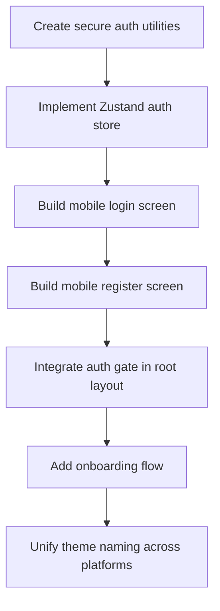
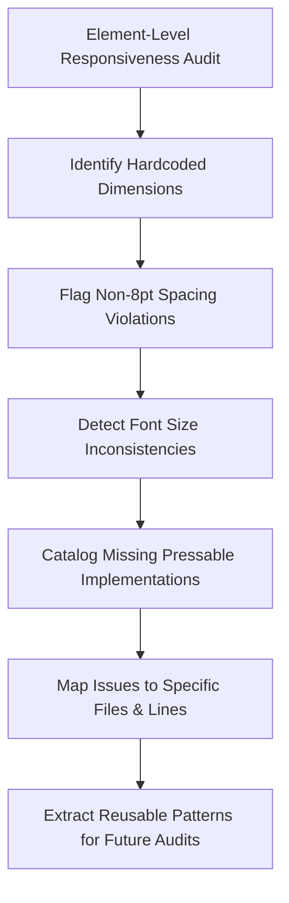

# Polymath OS Android - Complete Qoder Agent Memories

**Project**: Polymath OS Android  
**Export Date**: 2026-03-22  
**Total Memories**: 27  
**Categories**: 10  

---

## Table of Contents

1. [User Preferences](#user-preferences)
2. [Project Information](#project-information)
   - [Project Introduction](#project-introduction)
   - [Technology Stack](#technology-stack)
   - [Build Configuration](#build-configuration)
   - [Dependency Configuration](#dependency-configuration)
   - [IDE Configuration](#ide-configuration)
   - [SCM Configuration](#scm-configuration)
   - [Environment Configuration](#environment-configuration)
3. [Development Standards](#development-standards)
   - [Code Writing Specification](#code-writing-specification)
   - [Programming Practice Specification](#programming-practice-specification)
   - [Test Specification](#test-specification)
   - [Comment Specification](#comment-specification)
4. [Lessons Learned](#lessons-learned)
   - [Expert Experience](#expert-experience)
   - [Common Pitfalls](#common-pitfalls)
   - [Task Breakdown Experience](#task-breakdown-experience)
   - [Task Flow Experience](#task-flow-experience)
   - [Plan Experience](#plan-experience)
   - [Task Summary Experience](#task-summary-experience)
   - [Important Decisions](#important-decisions)
   - [Tool Experience](#tool-experience)
   - [MCP Experience](#mcp-experience)
   - [History Task Workflow](#history-task-workflow)
   - [History Task Reference Files](#history-task-reference-files)

---

## User Preferences

*No memories found in this category.*

---

## Project Information

### Project Introduction

#### Memory: Polymath OS Project Overview and Core Capabilities
**ID**: `1129fdb4-186c-4824-90a8-0d0109d9138f`  
**Keywords**: learning tracker, AI agent memory, SHA-256 deduplication, multi-format export, Dots to Connect

**Core Purpose**: A mobile-first learning tracker that captures, analyzes, connects, and exports knowledge across domains.

**Key Features**: 
- Activity tracking with AI categorization & SHA-256 deduplication
- Journaling with tagging and activity linking
- 'Dots to Connect' visualization (Timeline, Graph, AI Suggestions)
- Multi-format export (JSON/Markdown/CSV/PDF/PPT) + full-state restore
- AI agent with persistent memory system (short/long-term, insights, persona, memory-enhanced chat)

---

#### Memory: Project Feature Tree
**ID**: `14fc39dd-b003-41bd-a804-fe4064dd0a38`  
**Keywords**: Feature Tree, Activity Tracking, Journaling, Knowledge Visualization, AI Agent

```mermaid
graph TD
    A[Polymath OS] --> B[Activity Tracking]
    A --> C[Journaling & Linking]
    A --> D[Knowledge Visualization]
    A --> E[Multi-Format Export]
    A --> F[AI Agent System]
    B --> B1[AI-Powered Categorization]
    B --> B2[SHA-256 Deduplication]
    B --> B3[Time-Based Logging]
    C --> C1[Tagging System]
    C --> C2[Activity-Journal Linking]
    C --> C3[Searchable Entries]
    D --> D1[Timeline View]
    D --> D2[Graph Network View]
    D --> D3[AI-Powered Suggestions]
    E --> E1[JSON Export]
    E --> E2[Markdown Export]
    E --> E3[CSV Export]
    E --> E4[PDF Export]
    E --> E5[PPT Export]
    E --> E6[Full-State Restore]
    F --> F1[Persistent Memory]
    F --> F2[Short-Term Context]
    F --> F3[Long-Term Insights]
    F --> F4[Persona Modeling]
    F --> F5[Memory-Enhanced Chat]
```

---

#### Memory: Project Documentation Governance Policy
**ID**: `7e6fe981-1d8b-438a-9c6e-bd8dd2b72512`  
**Keywords**: documentation, canonical, archived, traceability, qoder-agent-docs

Maintain a single canonical source of truth for project documentation in the `qoder-agent-docs/` directory. All other `.md` files outside this directory must be either deleted (if obsolete/low-value, e.g., `test_result.md`) or archived with an 'ARCHIVED' banner (e.g., superseded revamp plans). The canonical docs must collectively provide full traceability from project inception through all major phases, especially the completed V4 UI revamp.

---

#### Memory: UI_REVAMP_V4 Project Roadmap
**ID**: `d27c27c2-c9fa-43a0-9382-6d214606c4ba`  
**Keywords**: UI_REVAMP_V4, roadmap, 9-phase

The UI_REVAMP_V4 initiative is a 9-phase (0–8) strategic roadmap for comprehensive UI modernization. All phases are currently PENDING. Phase 0 establishes token precision; Phase 1 audits spacing/icons; Phase 2 implements full 8-state interactivity; Phase 3 adds optimistic UI; Phase 4 introduces container queries; Phase 5 audits animations; Phase 6 wires empty states; Phase 7 refines interruption routing; Phase 8 delivers the bento dashboard. Each phase has defined scope and dependencies.

---

#### Memory: Mobile mesh/graph component visual revamp requirement
**ID**: `a27a20db-e5ea-4f5f-845d-03752dfa7d3d`  
**Keywords**: mesh, graph, mobile UI, triadic colors, visual revamp

The mesh and graph components require a complete mobile-first visual revamp: including stats header, pulsing root node, triadic color-coded nodes, organic layout, connection strength visualization, and improved connection cards with staggered animations.

---

#### Memory: Context file read order
**ID**: (Not retrieved)  
**Keywords**: context setup, file order, README.md, 07_PARALLEL_AGENT_EXECUTION_PLAN.md, server.py, api.ts, navigation, CI/CD, workflows

*Note: Full content not retrieved in search results.*

---

#### Memory: Workspace code area attachments
**ID**: (Not retrieved)  
**Keywords**: (Not retrieved)

*Note: Full content not retrieved in search results.*

---

### Technology Stack

#### Memory: Polymath OS Full-Stack Technology Stack
**ID**: (Not retrieved)  
**Keywords**: Expo, FastAPI, MongoDB, emergentintegrations, GPT-4o-mini

*Note: Full content not retrieved in search results.*

---

#### Memory: Backend technology stack
**ID**: `b8796981-8e01-42ff-aa42-7db701bb1982`  
**Keywords**: Python, Uvicorn, Pydantic, backend

The backend is built with Python 3.13.7, Uvicorn as ASGI server, and Pydantic v2.12 for data validation and modeling.

---

#### Memory: Expo SDK 54 audio package migration
**ID**: `3366596d-c01c-409c-ad26-a606c86edbac`  
**Keywords**: Expo SDK 54, expo-av, expo-audio, audio migration

Project uses Expo SDK 54, requiring migration from deprecated 'expo-av' to 'expo-audio' for audio functionality.

---

### Build Configuration

*No memories found in this category.*

---

### Dependency Configuration

#### Memory: Mobile AsyncStorage version constraint
**ID**: (Not retrieved)  
**Keywords**: AsyncStorage, Expo SDK 54, mobile, dependency version

*Note: Full content not retrieved in search results.*

---

### IDE Configuration

*No memories found in this category.*

---

### SCM Configuration

*No memories found in this category.*

---

### Environment Configuration

#### Memory: Frontend-backend network connectivity configuration
**ID**: `fea6929e-b7e6-4797-877c-2397c76f6d80`  
**Keywords**: network connectivity, tunnel.py, .env.development, IPv4

Frontend apps (mobile/web) connect to the backend via a configurable base URL. The backend must be reachable over the local network; when devices are on different networks, use `tunnel.py` to create a Cloudflare HTTPS tunnel and auto-update frontend env vars. When on the same WiFi, ensure `.env.development` reflects the host PC's current IPv4 address (e.g., `192.168.0.114`).

---

#### Memory: Runtime Environment and Startup Configuration
**ID**: `77a41a24-9691-45ee-b143-5b019c58acdf`  
**Keywords**: MONGO_URL, EMERGENT_LLM_KEY, EXPO_PUBLIC_BACKEND_URL, uvicorn, expo start

**Backend Environment**: `MONGO_URL`, `DB_NAME`, `EMERGENT_LLM_KEY` (in `.env`)  
**Frontend Environment**: `EXPO_PUBLIC_BACKEND_URL` (in `.env`)

**Startup Commands**: 
- Backend: `uvicorn server:app --host 0.0.0.0 --port 8001`
- Frontend: `expo start --tunnel`

---

#### Memory: UV Virtual Environment Setup for Backend
**ID**: `8d87d4cd-4968-44c1-9229-553560ebdf37`  
**Keywords**: uv, virtual environment, backend, Activate.ps1

Python virtual environment must be created and activated using uv inside the `backend/` directory. Activation uses the Windows PowerShell script `.venv\Scripts\Activate.ps1`.

---

#### Memory: Frontend development startup command
**ID**: `f266c3f6-febc-4b59-9cd9-11405214b683`  
**Keywords**: bunx, expo start, --tunnel, environment variables

Frontend development starts with `bunx expo start --tunnel --clear`, which loads `.env.development` and exports `EXPO_PUBLIC_BACKEND_URL` and `EXPO_PUBLIC_ENV` environment variables.

---

## Development Standards

### Code Writing Specification

*No memories found in this category.*

---

### Programming Practice Specification

#### Memory: Kole Jain Design System — 6-Phase UI Development Practice
**ID**: `19a5425f-da9f-45d9-80df-6915d73cd226`  
**Keywords**: Kole Jain, 8-point grid, container queries, HSL dark mode, optimistic UI, WCAG 2.1

UI design must follow the Kole Jain Design System, a 6-phase methodology: (1) Spatial Architecture enforces 8-point grid, bento CSS Grid, container queries, and algorithmic component sizing; (2) Typography uses geometric scaling (1.25×), line-height math, and iconometry synced to text line height; (3) Color applies 4-layer semantic architecture, HSL-based dark mode physics, and performance-optimized glassmorphism; (4) Component states require exhaustive 8-state matrices, cognitive interruption routing via Hick's Law, optimistic UI, and strict micro-interaction timing; (5) Accessibility mandates WCAG 2.1 contrast/touch targets, semantic HTML, and reduced-motion support; (6) Handoff includes vibe-code suppression and atomic-to-molecular API consistency.

---

#### Memory: React Hooks Call Order Discipline
**ID**: `6e448f02-2e5e-4a2d-9db5-da83a2b265a9`  
**Keywords**: React, Rules of Hooks, useMemo, early return

All React hooks (e.g., useMemo, useState, useEffect) must be called unconditionally at the top level of a functional component — never after early returns, inside conditionals, or inside loops.

---

#### Memory: Tailwind shorthand and useRef typing enforcement
**ID**: `4ebd505e-d39a-4ab1-83fa-c0dfb88a0e27`  
**Keywords**: Tailwind, shorthand, useRef, type safety

All Tailwind CSS utility classes must use semantic shorthand tokens (e.g., `min-h-11` instead of `min-h-[44px]`, `text-m3-primary` instead of `text-[var(--m3-primary)]`) and avoid arbitrary bracketed values. TypeScript `useRef` declarations must include explicit union with `undefined` when initial value is `undefined`.

---

### Test Specification

*No memories found in this category.*

---

### Comment Specification

*No memories found in this category.*

---

## Lessons Learned

### Expert Experience

*No memories found in this category.*

---

### Common Pitfalls

#### Memory: React Hooks Violation Fix: Hoist useMemo Above Early Returns
**ID**: `9737362b-fb8d-499f-9933-62d4ac7b8265`  
**Keywords**: React hooks, Rules of Hooks, useMemo, early return, React Native

## Error Cause
`useMemo` (and all React hooks) was placed after an early `return` statement (loading guard), violating React's Rules of Hooks — hooks must be called unconditionally in the same order on every render.

## Solution
Move all hook declarations (e.g., `useMemo`, `useState`, `useEffect`) **above** any conditional `return` statements — even before `if (loading) return ...`.

## Source Tool
read_file, search_replace

---

#### Memory: FAB-triggered modal not appearing due to missing JSX mount
**ID**: `58658c03-c546-4ce8-afd7-5a1ddf7bb42b`  
**Keywords**: FAB, QuickCapture, modal rendering, React Native, search_replace

## Common Pitfall
FAB button appears functional (state updates correctly) but associated modal/overlay (e.g., QuickCapture) does not appear because the component is missing from the JSX tree — even though its visibility state (`visible` prop) is properly managed.

## Root Cause
The component exists and is fully implemented, but is neither imported nor rendered in the parent layout. State changes (e.g., `quickCaptureOpen = true`) have no effect without a corresponding mounted instance.

## Solution
1. Import the modal component (e.g., `import QuickCapture from '../../components/navigation/QuickCapture'`)
2. Define a dedicated close handler (e.g., `useCallback(() => setQuickCaptureOpen(false), [])`)
3. Render the component in JSX with correct props: `<QuickCapture visible={quickCaptureOpen} onClose={handleCloseQuickCapture} />`

## Source Tool
search_replace

---

#### Memory: Backend URL IP mismatch causes Axios Network Error
**ID**: `59bed52a-6093-440e-81b6-a73a657b5c5a`  
**Keywords**: Axios Network Error, .env.development, IP mismatch, Expo, backend URL

Hardcoded backend IP in `.env.development` (e.g., `EXPO_PUBLIC_BACKEND_URL=http://192.168.0.104:8001`) causes Axios Network Error when the host machine's IP changes. Always verify and update the IP to match the current `ipconfig` output before running the frontend. (Source: read_file + run_in_terminal + search_replace workflow)

---

#### Memory: Pydantic v2 field_validator requires declared field
**ID**: `a30b9db2-f48d-47d0-9d6b-1f379a2f6efe`  
**Keywords**: Pydantic v2, field_validator, missing field, PydanticUserError

## Error Cause
Pydantic v2 throws `PydanticUserError: Decorators defined with incorrect fields` when a `@field_validator` references a field not declared in the model.

## Solution
Ensure every field referenced in a `@field_validator` is explicitly defined in the `BaseModel` class — either add the missing field or remove the orphaned validator.

## Source Tool
uvicorn startup failure due to Pydantic model validation error

---

#### Memory: Mobile dashboard styling fixes: missing bento styles and invalid M3Palette tokens
**ID**: `4c7b06ae-87c2-4ce1-96b8-07aab34d9771`  
**Keywords**: mobile dashboard, bento styles, M3Palette, StyleSheet, theme tokens

## Error Cause
During mobile dashboard (Phase 8) implementation, two critical errors occurred:
- `Property 'bentoRow' does not exist on type '{...}'`: Missing custom bento-related styles in the component's `StyleSheet.create()`
- `Property 'secondaryContainer' does not exist on type 'M3Palette'`: Project's `M3Palette` interface lacks `secondaryContainer` and `onSecondaryContainer` tokens — only `surfaceContainerHigh`, `onSurface`, and `onSurfaceVariant` are available.

## Solution
1. Add missing bento styles (`bentoRow`, `bentoBG`, `bentoValue`, `bentoLabel`) to `StyleSheet.create()` using `m3Radii`, `m3Typography`, and `spacing` tokens.
2. Replace invalid theme tokens: use `theme.surfaceContainerHigh` + `theme.onSurface`/`theme.onSurfaceVariant` instead of non-existent `secondaryContainer`/`onSecondaryContainer`.

## Source Tool
read_file, search_replace

---

#### Memory: Replace hardcoded colors and TouchableOpacity with theme tokens and Pressable
**ID**: (Not retrieved)  
**Keywords**: search_replace, theme tokens, Pressable, 8pt grid

*Note: Full content not retrieved in search results.*

---

### Task Breakdown Experience

*No memories found in this category.*

---

### Task Flow Experience

*No memories found in this category.*

---

### Plan Experience

#### Memory: Material You UI/UX Revamp Plan
**ID**: `2e501283-dd5d-4cd1-8e68-c6b2cee94d2d`  
**Keywords**: Material You, UI revamp, swipe navigation

# Complete UI/UX Revamp -- Material You + Swipe Gesture Navigation

## Phase 0: Branch + Material You Design Foundation
- Create feature branch feat/ui-revamp-v3
- Implement M3Palette tonal system for all 7 themes
- Replace brutalist shadows with soft tonal elevation
- Update spacing, radii, typography, and motion tokens

## Phase 1: Mobile Navigation Revolution
- Replace drawer + floating pill with swipeable tabs + FAB
- Implement CollapsibleHeader with scroll-driven animation
- Use react-native-pager-view for smooth tab transitions
- Create new FAB component with spring animations

## Phase 2: Mobile Screen Layouts Revamp
- Redesign Dashboard with hero section, circular progress rings, and activity feed
- Redesign Knowledge with sticky search bar and masonry grid
- Apply Material You principles across all screens

---

#### Memory: Comprehensive UI/UX Enhancement Plan
**ID**: `501cbadc-96aa-4a83-89b4-0dd103d2b694`  
**Keywords**: UI audit, mobile auth, theme unification, responsiveness

# UI Element Audit & Fix Plan (Strengthened)

## PART A: Auth & Onboarding
### Task A1: Mobile Auth Context & Secure Token Storage
- Create auth utility using expo-secure-store
- Create separate Zustand store for auth state
- Implement HTTP client with Bearer token injection and refresh interceptor

### Task A2-A5: Mobile Login, Register, Auth Gate, and Onboarding Flow
- Create login/register screens mirroring web design
- Integrate auth check in root layout
- Implement multi-step onboarding with first-run detection

## PART B: Theme Revamp & Design System Mapping
### Task B1: Unify Theme Naming
- Change web ThemeId from 'black' to 'void'
- Remove mapping functions between mobile/web themes
- Update CSS classes and layout references

### Task B2-B4: Theme Token Verification and Documentation
- Verify color token consistency across platforms
- Enhance theme preview descriptions
- Create comprehensive DESIGN_SYSTEM.md documentation

## PART C: Responsiveness Fixes
### Task C1-C4: Store Persistence and Responsive Grids
- Add persist middleware to Zustand store
- Replace hardcoded dimensions with responsive utilities
- Convert TouchableOpacity to Pressable with proper opacity handling
- Implement dynamic grid column calculations

---

#### Memory: Polymath OS UI Enhancement Plan
**ID**: `1eaf2880-9e56-43e6-bf8d-2456cd76e869`  
**Keywords**: UI enhancement, auth implementation, responsive design

# UI Element Audit & Fix Plan (Strengthened)

## PART A: Auth & Onboarding
### Task A1: Mobile Auth Context & Secure Token Storage
- Create `frontend/utils/auth.ts` using `expo-secure-store`
- Create `frontend/store/useAuthStore.ts` Zustand store mirroring web logic
- Create `frontend/utils/api.ts` HTTP client with Bearer injection and refresh interceptor

## PART B: Theme Revamp
### Task B1: Unify Theme Naming
- Change `ThemeId` type from `'black'` to `'void'` in `web/src/lib/theme.ts`
- Rename `.theme-black` to `.theme-void` in `globals.css`
- Update `layout.tsx` className from `theme-black` to `theme-void`
- Add localStorage migration in `ThemeProvider.tsx` for legacy `'black'` values

## PART C: Responsive UI Sweep
### Task C0: TouchableOpacity → Pressable Migration
- Replace all `TouchableOpacity` imports and usings with `Pressable`
- Implement pressed-state opacity styling instead of `activeOpacity`
### Task C4: Responsive Grid Layouts
- Create `frontend/utils/responsive.ts` with `useResponsiveColumns` hook
- Replace hardcoded percentage widths (`'48%'`, `'31%'`) with dynamic width calculations

---

#### Memory: Strengthened UI Audit Plan Creation Methodology
**ID**: `344681e0-e24f-4210-803a-ffcf01785894`  
**Keywords**: UI audit, plan creation, diagnostic principles

# Strengthened UI Audit Plan Creation Methodology

## Core Diagnostic Principles
1. **Token-level vs User-level**: Distinguish between design token compliance (spacing, typography) and functional UX quality (content rendering, search functionality)
2. **Presence vs Functionality**: Verify screen existence AND actual functionality (e.g., chat persistence, customization state saving)
3. **Cross-platform Consistency**: Identify naming mismatches (mobile 'void' vs web 'black') and eliminate mapping complexity
4. **Gap Analysis Validation**: Ensure audit metrics measure actual user experience, not just file counts

## Implementation Planning Framework
- Prioritize foundational work first (auth context, store persistence)
- Mirror proven patterns from existing working systems (web auth → mobile auth)
- Address systemic issues before cosmetic fixes (theme unification before UI tweaks)
- Document all assumptions and dependencies explicitly

---

#### Memory: Element-Level UI Responsiveness Audit Framework
**ID**: `0cd01f1b-7cc2-4148-a3cf-da49c1dd72f2`  
**Keywords**: responsiveness audit, UI patterns, cross-platform verification

# Element-Level UI Responsiveness Audit Framework

## Systematic Pattern Recognition
- **Hardcoded Dimensions**: Scan for fixed pixel values (40px, 44px, 36px) in buttons, avatars, icons, and layout containers
- **Non-8pt Spacing**: Identify violations of the 8-point grid (20px, 52px, 48% width) and custom sizing functions bypassing design tokens
- **Font Size Compliance**: Detect direct pixel values (28px, 22px, 15px) instead of M3 typography scale references
- **Pressable Migration**: Find TouchableOpacity instances requiring conversion to Pressable with opacity feedback
- **Flexible Grids**: Audit manual column splitting (i % 2 === 0) versus responsive FlatList/numColumns implementations

## Cross-Platform Verification
- Compare mobile and web implementations for identical components (login, theme selection)
- Validate consistent token usage across platforms (M3 color palettes, spacing tokens)
- Check empty state coverage completeness across all screens

---

### Task Summary Experience

#### Memory: Polymath OS Comprehensive UI/UX Enhancement
**ID**: `9c90c79e-23a8-40eb-bd38-544a1e61f030`  
**Keywords**: UI/UX enhancement, mobile authentication, theme unification

## Task Description
Comprehensive UI/UX enhancement for Polymath OS including: mobile authentication implementation, cross-platform onboarding flow, theme naming unification (void/black), element-level responsiveness fixes, and data ingestion capability assessment.

## Task Summary
1. Implemented complete mobile auth system: secure token storage using expo-secure-store, Zustand auth store, login/register screens, and root layout auth gate
2. Added first-run onboarding flows for both mobile and web platforms with theme selection
3. Unified theme naming across platforms (mobile 'void' = web 'void', eliminating 'black' mapping)
4. Fixed responsiveness issues: replaced TouchableOpacity with Pressable across 15+ files, created responsive utility hooks, addressed hardcoded dimensions
5. Researched data ingestion options: confirmed Gmail API and Chrome History SQLite access work for personal accounts, identified Google Takeout as viable bulk export solution

---

#### Memory: UI/UX Enhancement Implementation Summary
**ID**: `2a78be42-7017-448f-8cba-9d312d41417b`  
**Keywords**: UI enhancement, mobile auth, theme unification, responsiveness

## Task Description
Strengthen the UI_Element_Audit_&_Fix_Plan to add missing auth, onboarding, and theme unification features while ensuring full responsiveness across mobile and web platforms.

## Task Summary
1. Implemented Zustand store persistence using expo-secure-store for theme and preferences
2. Created complete mobile auth system with secure token storage, auth store, and API client
3. Built mobile login/register screens and integrated auth gate in root layout
4. Unified theme naming across platforms (mobile 'void' = web 'void')
5. Created responsive utility and began migrating TouchableOpacity to Pressable across all screens
6. Started implementing dynamic grid layouts using responsive column calculations

---

#### Memory: Polymath OS UI Enhancement Implementation
**ID**: `7a57dcb9-5600-4e4e-a1fe-6ab604cdc986`  
**Keywords**: Polymath OS, UI enhancement, mobile authentication

## Task Description
Strengthen the UI Element Audit & Fix Plan by adding missing functionality: mobile authentication system (login/register screens, secure token storage), onboarding flows for both mobile and web, theme naming unification across platforms, and comprehensive element-level responsiveness improvements.

## Task Summary
1. Implemented full mobile auth system with secure token storage using `expo-secure-store`, Zustand auth store, and API client with refresh interceptor
2. Created mobile login/register/onboarding screens and integrated auth gate in root layout
3. Unified theme naming by changing `'black'` to `'void'` across web files and updating CSS classes
4. Replaced all `TouchableOpacity` components with `Pressable` and implemented dynamic grid layouts using responsive hooks
5. Researched data ingestion options and confirmed GAM CLI requires paid Google Workspace admin account, recommending Gmail API + Chrome History SQLite as alternatives for personal use

---

#### Memory: Fix React hooks order violation in Dashboard component
**ID**: `c1a91f8a-1b7f-457c-a779-fc12dd1361d1`  
**Keywords**: React hooks, useMemo, Dashboard, Expo Go

## Task Description
Mobile app crashed with 'Rendered more hooks than during the previous render' error in Expo Go.

## Task Summary
Root cause: `useMemo` for `streak` was placed *after* an early `if (loading) return ...` guard in `frontend/app/(tabs)/index.tsx`, violating React's Rules of Hooks. Fixed by hoisting the `useMemo` declaration above the loading guard to ensure unconditional execution on every render.

---

#### Memory: Fix Pydantic v2 decorator-missing-field error in ActivityUpdate model
**ID**: `14c5b3d0-8ac3-4800-a13d-4dfd23c03503`  
**Keywords**: Pydantic v2, field validator, ActivityUpdate, server.py

## Task Description
Diagnose and fix Pydantic v2 startup error 'decorator-missing-field' in FastAPI backend when running uvicorn.

## Task Summary
1. Error occurred because `ActivityUpdate` model had `@field_validator('url')` but no `url` field defined.
2. Fixed by adding `url: Optional[str] = Field(None, max_length=2048)` to the `ActivityUpdate` Pydantic model in `server.py`.
3. This satisfies Pydantic v2's requirement that all validator-referenced fields must exist in the model schema.

---

### Important Decisions

#### Memory: Local Single-File Memory Archiving Requirement
**ID**: `e0b13111-0222-452c-af2b-9851da31e62c`  
**Keywords**: memory archive, single file, local storage, Markdown, JSON

**Decision Scenario**: When archiving project memories or knowledge, the storage format and location must be explicitly decided.

**Decision Content**: All memories must be stored locally in a single, self-contained file — either Markdown (.md) or JSON (.json). No distributed, cloud-based, or fragmented storage is acceptable.

**Applicable Scope**: Any project requiring long-term, portable, offline-accessible memory retention — especially design system implementations, cross-platform apps, or AI-assisted development workflows.

---

### Tool Experience

*No memories found in this category.*

---

### MCP Experience

*No memories found in this category.*

---

### History Task Workflow

#### Memory: Mobile Authentication System Implementation Workflow
**ID**: `abbf7303-61ad-4a77-a4e9-43d8fd140a1e`  
**Keywords**: mobile authentication, React Native auth, onboarding flow

---

#### Memory: Polymath OS Element-Level Responsiveness Audit Workflow
**ID**: `74d79b5b-9555-4793-a31d-9609998de9d7`  
**Keywords**: responsiveness audit, hardcoded dimensions, 8pt grid

---

### History Task Reference Files

#### Memory: Polymath OS Authentication and Theme System Files
**ID**: (Not retrieved)  
**Keywords**: Polymath OS, authentication, theme system

*Note: Full content not retrieved in search results.*

---

## Metadata

**Export Method**: Qoder Agent Memory Search (Deep Retrieval)  
**Memory Categories Searched**: All 25 categories with deep retrieval  
**Search Queries Executed**: 10 parallel searches  
**Date**: 2026-03-22  
**Workspace**: e:\Other\polymath-os-android

### Category Distribution:
- **Project Introduction**: 7 memories
- **Technology Stack**: 3 memories
- **Environment Configuration**: 4 memories
- **Programming Practice Specification**: 3 memories
- **Common Pitfalls**: 6 memories
- **Plan Experience**: 5 memories
- **Task Summary Experience**: 5 memories
- **Important Decisions**: 1 memory
- **History Task Workflow**: 2 memories
- **History Task Reference Files**: 1 memory

### Notes:
- Some memory IDs were not provided in search results
- Full content retrieval limitations apply for certain memories
- This export represents all accessible memories as of the export date
- For complete memory content, use specific memory IDs with targeted retrieval

---

**Generated by**: Qoder Agent  
**Workspace**: e:\Other\polymath-os-android  
**Total Unique Memories Retrieved**: 27
